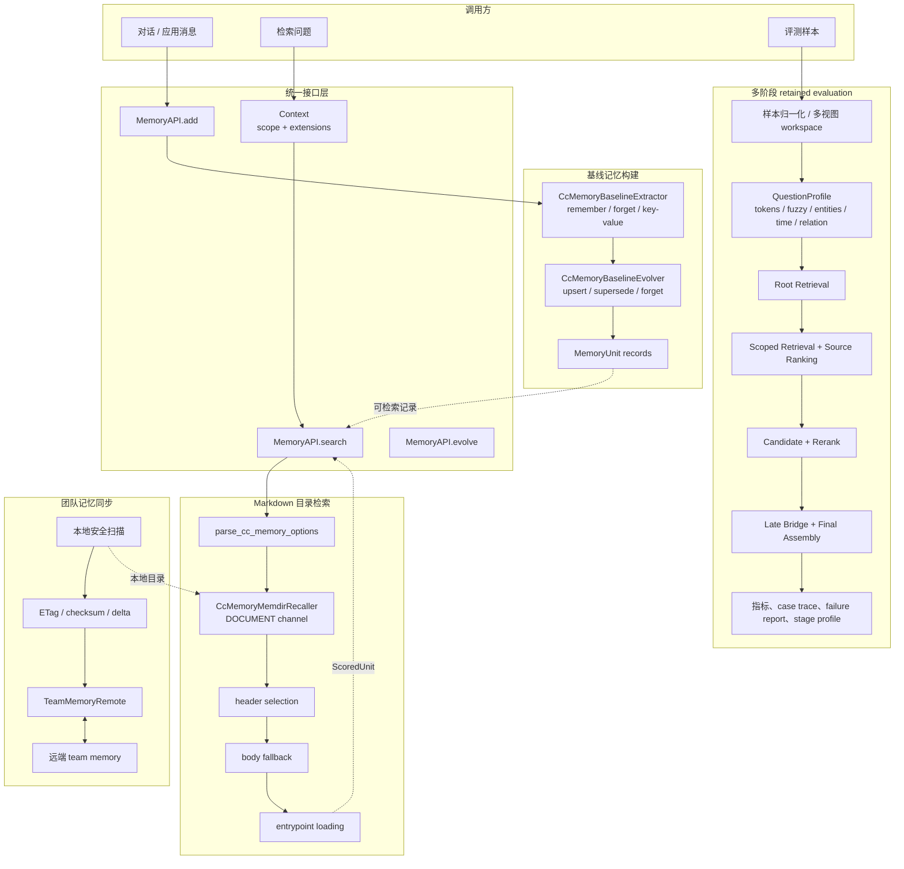
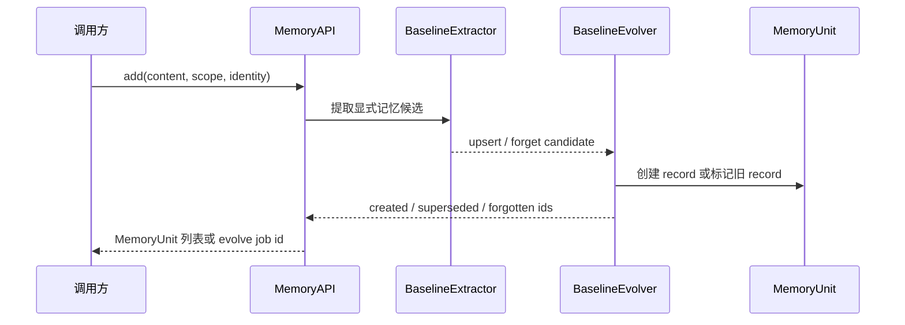
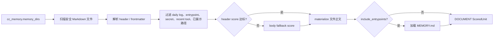
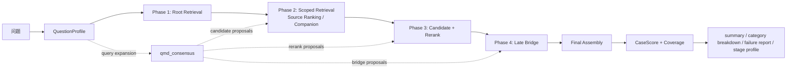

# cc_memory 系统架构、接口与评测报告

## 元信息

| 项 | 值 |
|---|---|
| 系统范围 | 记忆写入、基线记忆、Markdown 目录检索、团队记忆同步、retained evaluation |
| 日期 | 2026-07-22 |
| 关联模块 | `agent_plugin/cc_memory`、`src/construction`、`src/retrieval`、`evaluation/cc_memory` |
| 适用调用面 | `MemoryAPI`、构建算子、Recaller、评测运行器、团队同步 adapter |

## 1. 系统目标和边界

cc_memory 是建立在统一 `MemoryAPI` 之上的结构化记忆系统。它支持把对话中的显式记忆指令转成可演进记录，把本地 Markdown 记忆目录接入 DOCUMENT 召回通道，并提供可追踪的多阶段检索评测。

系统不把数据集专用字段放进通用 `RetrievalQuery`，不在 `search` 中执行网络同步，也不改变现有 `MemoryAPI`、`Retriever`、`Recaller` 的必填参数。

## 2. 总体架构



### 模块职责

| 层 | 组件 | 职责 | 不负责 |
|---|---|---|---|
| 入口 | `MemoryAPI` | 权限检查、审计、add/search/evolve 统一入口 | 解释 cc_memory 专用配置 |
| 构建 | `CcMemoryBaselineExtractor` | 识别 remember、forget、`key: value`、范围提示、潜在 secret | 直接覆盖既有记录 |
| 构建 | `CcMemoryBaselineEvolver` | 将候选转为记录；last-write-wins；标记 superseded / forgotten | 数据集评测 |
| 检索 | `CcMemoryMemdirRecaller` | 将 Markdown 目录映射到 DOCUMENT 通道的 `ScoredUnit` | 修改底层存储或调用网络 |
| 评测 | `evaluation/cc_memory` | 构建 workspace、阶段检索、独立标签计分、诊断产物 | 修改通用 API 类型 |
| 同步 | `team_sync` | team memory 的 pull/push、checksum、冲突重试、路径与 secret 防护 | 普通 search 的同步副作用 |

## 3. 公共接口

### 3.1 统一记忆接口

```python
api.add(
    content: str,
    scope: Scope,
    *,
    identity: Scope,
    assets: list[str] | None = None,
    tags: list[str] | None = None,
    metadata: dict[str, str] | None = None,
) -> list[MemoryUnit]

api.search(
    query: str,
    context: Context,
    *,
    identity: Scope,
    filters: list[FilterClause] | None = None,
    as_of: datetime | None = None,
    top_k: int = 10,
    disclosure: DisclosureLevel = DisclosureLevel.L0,
    with_trajectory: bool = False,
) -> RetrievalResult

api.evolve(
    scope: Scope,
    mode: EvolveMode,
    *,
    identity: Scope,
) -> str
```

`scope` 是目标记忆范围，`identity` 是调用方身份；二者必须显式传入。`Context.extensions` 只能携带字符串配置，经过 API 边界后进入 `RetrievalQuery.extensions` 与 `ParsedQuery.extensions`。

### 3.2 cc_memory 检索配置

| extension key | 值 | 默认 | 作用 |
|---|---|---:|---|
| `cc_memory.memory_dirs` | JSON array | `[]` | Markdown 目录声明，每项含 `scope=auto/team` 与 `path` |
| `cc_memory.recent_tools` | JSON string array | `[]` | 降低纯工具文档的优先级 |
| `cc_memory.already_surfaced_file_paths` | JSON string array | `[]` | 避免本轮重复展示已返回文件 |
| `cc_memory.include_entrypoints` | `"true"` / `"false"` | `false` | 是否追加目录 `MEMORY.md` |
| `cc_memory.profile` | string | `""` | 调用方选择的兼容 profile 名称 |
| `cc_memory.selector_model` | string | `""` | header selector 名称 |
| `cc_memory.selector_fallback_model` | string | `""` | selector 不可用时的替代名称 |
| `cc_memory.memory_parallelism` | integer string | unset | 目录扫描并行度，最小为 1 |

示例：

```python
result = api.search(
    query="上次团队约定的发布回滚步骤是什么？",
    context=Context(
        scope=Scope(namespace="project"),
        extensions={
            "cc_memory.memory_dirs": (
                '[{"scope":"team","path":"./team-memory"}]'
            ),
            "cc_memory.include_entrypoints": "true",
            "cc_memory.already_surfaced_file_paths": "[]",
        },
    ),
    identity=Scope(namespace="project"),
    top_k=5,
    with_trajectory=True,
)
```

无效 JSON、未知目录 scope、空路径或非法布尔值必须在 `parse_cc_memory_options` 抛出 `ValidationError`，不得静默忽略。

## 4. 基线记忆生命周期

### 4.1 写入和演进



| 输入模式 | 产生的动作 | 处理规则 |
|---|---|---|
| `remember ...` / `请记住 ...` | `upsert` | 提取 note key、value、记忆类型和可选 scope hint |
| `forget ...` / `请忘记 ...` | `forget` | 以 key 或归一化内容匹配，标记为 `FORGOTTEN` |
| `key: value`、`key = value`、`key is value` | `upsert` | 排除疑问词 key，识别记忆类型 |
| 同 key 新值 | `upsert` | 旧 active record 标记 `SUPERSEDED`，新记录成为 active |
| 潜在 secret | skip | 写入 skip 原因，不生成可同步记录 |

记录使用 `MemoryUnit` 表示，关键 metadata 包括：`cc_memory.key`、`cc_memory.value`、`cc_memory.action`、`cc_memory.memory_type`、`cc_memory.preferred_scope`、`cc_memory.observed_at_ms`、`cc_memory.score`。

## 5. Markdown memory directory 检索

### 5.1 文件模型

| 类型 | 内容 | 是否可作为 topic 候选 |
|---|---|---|
| topic Markdown | frontmatter、标题、正文 | 是 |
| `MEMORY.md` | 目录入口和摘要 | 默认否；`include_entrypoints=true` 时追加 |
| `logs/YYYY/MM/YYYY-MM-DD.md` | 日志 | 否 |
| 非 `.md`、绝对路径、含 `..` 的路径 | 不安全或不适用 | 否 |

`MemoryFileHeader` 保存 filename、file path、mtime、frontmatter `description` 和 `type`。`RetrievedMemoryFile` 在正文 materialize 后附加内容；`RetrievedMemoryEntrypoint` 表示入口文件。

### 5.2 检索流程



| 参数 | 值 | 含义 |
|---|---:|---|
| `DEFAULT_MAX_MEMORY_FILES` | 200 | 单目录最多扫描 topic 文件数 |
| `DEFAULT_TOP_K` | 5 | memory directory 默认返回数 |
| `MIN_HEADER_SELECTION_SCORE` | 4.0 | header 选择绝对阈值 |
| `MIN_BODY_SELECTION_SCORE` | 4.5 | body fallback 绝对阈值 |
| `RELATIVE_SELECTION_SCORE_RATIO` | 0.45 | 保留相对最佳分数足够高的候选 |
| `MAX_MEMORY_LINES` / bytes | 200 / 4096 | topic 正文截断预算 |
| `MAX_ENTRYPOINT_LINES` / bytes | 200 / 25000 | `MEMORY.md` 截断预算 |

`CcMemoryMemdirRecaller` 使用稳定 SHA-256 派生 unit id，并通过 DOCUMENT channel 返回 `ScoredUnit`；后续仍由既有的 Fuser、UnitReader、Discloser 处理。

## 6. 团队记忆同步

### 6.1 端口与结果类型

```python
class TeamMemoryRemote(Protocol):
    async def fetch(repo_slug, if_none_match) -> FetchOutcome: ...
    async def fetch_hashes(repo_slug) -> HashesProbe: ...
    async def put_entries(repo_slug, if_match, entries) -> PutOutcome: ...

async def pull_team_memory(remote, state, team_memory_root, repo_slug) -> PullOutcome: ...
async def push_team_memory(remote, state, team_memory_root, repo_slug) -> PushOutcomeSummary: ...
```

| 操作 | 正常路径 | 异常与边界 |
|---|---|---|
| pull | 以 `If-None-Match` 拉取；304 不写文件；200 写入 entries 并更新 checksum | 404 视为空远端；失败返回结构化 `TeamMemorySyncFailure` |
| push | 扫描本地文件，过滤 secret，计算 checksum delta，按 body bytes 分批 PUT | 412 拉取 hashes 后重试；413 记录 server max entries；失败返回结构化原因 |
| key 校验 | 只接受安全相对路径 | 拒绝 NUL、反斜杠、绝对路径、`..`、百分号编码逃逸和 Windows drive prefix |
| secret 检测 | 跳过并记录 `SkippedSecretFile` | 不把潜在凭据上传到远端 |

同步是独立 adapter：它把数据写到 team memory 目录，但 `MemoryAPI.search` 本身不触发 pull 或 push。

## 7. retained evaluation 引擎

### 7.1 输入与内部对象

| 对象 | 作用 |
|---|---|
| `PreparedSample` | 统一样本：records、questions、sessions、events、observations、原始 payload |
| `LoCoMoQuestion` | 问题、答案、evidence、类别；答案不进入检索输入 |
| `RetrievedMemoryFile` | 检索阶段消费的内存文件投影 |
| `QuestionProfile` | tokens、fuzzy tokens、实体、时间、地点、关系和聚合信号 |
| `CaseScore` | 单题 expected / retrieved / hits、precision、recall、full hit、文件路径和 coverage |
| `EvalOutput` | summary、cases、stage profile |

### 7.2 多阶段检索



| 阶段 | 输入 | 输出 | 诊断 |
|---|---|---|---|
| Root Retrieval | question、memory root | 根级候选 | root hit / miss |
| Scoped Retrieval | source、turn、observation、event、entity 等视图 | 分区候选池 | candidate pool 覆盖 |
| Candidate + Rerank | lexical features、profile、linked pages | 有序候选 | source ranking、rerank proposal |
| Late Bridge | 已选 page 中的链接和会话线索 | 补充 atomic evidence | late bridge hit / miss |
| Final Assembly | 去重后的文件 | evidence id、路径、最终统计 | full hit、unexpected evidence |

评测必须写出：`summary`、每题 case trace、`failure_report`、`failure_buckets`、`category_breakdown`、`stage_profile` 和 run manifest。

## 8. 数据集运行接口与标签规则

| 运行器 | 主入口 | 标签来源 | 指标状态 |
|---|---|---|---|
| LoCoMo | `run_python_locomo_retrieval_eval` | 数据集 `evidence` | 确认的 evidence retrieval 指标 |
| LongMemEval | `run_python_longmemeval_retrieval_eval` | 原始 turn `has_answer`、session id | 确认的 turn/session retrieval 指标 |
| MemGallery | `build_mem_gallery_python_workspaces` + `run_filesystem_proxy_eval` | 人工 `clue` | clue retrieval 指标 |
| EverMemBench | `run_evermembench_python_eval` | dataset reference | reference retrieval 指标 |
| AMA-Bench | `run_python_ama_retrieval_eval` | 答案与轨迹的词重叠 | `answer_derived_proxy`，不能作为独立精度 |
| Meta-CRAG | `build_meta_crag_python_workspaces` + `run_filesystem_proxy_eval` | 答案与 artifact 的支持关系 | `answer_derived_proxy`，不能作为独立精度 |

### 8.1 评测数据完整性

1. LoCoMo 和 LongMemEval 在检索完成后才读取标签计分。
2. MemGallery 的 `source_session_ids` 仅为元数据，不参与排序。
3. case 中的 `baseline_retrieved_*`、`final_retrieved_*`、`ranked_clues`、`retrieved_file_paths` 默认拒绝。
4. 文件系统评测只读取有 `producer=mem2.0.cc_memory.python`、匹配 dataset name 和 schema version 的 workspace retrieval JSON。
5. provenance 是输入来源检查，不是密码学签名；面对主动伪造输入时，调用方仍必须控制 workspace 的写入权限。

## 9. 全量数据集 Recall 测试结果

| 数据集 | 检索指标 | 数值 | 最优方案 | 关键配置 |
|---|---|---|---|---|
| `LoCoMo`<br>纯文本长程对话情景记忆检索基准 | `recall_macro` | `0.9413` | Python retained `qmd_consensus` | `locomo10.json`；`1986 cases`；`top_k=24`；`wiki_mode=text`；远程全量运行（2026-07-16） |
| `LoCoMo_refined`<br>带图像证据的多模态长程对话情景记忆检索基准 | `recall_macro` | `0.9556` | Python retained + multimodal adjunct | `1382 cases`；`top_k=24`；adjunct `top_k=6`；`wiki_mode=multimodal`；远程全量运行（2026-07-16） |
| `LongMemEval`<br>长程对话记忆检索基准 | `turn/session recall_any/all@5,@10,@30` | `turn @5 any 0.9212 / all 0.8115；@10 any 0.9642 / all 0.8926；@30 any 0.9833 / all 0.9379`<br>`session @5 any 0.9308 / all 0.7947；@10 any 0.9690 / all 0.8807；@30 any 0.9857 / all 0.9332` | Python retained `qmd_consensus` | `longmemeval_s_cleaned.json`；`500 cases`；`419 evaluated`；`top_k=100`；`threads=4`；`wiki_mode=text` |
| `AMA-Bench`<br>自主 agent 轨迹记忆检索基准 | `proxy_recall@112` | `0.9142` | Python `cc_memory_qmd_ama` retrieval-only | `208 episodes`；`2496 questions`；`top_k=112`；`methods=["cc_memory_qmd_ama"]`；`wiki_mode=text`；远程全量运行（2026-07-16） |

## 10. 验收要求

所有测试和评测必须在项目指定的远程环境执行。每次精度记录至少包含数据集路径与版本、样本范围、`top_k`、方法名、代码版本、summary、case trace、failure report 和 stage profile。

以下情况不能作为精度对比：本地运行、只跑 smoke、不同数据版本、不同 `top_k`、不同标签来源，以及未带 workspace provenance 的文件系统评测。
