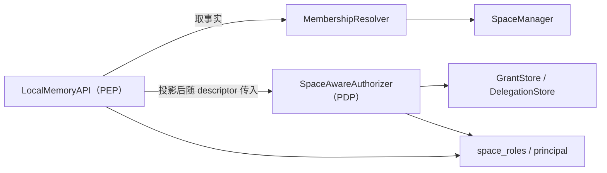

# F07 — 群体记忆端到端设计

## 元信息

| 项 | 值 |
|---|---|
| 日期 | 2026-08-20（决策 25 于 2026-08-28 追加；2026-08-29 并入原 `S09-collective-memory.md` 的契约章节，该规约随之删除——群体记忆是特性，不占模块规约编号） |
| 影响范围 | `jiuwen_memory/api/`、`jiuwen_memory/control/`、`jiuwen_memory/construction/`、`jiuwen_memory/common/security/`、`jiuwen_memory/common/type_def/memory.py`、`deploy/migration/`、`agent_plugin/jiuwenswarm/`、`docs/specs/S02-memory-api.md`、`docs/specs/S03-control.md`、`docs/specs/S04-retrieval.md`、`docs/specs/S05-construction.md`、`docs/specs/S07-common.md` |
| 测试基线 | 见「验证」 |
| 相关规约 | 本文档自带契约章节（接口契约 / 数据结构 / 判定规则 / 配置契约）；跨模块改动同步落 S02、S03、S04、S05、S07；安全横切契约随上游安全模块合入 |
| Refs | — |

## 背景

现状的记忆隔离建立在「一次调用一个 `scope`、`scope` 由调用方给定」之上。这套形态在单用户单代理场景成立，进入多用户、多代理、多项目协作后暴露六项缺口：

| 能力 | 现状 | 缺口 |
|---|---|---|
| 空间内的权限分档 | 成员记录只有一个 `role` 字符串，条目读写与成员管理共用一档 | 表达不出「能管成员但看不到条目内容」这一档，运营与内容两类职责只能同权 |
| 空间的归属 | 空间只有成员表，不记录它属于谁 | 没有成员记录的个体空间在判定看来无人可放行，本人访问自己的记忆要靠额外发放授权 |
| 代理调用与本人调用的区分 | 条目上没有作者位，判定也拿不到「这条是谁写的」 | 「谁在写」与「写给谁」不可区分，用户对自己代理的隔离无法表达 |
| 条目落哪个空间 | 完全由调用方传入的 `scope` 决定，内核不判断 | 一段对话里既有个人偏好又有团队约定时，两者只能落进同一个空间 |
| 跨空间检索 | 一次调用只查一个空间 | 调用方自行循环，逐次判定与结果合并的规则散落在接入层 |
| 主体能访问哪些空间 | `list_spaces` 走全 keyspace 遍历后逐个过滤 | 成本随全库规模增长，且没有可复用的「主体到空间」查询 |

第三项另有一条更基础的成因：接入层现状用同一个对象同时表达「谁在调用」与「读写哪个位置」。两者合一时，「代理替用户写」与「用户自己写」在判定看来完全相同，归属对比一步退化为无条件成立。因此身份与目标的分离是其余能力的前提，不是可选项。

## 目标模型

### 归属维与收窄维

判据是「换掉哪个坐标这条记忆就不成立，那个坐标即它的归属维」：

| 记忆 | 换 user | 换 agent | 换 project | 归属维 | 收窄维 |
|---|---|---|---|---|---|
| 「User1 的部署环境是 K8s」 | 不成立 | 成立 | 成立 | user | 无 |
| 「User1 让我用简洁风格回复」 | 不成立 | 不成立 | 成立 | user | agent |
| 「project1 的部署环境是集群 A」 | 成立 | 成立 | 不成立 | project | 无 |
| 「所有项目代码必须过 lint」 | 成立 | 成立 | 成立 | 组织，判定不可写入 | 无 |

三条配套规则：恰好一个坐标不成立时该坐标即归属维；多个坐标不成立时取隔离性最强的作归属维、其余降为收窄维；全部成立时归属最外层，但组织空间不接受判定写入，实际落 fallback——一个用户的一句话不足以确立组织级规范，允许写入等于任何人说句话即可影响全组织。

第二条规则的依据是判错后果不对称：落 user 空间加代理收窄时，谓词遗漏使同一用户的另一个代理看到其偏好，不构成泄露；落 agent 空间加用户收窄时，谓词遗漏使一个用户的偏好出现在另一个用户的会话中，属跨用户泄露。后者把跨用户硬边界交给了可选谓词。

### 归属维落空间，收窄维落标签

划分判据：越界的后果是内容被另一个主体看到，用空间；只是上下文混入无关内容，用标签。

| 概念 | 越界后果 | 载体 |
|---|---|---|
| user | 另一个人看到了本人的信息 | 空间 |
| project | 成员之外的人看到项目内容，且跨用户可见是设计意图 | 空间，兼收窄维标签 |
| agent-team | team 被多用户共用，本身不是可见性边界；做成空间会导致换 team 失忆 | 记录维标签 |
| agent | 同一用户的多个代理服务同一个人，互见不构成泄露 | 收窄维标签；跨用户复用的内容另落空间 |
| session | 跨会话互见即「记住上次」，是记忆的目的 | 收窄维标签 |

两套机制不可合并：

| | 空间：能不能看见 | 标签：该不该出现在上下文 |
|---|---|---|
| 判定者与时机 | 授权判定器，在调用入口、读数据之前 | 检索谓词过滤，召回时下推到索引侧，在 top-k 截断之前 |
| 默认方向 | 默认拒绝，无授权即不可见 | 默认放行，不加谓词即全部出现 |
| 判错后果 | 内容被另一个主体看到，不可逆 | 上下文混入无关内容或漏召回，可调整 |
| 合并的后果 | 全用空间：换代理换 team 即失忆，删 user 要遍历所有空间，空间数随实体组合增长 | 全用谓词：跨用户的硬边界降级为可选参数，遗漏即泄露 |

### 场景与空间清单

| # | 场景 | 空间形态 | 谁可达 |
|---|---|---|---|
| 1 | 用户名下某个代理专属的记忆 | 个体空间 + 代理收窄维 | 本人，以及本人经该代理发起的调用 |
| 2 | 单个用户使用一个 agent-team | 共享空间 | 成员表中的该用户与各代理 |
| 3 | 多个用户共用一个 agent-team | 共享空间 | 成员表中的多个用户与各代理 |
| 4 | 关于用户本人、名下任一代理均可读写的记忆 | 个体空间，不带收窄维标签 | 本人，以及本人经名下任一代理发起的调用 |
| 5 | 组织内全体共享 | 共享空间，组织通配成员记录 | 组织通配命中的全体；接入方只读 |
| 6 | 某代理跨用户复用的技能 | 共享空间，代理级配置 | 该代理与组织通配命中的用户 |

场景 1 与场景 4 同处一个空间，差别只在条目是否带代理收窄维标签，由标签区分而非空间区分。跨组织共享不在设计范围内：组织是硬隔离，判定第 6 步无条件拒绝，合作双方各自建空间。

**不设用户私密空间，也不设条目级的可见性声明。** 现有覆盖判定是前缀语义，父 scope 某一维为空时不约束该维，因此「用户私密空间」对该用户名下的代理同样覆盖成立；前缀覆盖没有「该维必须为空」的表达形式，写一个占位取值会连用户本人一并挡掉。「让一部分内容对用户名下的代理不可见」这一诉求本方案不承接，理由见决策 19：要做这类隔离，做法是把内容放进另一个空间。

## 决策

### 决策 1：权限拆成内容与治理两条独立的轴

内容轴管条目的读写改删，治理轴管成员与策略。同一成员可以只持有其中一轴。

单轴增加档位表达不出「能管成员而看不到内容」——这是运营与内容两类职责分离的最小要求。两轴的代价是成员记录多两个字段与一次存量兼容解析，均可控。

治理轴中间档取名 `manager` 而非 `admin`，与上游组织级 `Role.ADMIN` 区分：两者作用范围、数据来源与判定位置都不同，同名会在读代码时被当成一回事。

### 决策 2：个体空间靠归属登记裁决，不写成员记录

空间登记归属主体，成员表为空时按归属登记与条目作者标记裁决。

备选是给每个个体空间写一条成员记录。不取的原因是写成员记录即成员表非空，各主体转由角色求值，内容权可编辑即互相可读，与个体记忆的隔离要求直接冲突。

登记项取单维而非把调用方身份整体记下，是为了让本人直接调用与经代理调用对上同一条登记。

### 决策 3：归属对比只放行内容轴

治理动作（删空间、改策略、导出）经归属对比一律不通过，另按归属主体档的入口清单裁决。

归属关系说明条目属于谁，不说明可以处置这个空间。放开后一次删空间即删掉其他归属者的条目——回填产生的多归属空间使该情形真实存在。

### 决策 4：判定判据与宿主分离，宿主取控制层 `PermissionManager` 的实现

判定拆成两部分：**判据主体**是不访问存储的纯函数，落 `common/security/space_decision.py`；**宿主**负责取空间事实、调用判据、把结论折算成调用方要的形态，落控制层 `PermissionManager` 的实现 `space_aware`，与 `sqlite` / `allow_all` / `routing` 平级注册。

这一分工是本决策的实质。判据不绑定宿主，安全架构演进时换宿主只改外壳、不动判据主体。三条成立依据：

| 依据 | 证据 |
|---|---|
| 签名同构 | `PermissionManager.check(actor, target, action, context) -> bool` 的输入输出与任何一个判定契约等价 |
| 空间事实有通道 | `PermissionContext` 是本仓库自有类型，加一个字段承载 `SpaceAuthorizationFacts` 不需与外部类型作者对齐——而这是本方案唯一一项须对齐的外部依赖（决策 5） |
| 入口名已在参数中 | `_authorize(..., audit_action=...)` 传的就是入口名，归属主体档两级清单按它查表，不依赖任何外部动作枚举 |

取独立实现而非装饰既有实现：两轴求值必须嵌在授权记录求值的内部（成员记录与授权记录先取并集、再按两维取交），装饰形态插不进那个位置。代价是判定顺序中的若干步要照抄一遍，源实现改次序时两处须同步——这一代价在文档与代码注释中都要显式标注。

#### 五步无判据来源

十步判定中有五步在本特性内无判据来源，全部因组织级角色与委托记录不属本特性范围：

| 步 | 缺失项 | 处置 |
|---|---|---|
| 1 身份形态校验的组织级形态 | 组织级 `Role` | 数据面入口由 `require_principal` 拦截 |
| 3 管理面角色闸门 | 组织级 `Role` | 组织级入口（`create_space`、`audit`）维持现状判据，不落入两轴求值 |
| 4 `ROOT` 放行 | 平台级角色 | 同上 |
| 5 组织 `ADMIN` 治理放行 | `auth.role` | 不实现。两项情形因此不可解：空间拥有者离职后无人可治理；显式声明不登记归属的共享空间（`SpaceSpec.owner` 取 `Scope()`）引导不出第一个成员——成员表为空且无归属登记，任何具名身份都被判定拒绝，须由运维脚本直接经 `SpaceManager` 写入首条成员记录 |
| 9 代操作委托 | 委托记录存储 | 不实现 |

除第 3 步外均为「命中即放行」分支，缺失方向是更严格而非更宽松，不构成越权。第 3 步是终局判据，其缺失会使组织级入口落入后续步骤而被拒，故上表单列处置。

另有一处方向相反的既有行为：`sqlite_permission_manager` 对空身份放行，而本特性的第 2 步对空身份拒绝。数据面入口由 `require_principal` 拦截，运维通道保持现状。

#### 两条编码约束

两条都是为了让判据主体不被宿主形态污染，须在施工时落实：

| 约束 | 理由 |
|---|---|
| 判定主体的内部返回 `(allowed, rule, reason)` 三元组，由 `check` 外层折算为 `bool` | 带判据的结论对象要求放行与拒绝两侧都填 `rule`。主体直接返回 `bool` 则换宿主时每个分支都要补 `rule` |
| 判定步骤按目标次序编排，不照抄 `sqlite_permission_manager` 现有次序 | 现有次序是「主体覆盖 → 组织边界」，正确次序要求组织边界在前，以使跨组织请求得到准确的拒绝原因。新实现不改老实现，次序可自由选定 |

判据主体带出一个空间判定专用类型 `common.security.space_decision.DecisionOutcome`，经 `PermissionManager.decide` 暴露给鉴权点。引入的理由是空间策略裁剪要知道本次通过的是哪条轴，而布尔 `check` 表达不了，另发起一次判定又与 F07「裁剪不另发起一次判定」相悖。

### 决策 5：空间事实由鉴权点一次读取后传入判定实现

判定实现不读存储，这是判据主体做成纯函数的前提（决策 4）。同时，状态校验、归属对比的前提与两轴求值必须看到同一份成员表，否则一次调用内的三处判据可能基于不同快照。两条合起来只有一个解：鉴权点在入口处取一次，随资源描述对象下发。

空间级目标缺事实即按拒绝处理，不回落到「判定实现自己去读一次」——回落会掩盖装配缺失，且使性能预算不可核算。

该通道需要给上游 `ResourceDescriptor` 增一个结构化字段。这是本方案唯一的外部依赖，须与上游类型作者共同确定，未定前判定的入参部分不定稿。

### 决策 6：空间生命周期状态留在鉴权点，不进判定链

状态检查不问「谁」，只问「这个空间此刻允许什么动作」，换任何调用方结果相同，不是授权判定。

更实际的理由是错误类型：留在鉴权点仍抛参数校验失败，调用方能区分「空间已冻结」与「无权限」；并进判定后只剩布尔结论，两者会合并成同一个拒绝。代价是判定实现单独看不完整，须与鉴权点合起来读。

### 决策 7：组织级 `ADMIN` 自动获得本组织的空间治理权，只覆盖治理轴

与上游「组织管理员可管理本组织内主体」的语义一致。否则空间拥有者离职后该空间无人可治理，只能由平台方介入单个租户的内部空间。

内容轴不放行：组织管理员默认读不到空间内的记忆内容。已知性质是组织管理员可以把自己加为内容轴成员从而取得内容权——该路径经过判定并落审计，与「默认可读」不同。

连带约束：该角色不得发给最终用户。发了即等于该用户对本组织全部空间持治理权，治理轴整体失效。用户主空间因此改由开通服务预建。

### 决策 8：归属判定做成构建层可装配算子，插在抽取之后

判定的输入是抽取产出的派生单元，API 层拿不到；做成算子也使未装配时行为与改造前一致，可灰度上线。

插入点必须早于去重：去重按候选自身的 scope 取数并按同 scope 过滤，判定晚于去重会导致在源空间比对、在目标空间落盘。

### 决策 9：判定覆盖同步抽取与结论直写两类路径，不覆盖后台通道

三条路径判定：同步抽取（派生单元逐条判）、过程记忆抽取、以及结论直写（`infer=false` 且 `scope.space` 为空）。判定位置分两类——前两条在构建层的抽取之后插入；结论直写没有抽取环节、构建层没有插入点，判定由控制层 `control/collective/routing.py` 调用构建层算子完成，API 层只把入参内容整体作为一条候选、连同已鉴权的候选空间集合送进 `RouteContext`，判定只在集内选择，无从扩权。

结论直写这条路径最初被判为「不需要判定」，理由是它落盘的是原文整轮对话、不是可归属的记忆条目。该定性只对逐轮同步的原文落盘成立，对接入层的结论写入入口不成立：后者写入的是一条已经成形的结论，恰是最需要归属判定的产物；不判定的实际后果是项目级事实经此入口永远进不了协作空间。

两类路径的失败处置不同：派生单元判为丢弃即剔除，结论直写判为丢弃时取 fallback——落盘的是调用方给的内容，不能替调用方丢弃。

后台通道无法判定的原因是机制性的：判定上下文经瞬态 metadata 键传递，落盘时按瞬态键清单过滤，而后台任务从存储重新读取原文，反序列化后该键已不存在。全覆盖需要落盘一份坐标副本，属后续阶段的工作。

首版的规避方式是接入层在同步抽取模式下不再调用会话结束时的批量抽取——否则同一事实可能既被同步判定进其他空间、又被后台任务落进任务自身的 scope，而去重跨空间不比对。

### 决策 10：判定首版只交付模型实现

规则实现需要一套「类别到关键词或正则」的配置，而类别名来自接入方声明，不可照搬既有分类器的模块级常量；规则缺失时它整体落 fallback，等同判定关闭。判定失败的降级已由算子调用处的异常分支承担，不需要第二个实现充当降级通道。

代价是判定路径的写入时延增加约一倍。按批而非按条调用是硬要求：一次抽取常产出 3 到 8 条派生单元，逐条调用会把这项放大同等倍数。

### 决策 11：成员表由逐成员键改单键

判定链每次调用都要读成员表，逐成员键的遍历因此落在全部数据面调用的前置路径上，在部分后端上是全 keyspace 扫描。改单键后成员读取由遍历变一次点读，成本与后端规模、空间内条目数均无关。

读取侧不做「新键读不到就回落去遍历旧键」的兼容：保留回落等于那个遍历永久留在鉴权路径上，本项改造的收益就没有了。因此必须靠回填把老键合并成新键。代价是同一空间的并发成员写入以后写覆盖结束。

### 决策 12：反查索引只有三类桶键

具名 user、具名 agent、组织通配，不设 user 与 agent 双维桶，并在成员写入处校验拒绝双维记录。

原因在判定侧而非索引侧：两轴求值按两维各取最具体的一条记录再取交，一条双维记录会在两维同时命中，取交退化为与自身相交，「两维各自约束」的语义消失。同一用户名下的代理收窄由收窄维标签承担，不需要成员记录表达。

索引语义按「超集」定义：允许多给（候选集虚大，逐空间判定裁决），不允许遗漏（漏给表现为空间不可见）。写入次序因此为主数据先、索引后，删除次序相反。

### 决策 13：缓存失效由 API 层的治理入口下发

不放在空间管理器内部：后者会与事实解析模块构成构造期环，且匿名构造会产生两份实例使失效静默无效。事实解析模块的消费方唯一确定为鉴权点，失效落点因此没有第二种选择。

代价是绕过 API 层直接操作空间管理器时不触发失效，最长滞后一个 TTL。该形态只应用于装配期与运维脚本。

### 决策 14：`coords` 经参数袋传入，六个入口的形参列表不变

早前形态取显式入参，理由是 `Context.extensions` 的既有约定为「内核核心不解释其内容」，
把一项内核必须解释的语义输入放进去会使该约定在两处成立、在一处不成立。最终改为参数袋，
两项判据推翻了它：

| 判据 | 说明 |
|---|---|
| 形参改动的影响面 | 写入侧 `add` / `batch_add` 本无 `Context` 形参，检索侧加形参则六个入口的签名全部变更，全部存量调用方与仓库外 HTTP 层须同批改造；参数袋只需网关透传既有字段 |
| 「不解释其内容」已有先例 | `EXT_MAX_TOKENS` 同样是内核解释的键，同样在入口即取出并从副本移除，本键照同一处置 |

落点因此是：写入侧 `system_metadata["coords"]`，检索侧 `Context.extensions["coords"]`，
入口即取出、不落盘、不下传（S02「归属坐标不占形参，经参数袋传入」）。原理由中「调用方
无从从签名看出这次检索是否受坐标影响」这一项作为已知代价保留，由文档与运行期判型承担。

代价是仓库外的 HTTP 层须同批同步透传这两个字段与跨空间检索的 `spaces` 键，否则取值在网关处被丢弃、表现为判定始终落 fallback。

### 决策 15：`list_spaces` 取消翻页语义

逐空间求值使过滤发生在候选切片之后，分页与终止条件不可兼得：返回值不带游标时，「候选已耗尽」与「本页候选全被判定拒绝」在返回值上都是空列表。

`limit` 因此转为返回条数上限，`cursor` 签名保留但停用、标记废弃，存量调用方传入任意游标都得到同一份完整结果，不报错。

候选来源另有一处定案：不取主体反查索引，理由见 F07「`list_spaces` 的候选来源」——索引的超集契约针对成员关系，靠显式授权取得读权的主体不在其中。

### 决策 16：主体次序（`principal_path`）跟随上游保留

早前设计停用该维度并固定为用户优先，理由是「次序由请求决定不安全」。上游已把它的取值来源从请求上下文改为空间策略这个真源，该理由不再成立；继续停用只剩实现简化一项收益，代价是与上游行为分叉。

保留后存量授权记录的匹配语义不变，早前设计里那项「升级前须审查存量授权」的动作随之取消。

### 决策 17：五个组织级入口改走上游角色闸门

`create_space`、`audit` 与三个 `admin_*` 的动作取上游管理面动作，由角色闸门终局裁决，不再由授权记录裁决。

上游已有一套管理面动作与角色闸门，另立一套等于同一件事两处判据。方向是收紧：「谁能建空间」由授权发放改为服务端角色配置。连带影响用户开通流程，见「破坏性变更」第三项。

空间内的策略配置不取上游的 `MANAGE_POLICY`：该动作在闸门里要求组织级 `ADMIN`，取它会使空间拥有者改不了自己空间的策略，而空间策略正是空间自治的内容。

### 决策 18：两族检索谓词分开生成

第一族（个体空间系统谓词）由空间事实与调用方身份生成，调用方不可干预；第二族（收窄维谓词）由调用方声明的坐标生成。

第二族允许调用方控制不构成越权：空间级读权已由判定裁决过，改写坐标只能在本来就有读权的空间里换一批结果。实现上两族必须分开写，要防的是一件具体的事：不能因为第二族接受外部输入，顺手把第一族也做成可配置或可关闭。

两族与调用方过滤表达式合成一个 AND 表达式一次下推，不做召回后二次过滤——二次过滤会让被筛掉的条目白占召回名额，最终返回条数少于请求条数。

### 决策 19：条目的可读范围由空间权限决定，不设条目级可见性声明

写入入口不提供声明条目可见性的入参，条目上也不落对应的 metadata 键。作者代理（`author_agent`）只作记录项，判定不读它：同一用户经其名下任一代理发起的调用与本人直接调用推导出同一个作者主体，因此换代理不改变可达性。

早前方案在写入入口设 `private: bool = False`，用于表达「这条对该用户名下的代理不可见」。该设计的判据是调用方身份的代理维，而接入层的代理维当前由调用方在请求体中经 `actor_agent` 字段自行声明、服务端不校验（`bootstrap/core/handler.py` 的 `_actor_scope`，注释即写明是 claimed actor）。判据可由调用方自行规避，标记因此不构成任何强度的隔离，反而使读者误认为敏感内容受保护。

替代做法是空间隔离：要让一部分内容对某些主体不可见，把它放进另一个空间。后续若确有条目级的需求，须与安全横切契约提供的可信代理身份一并引入——彼时代理维取自认证产物，判据才成立。

作者主体（`author_principal`）保留并仍参与判定：它是「本人所写」判据、代理自主运行的隔离与删 user 连带清理的依据，这三项都不依赖代理维。

### 决策 19b：调用方指定的空间须显式创建；fallback 空间按开关自动创建，默认开

写入未注册的空间由放行改为拒绝。这不是新增的存在性校验，而是判定生效后的结果：鉴权的两个判据（归属登记与成员记录）都存放在空间注册记录里，未注册时两者皆空，四条放行路径全部落空。

**两种写入形态的结论不同，判据是「空间名由谁决定」**：

| 形态 | 空间名的来源 | 自动创建 | 理由 |
|---|---|---|---|
| 调用方传入 `scope` | 调用方给的字符串 | 不做 | 内核只有「坐标 → 空间名」的渲染方向，反解不出该空间归谁：模板是接入方声明的任意字符串，`u_{user}` 与 `p_{project}` 可以匹配同一串。归属只能登记给写入者，于是先写入者即占有该空间名——知道命名规则即可在他人开通前抢占其主空间 |
| `scope.space` 为空，fallback 空间不存在 | 内核用调用方自己的身份渲染 | 做，默认开 | 别的主体渲染不出这个空间名，没有抢占面；归属该登记给谁是确定的——调用方本人 |

本决策的初版把两种形态一并否决，理由是「空间名可被猜中」。该理由只对第一种成立：fallback 空间名由调用方自己的身份渲染，猜中别人的名字也渲染不出来。初版另一条理由「要把『哪个类别是个人主空间』的判断写进写入路径」同样不成立——fallback 类别由判定表的加载期第 4 条校验保证有且仅有一个，写入路径直接取它，不需要额外判断。

保留的把关点因此只剩组织对空间开通的控制（配额、成本归集、合规口径），而这些可以后置到用量统计与审计，不必在创建时把关。开关关闭即回到硬前置形态：

| 项 | 内容 |
|---|---|
| 策略键 | `space.auto_create_fallback`，默认 `true` |
| 作用范围 | 只有 fallback 空间；坐标指向的协作空间不自动建——共享形态成立的唯一条件是成员表非空，而内核不产生成员记录 |
| 只处理「不存在」 | 空间存在但调用方无写权（归档、被移出归属登记）时不创建，照常拒绝。否则任何一次写入都能把归档撤销 |
| 执行通道 | 走空间管理器而不是 `create_space` 入口：这是内核代行的动作，不该按调用方身份过一次建空间的闸门。仍落一条审计事件使其可归因 |
| 空间策略 | 取默认值。按套餐设配额仍须由开通服务预建，两者不冲突——预建过的空间不触发自动创建 |

代价：开关关闭时接入方的开通流程是硬前置，且须先于内核上线，否则新主体的首次写入全部失败。该项列入发布说明与上线次序约束。

### 决策 20：两轴角色、归属主体档清单与身份比较函数落安全层

这些不落 `control/types.py`，也不落 API 层，而是落 `common/security/space_roles.py` 与 `common/security/principal.py`。

最初的落点是控制层类型模块；设计当时那里仍有五值动作枚举，与本方案取的安全域 12 值枚举无法同模块共存。当前 `control/types.py` 已兼容再导出同一个安全域 `Action`，但更根本的落点理由不变：消费方跨三层，矩阵被判定实现与鉴权点两侧读取，角色枚举还要作成员记录的字段类型（控制层），三者能共同依赖的只有公共层。落上层即安全层反向依赖上层，与「判定事实的类型不能落控制层」是同一条判据。

判定事实因此也分两层：控制层持全量快照供状态校验与谓词生成，安全层只收最小投影（归属登记 + 成员记录的两轴角色）。空间策略与生命周期状态不进入判定的可见范围，与「状态校验不是授权判定」一致。

### 决策 21：归属主体档排在两轴求值之前

第 10 步分两段，归属主体档在前。这不是风格选择，而是可达性要求。

排在后面时，个体空间的判定链是这样的：主维取不到成员记录，在「主维无记录即拒绝」处终止，归属主体档整段不可达。而预建的用户主空间恒不写成员记录——个体形态正是代理收窄与作者隔离的依据。后果是用户改不了、删不了自己的主空间，也读不到它的策略与成员表，而条目读写照常通过（那条由归属对比放行）。症状是「部分能用」，不产生任何用例失败。

原次序还有一处不稳定：主维取自空间策略里的主体次序，取值翻转时「主维无记录」的条件随之翻转，同一条判据的可达性随空间策略变化。

前置只在一个方向上改变结论：原先在「主维无记录」处被拒、而归属主体档本应放行的请求改为放行，范围恰好是两级清单列出的入口；两段都通过的请求集合不变。

### 决策 22：`list` 也注入第一族谓词

早前只在 `search` 与跨空间检索两处注入。`list` 是同样按空间返回条目的批量入口，不注入的后果与 `search` 同因同向：自主运行的代理读得到该空间内其他主体所写的条目，回填期的多归属空间中两个归属主体互相读得到对方的条目。

它的逐条鉴权不能替代谓词：失败形态是抛异常而非过滤，一条不可见的条目会使整次调用失败。同理，`list` 的第二段鉴权不携带作者标记，内容边界改由谓词在取数时承担。

`list` 不增坐标入参，只注入第一族。第二族是上下文相关性而非隔离依据，而 `list` 是枚举入口：按当次会话或项目收窄会使返回集少于该空间的实际内容，且调用方无从察觉；`search` 按相关性排序、召回本就不完整，收窄不产生同类误解。

### 决策 23：五类空间的开通形态定为契约

共享形态成立的唯一条件是成员表非空，而三个可能的建立方都不承担这件事：内核不产生成员记录，回填只处理存量个体空间，接入层的写入路径不调建空间与加成员。

缺这一段的后果不是「共享空间的权限配不全」，而是四类共享空间没有任何建立途径：首次写入产生的隐式空间成员表为空，判定按个体空间处置，第二个用户的内容落回自己的主空间，协作从头到尾不成立。空间命名解决的是「坐标怎么变成空间名」，不解决「成员表从哪来」。

因此逐类空间写明建立时机、调用方、是否登记归属主体、开通时写入哪些成员记录，执行方是接入方服务侧，内核侧的支撑改动只有建空间入口的一个归属主体入参。

### 决策 24：实体删除后的清理不由内核编排，只交付谓词能力

早前的设计给了一个 `cascade_delete(entity, entity_id, org, *, identity)` 入口：由内核按判定表推导谓词、按主体反查索引枚举空间、逐个鉴权执行。施工后经端到端推演撤下该入口，内核只保留 `DeleteSelector.filters`（判定标签与作者主体标记都落在 `metadata` 上，既有的 `tags` 是标签数组、表达不了键值对），编排交给接入方。

三条判据：

| 判据 | 内容 |
|---|---|
| 唯一有合规驱动的场景，谓词语义不匹配 | 三类实体里只有删 user 有明确驱动（数据主体删除权）。而该步的谓词是 `author_principal EQ "user:<id>"`，语义是「谁写的」，合规要清的是「关于谁的个人数据」。差集双向存在：协作空间里该用户写的项目知识不是他的个人数据，一并删掉对组织是损失；别人写的关于他的条目该删而删不到 |
| 内核枚举不比接入方的名单更全 | 反查索引是**当前**成员关系的派生，不是历史足迹。主体退出某协作空间时索引项随成员记录一并删除。实测：alice 退出 `p_apollo` 后 `cascade_delete("user","alice")` 只清了主空间，协作空间那条留存且不报错——失效方向是静默漏删，而合规场景里漏删比多删严重。业务系统保有历史参与记录，反而更全 |
| 另两类实体的需求存疑 | 项目结束通常是归档而非删除；会话记忆的生命周期已由 TTL 与 forget 通道承担 |

连带取消 R04 的两项缺陷（D3「连带按调用方身份反查」、D4「整空间清除走内容轴」）——两者都在该方法体内。撤下后仍缺一项对外形态：**清空一个空间的内容但保留空间本身**，`delete` 的空选择器校验拒绝三项皆空的 selector，`delete_space` 则连元数据一并删。需要时另定接口，不在既有入口上开旁路。

### 决策 25：跨空间召回的扇出下沉控制层，逐空间判权与谓词生成留 API 层

跨空间检索原先整段落在 `local_memory_api.py`：定候选、逐空间判权、摊配取数上界、逐空间构造 `RetrievalQuery` 并召回、轮转合并。第 3—5 步（摊配、扇出、合并）移入新模块 `control/collective/cross_space_recall.py`，前两步半留 API 层。

**分界判据取 S02「不做业务编排逻辑」那条的原文——「移出本层是否还能按 `identity` 裁决」，不按「这一步是否属于检索」。** 逐条对照：

| 步 | 读 `identity` 吗 | 落点 | 移出的后果 |
|---|---|---|---|
| 1 定候选空间 | 读（反查索引按主体） | API | 反查移出即主体可见范围的计算离开 PEP |
| 2 逐空间判权与状态校验 | 读 | API | 循环体就是 `PermissionManager.decide` 本身，移出即 PEP 分裂为两处（S03 不变量 22） |
| 2.5 逐空间谓词 | 读（两族谓词按身份与空间事实生成） | API | 属 S02「鉴权驱动的编排」明列的「生成并回注系统谓词」，移出即系统谓词的来源离开 PEP |
| 3 摊配取数上界 | 不读 | 控制层 | — |
| 4 召回扇出 | 不读 | 控制层 | — |
| 5 轮转合并 | 不读 | 控制层 | — |

第 3—5 步在候选集与谓词都已定妥之后执行，全程不需要知道调用方是谁。留在 API 层的代价不是「多几行」，而是 PEP 里多出一段与鉴权无关的取数编排——逐空间构造 `RetrievalQuery` 的循环本身就是取数编排，与 S02「不做业务编排逻辑」直接冲突。

**下沉的两条形态与写入侧对齐。** 与 `write_targets.py` 收 `can_write` 回调同形：

| 项 | 写入侧 | 检索侧 |
|---|---|---|
| 回调 | `can_write`（判权） | `recall`（引擎门面） |
| 成品数据 | `RouteContext.candidates`（已判权候选集） | `SpaceRecallTarget`（已判权空间 + 逐空间谓词） |
| 不收 | `identity`、`PermissionManager` | `identity`、引擎实例、检索算子 |
| 不抛 | 权限异常（返回 `fallback=None` 由 PEP 抛） | 权限异常（判权在 API 层，本模块只处置扇出失败） |

控制层因此只 import `retrieval/cross_space.py` 的三个纯函数（无 Producer 注册、实现不可替换、不访问存储与模型），不 import 引擎实现与检索算子。依赖方向 control → retrieval 与 `engine.py` / `pipeline.py` 既有的类型依赖同向，检索层不反向依赖控制层，无环。这需要 S03「不执行检索」补一条限定——否则下一轮检视必把这次调用记成新的越界。同步桥接仍留 API 层：控制层给协程，API 层 `asyncio.run`。

**纯助手不跟着搬。** `allocate_quota` / `merge` 留在 `retrieval/cross_space.py`：S04「管什么」第 4 条「融合：多路候选合并去重」正是它们所做的事，刚定的落点不因调用方换了一层就反悔。新增的 `space_error` 与它们同处——判权剔除在 API 层、扇出失败在控制层，两处产出同一形态的错误项，共用一个构造点即 `channel` / `source` 的编码只有一份。

**空间级扇出失败与判权剔除分两路返回。** 控制层交回 `(merged, space_failures)`，不把 `space_failures` 并进 `merged.errors`。理由是耦合而非来源区分：`merge` 已把每空间的分通道错误（`VECTOR` / `KEYWORD` 等）并进 `merged.errors`，扇出失败再并进去，API 层要为「整个空间挂了」写审计就只能按 `channel is RecallChannel.SPACE` 过滤——那是把审计判据绑在控制层的 channel 编码上，控制层改一次编码即静默改掉上层的审计范围。分两路之后 API 直接拿列表写审计，再 `merged.errors.extend(denied + space_failures)`，返回值三类错误齐全。

**命名不取 `read_targets.py`。** 与 `write_targets.py` 对称的读侧概念是「哪些空间可读」，那恰恰是留在 API 层的第 2 步；本模块做的是判权之后的召回扇出，叫 `read_targets` 会指向它不承担的那件事。`cross_space_recall.py` 字面即内容。它与 `retrieval/cross_space.py` 名字相近，由包路径消歧（`control/collective/` vs `retrieval/`），且两者是调用方与被调方的关系，同名根反而提示同源。

**行为逐字不变。** 本次只搬位置，不修缺陷：返回值、异常类型、审计事件与日志内容都不动，唯一新增是审计明细里的 `failed_spaces` 计数——它是分离返回之后顺带可得的，此前该数字无处可取。净减 API 层约 70 行（3188 → 3112，2.4%）。B-03 记的其余几项（路由分流、两段鉴权、`middle` 排除、状态校验）都是 PEP 内生职责，由 S03 不变量 22 钉住，本次不碰。

## 两个开关与四种部署组合

特性由两个互不相关的开关控制，各自独立开启：

| 开关 | 判据 | 开启后生效的部分 |
|---|---|---|
| 空间治理 | 判定实现声明需要空间事实（`permission.default.target = space_aware`） | 两轴角色判定、归属对比、归属主体档、检索谓词第一族、空间状态校验扩展至全部入口 |
| 归属判定 | 声明 `router` 命名空间且判定表非空 | 写入侧 `scope.space` 可为空、归属坐标生效、候选空间集合、显式 `scope` 归一、检索谓词第二族、写入边界校验 |

| 组合 | 行为 | 是否合法 |
|---|---|---|
| 两个都不开 | 与改造前一致 | 合法，是灰度上线的起点 |
| 只开空间治理 | 空间之间有权限边界，`space` 为空照旧直写、归属坐标不产生落点 | 合法 |
| 只开归属判定 | 内容按坐标分流进协作空间，而协作空间没有任何权限边界 | **装配期拒绝** |
| 两个都开 | 完整特性 | 合法 |

第三种组合等于把内容写进一个组织内任意主体可读的位置，方向为放行，且从调用侧看不出异常——写入成功、检索也拿得到，只是拿得到的人多了。由 `_reject_routing_without_space_authorization` 在 `build_kernel` 末尾拒绝，不靠配置注释提示。

## 不变量

1. **`MemoryAPI` 是唯一鉴权点（PEP），判定实现是唯一判定点（PDP）**：判定不落控制层 `PermissionManager`——该算子在上游改造后退出请求授权路径，只服务兼容测试。本条约束目标形态；上游未合入期间的宿主形态与迁移义务见「判定宿主的过渡期形态」。
2. **判定实现不访问存储**：判定所需的空间事实由 PEP 一次读取、折算为最小投影后随资源描述对象传入；空间级目标缺事实即按拒绝处理，不回落为「判定实现自行读取」。
3. **安全层不反向依赖上层**：两轴角色、动作矩阵、归属主体档清单、判定事实投影与身份比较函数全部落 `common/security/`，其消费方跨安全层、API 层与控制层三侧。
4. **身份只有一个来源**：调用方身份取自 `security.auth.actor`，不新增 `identity` 入参，不由调用方经普通入参声明。
5. **身份不下沉**：作者标记在 API 层由身份推导后写入条目 metadata，`identity` 不传入引擎层与构建层。
6. **判定不改写调用方身份**：会话维在判定实现内部剥除用于比对，传入的 `AuthContext` 本身不改写——它是认证边界的产物。
7. **作者标记不可伪造**：`author_principal` / `author_agent` 由内核按身份推导写入，属保留 metadata 键，写入路径拒绝调用方赋值。
8. **判定相关的 metadata 键恒写入**：全部收窄维标签键在写入时一律落键，取值为空也不省略——两族谓词的语义依赖键存在，键缺失时过滤算子的行为不可预期。
9. **两轴独立授予**：内容轴与治理轴各自映射到一组动作，同一成员可以只持有其中一轴；归属对比只放行内容轴。
10. **归属关系不蕴含处置权**：归属主体经归属对比只取得内容轴的条目动作，治理动作与整空间导出另按归属主体档的入口清单裁决。
11. **空间生命周期状态不进判定链**：它不问「谁」，作为 PEP 的后置校验执行（排在授权通过之后），错误类型为参数校验失败，与无权限可区分。
12. **成员记录主体维取单维**：`user` 与 `agent` 同时非空的成员记录在写入处被拒绝；反查索引因此只有具名 user、具名 agent、组织通配三类桶。
13. **判定不扩权**：多空间写入的候选空间集合由「调用方在该空间有写权」机械推出，归属判定算子只在集内选择。
14. **反查索引是超集**：允许多给（候选集虚大，由逐空间判定裁决），不允许遗漏；写入次序为主数据先、索引后，删除次序相反。
15. **两族检索谓词分开生成**：第一族由空间事实与调用方身份生成、调用方不可干预；第二族由调用方声明的归属坐标生成。第二族可配置不得使第一族一并可配置。
16. **谓词一次下推**：两族谓词与调用方过滤表达式合成一个 AND 表达式随查询下推，在 top-k 截断之前生效，不做召回后二次过滤。
17. **单条判据与批量谓词同源**：「某条条目对当前调用方是否可读」在判定链与检索谓词两侧用同一个判据（`author_principal`）。判据分叉即出现「搜不到但按 id 读得到」或其反向。
18. **判定失败不阻断写入**：归属判定算子异常或未装配时，产物落 fallback 空间，行为与未启用该特性一致。
19. **判定早于去重**：归属判定插在抽取之后、去重之前；晚于去重会导致在源空间比对、在目标空间落盘。
20. **判定表来自配置**：类别、收窄维与空间命名由部署声明，加载期校验不通过即装配失败，不留到运行期。
21. **内核不认识接入方的产品概念**：归属坐标的键集合由内核自带三项（`user` / `agent` / `session`）加部署声明项构成，后者只作字典键透传；内核三项以身份为准，不接受调用方覆盖。
22. **条目落盘 scope 只有两维**：条目一律存在 `Scope(org, space)` 下，主体维与会话维交由条目上的作者标记与收窄维标签表达。

## 接口契约

### 鉴权点的职责（`_authorize`）

PEP 在上游既有职责（来源证明校验、凭据撤销复核、调 PDP、放行与拒绝审计）之上增加三件事：空间事实读取、事实投影与属性编排、空间状态校验。

| 步骤 | 内容 |
|---|---|
| 1 形态校验 | 数据面入口要求身份带主体维，两维皆空即拒绝 |
| 2 取事实 | 目标带 space 且调用方未传入时，取一次空间授权事实；后端异常时留空，由 PDP 按拒绝处理 |
| 3 编排属性 | 轴、入口名、条目作者标记、主体次序写入资源描述属性 |
| 4 折算投影 | 控制层的空间事实折算为判定用的最小投影，一次折算、两轴共用 |
| 5 判定 | 一次判定一个轴；「两轴任一」在本层依次尝试，治理轴在前，任一通过即放行并记下通过的轴 |
| 6 状态校验 | 排在授权通过之后、入口返回之前 |

第 5 步的轴次序不可颠倒：治理轴不查授权记录，且其结论要被空间策略裁剪复用。

第 6 步的位置是刻意的：排在授权之前，无权调用方也能凭错误类型判断出该空间处于冻结或归档，与「不泄露空间是否存在」的方向相反；排在之后不削弱约束——归属主体与成员都要先过授权再撞上状态校验，平台级角色则两处都不受限。

**条目级入口分两段鉴权，两段的目标不同。**

| 段 | 目标 scope | 额外携带的属性 | 判什么 |
|---|---|---|---|
| 第一段 | 入参 scope 经归一后的空间级 scope（主体维恒为空） | 无 | 调用方对该空间有无该动作的权限。空间不存在即在此拒绝 |
| 第二段 | 条目真源 scope，由引擎从条目本身取回 | `author_principal` | 归属对比的作者标记比对与「本人所写」附加集合 |

两段都通过才放行。第二段的目标必须取条目真源 scope，不得沿用入参 scope：这是「判定第 8 步不会命中」的前置条件之一，也是「本人所写」判据能拿到作者标记的唯一途径。

`search` 与 `export_space` 只有第一段：前者的目标是查询范围、后者是整个空间，都不落到具体条目，内容边界由检索谓词与归属主体档承担。

**`list` 是两段，但第二段不携带作者标记。** 逐条鉴权的失败形态是抛异常而非过滤，携带后个体空间内只要有一条作者不是调用方的条目，整次 `list` 调用即失败——代理自主运行写入的条目与回填期多归属空间中另一归属主体写入的条目都属此列。`list` 的内容边界改由第一族谓词在取数时承担，第二段只判条目真源 scope 的空间归属。

### 空间状态校验

```python
def _ensure_space_state_allows(facts, action, entry, auth) -> None: ...
```

由现状的写入前置校验扩展并改名，调用点由两处扩到全部入口，判据由「非活跃即拒写」扩为完整状态规则：

| 状态 | 规则 |
|---|---|
| `ACTIVE` 或空间不存在 | 通过 |
| 平台级角色 | 一律通过，否则冻结不可逆、运维无法介入 |
| `DELETING` / `DELETED` | 全部动作拒绝，不适用任何豁免 |
| `FROZEN` / `ARCHIVED` | 读动作放行；仅改状态的那次变更放行；其余拒绝 |

「仅改状态」按修改内容判定，不按入口名：`update_space` 同时能改 `policy` 与 `principal_path`，二者都是判定依据，只看入口名等于允许在冻结态改写判定依据，冻结语义随之不成立。

仍抛参数校验失败而非权限拒绝。**错误类型的可区分性由调用次序保证，不是自动成立的**：无权调用方得权限拒绝（此时不透露状态），有权调用方对冻结空间得参数校验失败。次序被改动不会使任何既有用例失败，须有专项回归。

### 空间感知判定实现

判定是安全横切契约的 `Authorizer` 契约的第二个实现，与 `StandardAuthorizer` 平级、互斥装配。取独立实现而非装饰上游实现，是因为两轴求值必须嵌在授权记录求值的内部（成员记录与授权记录先取并集、再按两维取交），装饰形态插不进那个位置；代价是上游判定顺序中的五步要照抄一遍，上游改次序时两处须同步。

共十步，其中三步为本规约新增，七步沿用上游判据与次序：

| 步 | 来源 | 判据 | 结果 |
|---|---|---|---|
| 1 上下文时效 | 上游 | 身份凭据对 `environment.now` 是否有效 | 无效即拒绝 |
| 2 主体非空 | 上游 | `auth.actor` 是否为空 `Scope()` | 为空即拒绝 |
| 3 管理面角色闸门 | 上游 | 动作属管理面动作集合时按最低角色要求比对 | 终局：放行或拒绝，均不落后续 |
| 4 `ROOT` 放行 | 上游 | `auth.role` 为平台级角色 | 放行 |
| 5 组织级 `ADMIN` 治理放行 | 本规约 | 组织管理员 + 同组织 + 治理轴 | 放行 |
| 6 组织边界 | 上游 | 调用方组织与目标组织不同 | 直接拒绝 |
| 7 归属对比 | 本规约 | 个体空间、调用方覆盖归属登记、作者标记比对通过 | 放行，仅限内容轴 |
| 8 主体覆盖 | 上游 | `scope_covers(actor, resource.scope, principal_path=)` | 覆盖即放行 |
| 9 代操作委托 | 上游 | 按委托标识回查 `DelegationStore` | 命中即放行 |
| 10 归属主体档 + 两轴求值 | 本规约 | 先查归属主体档，未命中再按轴合成动作集合 | 任一命中即放行，否则拒绝 |

第 6 步刻意排在第 8 步之前，使跨组织请求得到准确的拒绝原因。

**第 8 步在目标形态下不命中，但该结论有两个前置条件，缺一即失效**：

| 前置条件 | 由谁保证 | 不成立时 |
|---|---|---|
| 条目真源 scope 不带主体维 | 存量回填的第 3 项 | 未回填的条目 scope 仍带主体维，该步逐维相等即放行，作者取得对自己条目的全部动作、不经内容轴矩阵 |
| 条目级入口第二段的目标取条目真源 scope | 两段鉴权 | 若沿用入参 scope，该步同样落空，但「本人所写」判据也拿不到条目真源，附加集合整体不生效 |

两条的失效方向相反，因此不能只靠其中一条。该步保留是为了不改上游对非空间级资源的既有行为。

四类入口实际经过的步骤：

| 入口类别 | 3 角色闸门 | 5 组织 ADMIN | 6 组织边界 | 7 归属对比 | 10 归属主体档 + 两轴 |
|---|---|---|---|---|---|
| 组织级入口 | 终局 | 不执行 | 不执行 | 不执行 | 不执行 |
| 空间级内容入口 | 不拦 | 轴不匹配，不放行 | 执行 | 个体空间且归属命中即放行 | 归属主体档 + 成员记录取交 |
| 空间级治理入口 | 不拦 | 组织管理员在此放行 | 执行 | 轴前置条件不满足，一律不放行 | 归属主体档 + 成员治理档 |
| 空间元数据读取入口 | 不拦 | 治理轴那遍放行 | 执行 | 治理轴那遍不放行 | 两轴各求值一次，先治理后内容 |

组织级的 `grant` / `revoke` 目标无 space 维，空间事实为空，第 10 步走纯授权记录分支。**该分支对非平台级、非组织管理员的主体恒拒绝**：治理轴上不查授权记录，动作集合恒为空集。它不是一条能经授权记录放行的功能路径，`rule` 取值只用于审计归因。

#### 第 7 步的两条排除

| 排除 | 内容 | 不设时的后果 |
|---|---|---|
| 只放行内容轴 | 治理动作转第 8、9、10 步 | 「目标不含条目信息即通过」会让删空间、改策略经代理调用时在本步放行，归属主体档的两级随之失效 |
| 内容轴中按「逐维相同」裁决的入口不走本步 | `export_space` 落第 10 步的归属主体档 | 该入口取内容轴读动作、又不带条目信息，只有轴排除时本步对它无条件放行。整空间导出产出的是脱离后续判定的全量副本，须按归属主体档第一级（主体维逐维相同）裁决；本步放行会使归属主体的代理导出整个空间，回填期的多归属空间中该副本还含另一归属主体写入的条目 |

目标不含条目信息（`search`、`list`）时本步跳过作者比对直接通过；携带时比对 `author_principal`。

组织比对不在本步进行：第 6 步的组织硬边界已保证两者相等。

#### 第 10 步的两段与次序约束

先查归属主体档，未命中再按维划分候选记录、每维取最具体的一条、与显式授权取并集、两维取交、按轴判含。维次序取自 `principal_path`，缺失与非法值一律回落默认次序。

求值内部的次序同样不可颠倒：先取最具体、再与显式授权取并集；主维无记录的拒绝判定在并入显式授权之后执行，提前则任何显式授权对非成员一律不生效。主体维为空与该维无记录命中是两种情形，前者不参与求值，后者不构成约束、不参与收窄。

**归属主体档必须排在「主维无记录即拒绝」之前，这是次序约束而非风格选择。** 四种事实形态下的可达性：

| 归属登记 | 成员表 | 排在其后时 | 排在其前时（本规约） |
|---|---|---|---|
| 单项（预建的用户主空间） | 空 | 主维取不到记录，在上一段即拒绝，归属主体档不可达 | 由归属主体档裁决，个体空间的治理入口可用 |
| 单项（写入首条成员记录后） | 非空 | 可达，但两轴求值通常已放行 | 先由归属主体档放行，审计归因改为归属主体档 |
| 多项（回填产生的多归属空间） | 空 | 同第一行，整体不可达 | 只放行第二级的四个只读入口，第一级由项数判据显式挡住 |
| 空（四类共享空间） | 非空 | 可达但恒返回假 | 立即返回假，落两轴求值 |

第一行是唯一需要归属主体档的形态，也恰好是它在原次序下到不了的形态：预建的主空间恒不写成员记录，因此归属主体档的全部入口整体不可达——用户改不了、删不了自己的主空间，也读不到它的策略与成员表，而条目读写照常通过。症状是「部分能用」，且不产生任何用例失败。

原次序还有一处不稳定：主维取自空间策略的主体次序，取值翻转时「主维无记录」的条件随之翻转，同一条判据的可达性随空间策略变化。

次序调整只在一个方向上改变结论：原先在「主维无记录」处被拒、而归属主体档本应放行的请求改为放行，范围恰好是两级清单列出的入口。两段都通过的请求集合不变。

**该范围与多归属空间的三项限制有交集，因此第一级另加项数判据。** 多归属空间与预建主空间的事实形态相同（归属登记非空、成员表为空，回填不写成员记录），唯一区别是登记项数，而两级清单本身不看项数。三项限制在原次序下都是「主维无记录即拒绝」的副产物、不是显式判据：次序一调，删空间与整空间导出对任一归属者放行，加成员也放行——而首条成员记录的补写只取第一项登记，写入后其余归属者失去归属主体档。加项数判据之后这三条由该判据保证，不再由求值次序保证。第二级的四个入口只读空间元数据、不含条目内容，不受该限制。

显式授权只在内容轴参与求值，治理轴不查授权表：治理权只由成员记录与归属主体档决定。该惰性同时是空间元数据入口「治理轴先判」的成本前提。

覆盖判定与授权记录存取全部取安全横切契约的单一实现，不自建；时效基准取 `environment.now`，一次判定内所有时效检查用同一个值。

### 空间事实的两层投影与传入通道

事实分两层，投影关系：

| 层 | 类型 | 内容 | 使用方 |
|---|---|---|---|
| 控制层 | `SpaceFacts`（`control/types.py`） | 空间元数据全量、成员记录全量（含时间戳与存量单轴角色） | 鉴权点：状态校验、空间策略读取、检索谓词生成 |
| 安全层 | `SpaceAuthorizationFacts`（`common/security/space_roles.py`） | 归属登记 + 成员记录的两轴角色，最小投影 | 判定实现 |

取投影而非直接传控制层类型的三条理由：上游公共类型不反向依赖控制层；空间策略与生命周期状态不进入判定的可见范围，与「状态校验不是授权判定」一致；上游文件的净改动收敛为一个字段。折算在鉴权点完成，是一次纯计算、不访问存储。

判定所需的五项信息经资源描述对象传入，按能否用字符串表达分成两处：

| 项 | 承载位置 | 取值 |
|---|---|---|
| 轴 | `attributes["space_axis"]` | `content` / `governance` |
| 入口名 | `attributes["space_entry"]` | 入口方法名，归属主体档按它查两级清单 |
| 条目作者主体 | `attributes["author_principal"]` | 归属对比与「本人所写」判据的比对值 |
| 主体维次序 | `attributes["principal_path"]` | 由上游从空间策略这个真源写入，非法值回落默认次序 |
| 空间事实快照 | `ResourceDescriptor.space_facts` | 新增的结构化字段 |

条目作者代理不在此表：它是记录项而非判据，写入条目 metadata 供审计与按作者的批量删除使用，判定不读它。

三条约束：

1. **必须是结构化字段**。安全横切契约规定 PDP 不读存储，事实只能由 PEP 传入；而属性通道是字符串映射且构造期强制字符串化，装不下成员元组与归属登记。备选形态是序列化为 JSON 串塞进属性，代价有两条：判定依据的类型检查由编译期挪到运行期，而这是安全属性；成员上限 1000 条时该属性体积达数十 KB。该字段与「请求 metadata 不能覆盖资源安全 metadata」这条上游约束不冲突——空间事实由 PEP 从成员表与空间元数据两个真源读出，请求方无法触及，与上游自己把主体次序写入资源描述属于同一性质。
2. **入口名与资源类型必须分开**，两者取值域不同：后者承载资源类型（`write_input` / `query` / `space_member` 等），归属主体档的清单按入口名列举。合并会使空间元数据读取入口静默失去归属主体档，失效方向是拒绝——归属主体读不到自己空间的元数据。
3. **「是否携带作者标记」由键是否存在表达**，不另设布尔字段：`author_principal` 在携带时恒非空，键存在即判据。

### MembershipResolver（`control/membership.py`）

```python
class MembershipResolver(ControlOperator):
    def facts(self, org: str, space: str) -> SpaceFacts: ...
    def spaces_for(self, actor: Scope, org: str) -> tuple[str, ...]: ...
    def invalidate(self, org: str, space: str | None = None) -> None: ...
```

| 方法 | 语义 | 约束 |
|---|---|---|
| `facts` | 取回该空间的元数据与已滤除过期记录的成员表 | 两次点读，不做 `scan`；后端不可用时抛 `BackendError`，调用方按拒绝处理，不沿用过期结果 |
| `spaces_for` | 按主体反查相关空间 | 超集契约：不遗漏、允许多给。返回值按空间名字典序去重排序——上限截断按序取前 N 项，顺序不稳定即截掉的空间随调用漂移 |
| `invalidate` | 使指定空间的事实缓存失效 | 调用方是 API 层的七个空间写入入口（含 `create_space`），各在提交返回后调一次 |

`health` 只探 `SpaceManager`，这不是漏检：正查与反查都经该契约，本算子没有第二个必需依赖。反查索引是 `SpaceManager` 实现内部的派生数据，与空间主数据落在同一个 KV，由该实现的 `health` 一并覆盖。

`facts` 不收调用方身份、不返回显式授权记录。两项都是为防止该算子重新成为判定的依赖：安全横切契约规定 PDP 不读存储，而判定实现一旦持有它，具名工厂的实例缓存在构造完成后才写入，互为依赖的两侧都取不到对方的半成品，装配以无限递归结束。

缓存契约：按 `(org, space)` 缓存整份事实，TTL 决定授权变更的最大延迟。「空间不存在」同样装填一份（元数据与成员皆空），因此建空间也须下发失效——接入层的先查后建会在建之前装填该形态，不清则新空间在一个 TTL 内判定无归属、无成员，归属主体本人也写不进去，且无任何错误信号可循。失效落在 API 层而非空间管理器内部——后者会与本算子构成构造期环，且匿名构造会产生两份实例使失效静默无效。代价是绕过 API 层直接操作空间管理器时不触发失效，滞后至多一个 TTL。

依赖方向单向无环：



### 主体反查（`SpaceManager.spaces_for`）

「某主体在哪些空间」是成员关系的反方向查询。成员表与归属登记按空间存放（`(org, space)` 桶下的 `/space/members`、`/space/info`），能一次点读「这个空间里有谁」；反过来问「alice 在哪几个空间」，记录散在每个空间自己的表里，在这个布局下只能遍历全库 scope 逐个翻成员表——`list` 现在就是这么做的，而 `KVStore.scopes()` 是 `SELECT DISTINCT ... FROM kv`，其契约标注为「供全局 sweep/offboarding 这类管理任务使用」。`list_spaces` 低频，走这条可接受；跨空间检索在数据面，每次都全表扫一遍不可接受。

KV 没有二级索引，一份数据只能按一个键查，因此实现须另存一份按主体组织的派生索引。

```python
class SpaceManager(ControlOperator):
    ...
    def spaces_for(self, actor: Scope, org: str) -> tuple[str, ...]: ...
```

**不另立契约。** 反查与正查是同一批事实的两个方向，消费方（`MembershipResolver`）要的是结论而不是索引本身；单独抽一层 `SpaceIndex` 契约会引入第二个 Producer 与两个匿名实例，并使 `MembershipResolver` 依赖两个契约而非一个。索引是实现细节：换一个 `SpaceManager` 实现即换一套索引形态，而本方法的契约（超集语义、有序返回、单维主体）不变。

**索引形态（KV 实现）。** 索引项落 KV 根 scope 桶、键前缀 `/index/principal/`，与 `/spaces/by-id/` 空间名注册表同处——两者都是跨 org 的全局注册数据，不属于任一空间的命名空间，主体与 org 编在键里而不靠 scope 列区分。

桶键只有三类：具名 user、具名 agent、组织通配。调用方带两维时两个桶都取，取并集而非交集——索引只负责不遗漏。

不设 user 与 agent 双维桶：两轴求值按两维各取最具体记录再取交，一条双维记录在两维同时命中，取交退化为与自身相交。同一用户名下的代理收窄由收窄维标签承担，不需要成员记录表达。写入方遇到双维主体报 `ValidationError`。

维护点四处，均与主数据写入同一方法：

| 触发点 | 索引动作 | 失败处置 |
|---|---|---|
| `create` 写归属登记 | 增索引项 | 索引写失败即回滚空间创建 |
| `add_member` | 增索引项 | 先写成员记录再写索引；索引失败中止并回滚 |
| `remove_member` | 删索引项 | 先写成员记录再删索引；反过来时中断会留下「成员记录仍在、索引项已删」，即唯一禁止的遗漏方向。本次序下的中断留下孤儿索引项，属允许的多给方向 |
| `delete` | 清理该空间全部索引项 | 唯一先清索引的一处：空间数据随后整体消失，遗漏不成立。残留的孤儿项在逐空间判定处被挡住，只造成候选集虚大 |

**消费方只有一处**：跨空间检索不传 `spaces` 时的候选空间集合。`list_spaces` 不用它——索引只覆盖成员记录与归属登记，靠 `grant` 显式授权取得读权的主体不在索引里，以索引作候选会出现「`search` 读得到、`list_spaces` 列不出来」且不报错。

**不含鉴权**，与 `list` 同级：鉴权在 API 层的逐空间判定循环里，本方法是裸内部算子。

### 身份推导与比较（`common/security/principal.py`）

无状态纯函数模块，不访问存储，被判定实现、API 层与控制层三侧共用。

```python
AUTHOR_PRINCIPAL = "author_principal"
AUTHOR_AGENT = "author_agent"

def derive_author(identity: Scope) -> tuple[str, str]: ...
def kernel_coords(coords: dict[str, str] | None, identity: Scope) -> dict[str, str]: ...
def require_principal(identity: Scope) -> None: ...
def owner_entry_of(identity: Scope, org: str, space: str) -> Scope | None: ...
def covers_owner(entry: Scope, actor: Scope) -> bool: ...
def same_dims(entry: Scope, actor: Scope) -> bool: ...
def author_match(actor: Scope, author_principal: str) -> bool: ...
```

| 函数 | 语义 | 用途 |
|---|---|---|
| `derive_author` | 身份带 user 即返回 `("user:<id>", <agent>)`；只带 agent 即返回 `("agent:<id>", "")`；两维皆空抛校验异常 | 代理链上有人类主体即归人类 |
| `kernel_coords` | 按 `KERNEL_COORD_KEYS` 逐项以身份覆盖归属坐标，取值为空的键不产出 | 装配判定上下文与检索折算的共同前置。收 `identity`，故落安全层——S02 不变量 2 与本规约不变量 5 分别排除控制层与构建层 |
| `require_principal` | 主体维全空即拒绝 | 数据面入口的形态校验。与安全横切契约对空身份的拒绝是两层判据：前者拒绝形态不完整的数据面调用，后者拒绝完全空的身份 |
| `owner_entry_of` | 归属登记项，取单维；主体维全空返回空 | 运维通道建的空间不登记 |
| `covers_owner` | 登记项每个非空维在调用方上取值相同，调用方可另带其他维 | 归属对比的前提之一、归属主体档第二级 |
| `same_dims` | 主体维逐维相同 | 归属主体档第一级 |
| `author_match` | 只比作者主体项，不比作者代理——同一用户名下换代理不改变可达性 | 归属对比与「本人所写」判据 |

三个比较函数一律不比较 space 维。

身份的空间维不由 PEP 补齐：调用方身份来自认证产物，空间维缺失属身份不完整。会话维的剥除只在判定实现内部进行。

### 归属判定算子（`construction/router.py`）

与 `Classifier`、`LayerAnnotator` 同构：契约在接口层、实现自注册、不注入即跳过。

```python
class Router(ConstructionOperator):
    def route(self, units: list[MemoryUnit], ctx: RouteContext) -> list[RouteDecision]: ...
    def operator_type(self) -> OperatorType: ...     # OperatorType.ROUTER

    @property
    def table(self) -> RouteTable: ...               # 本实现装配时解析出的判定表


# 归属坐标的入口校验与折算，与判定表同处本模块：两者的输入类型都定义在本层，
# 且入口拒绝与判定表加载期第 12 条校验是同一口径的两端，同处后可直接比对。
def reject_kernel_coords(coords: dict[str, str] | None) -> None: ...
def narrow_dims_of(resolved_coords, dims: Iterable[NarrowDim]) -> dict[str, str]: ...
```

| 函数 | 语义 | 失效方向 |
|---|---|---|
| `reject_kernel_coords` | 调用方给内核三项坐标赋值即抛校验异常 | 拒绝。静默丢弃则调用方以为指定了归属、实际被忽略，落点与检索结果都与预期不符且无提示 |
| `narrow_dims_of` | 已折算坐标 → 收窄维取值（`标签键 -> 取值`），缺项不生成 | 放宽。**入参须为已由 `kernel_coords` 覆盖过内核三项的坐标**：本函数不再覆盖一次（两处各覆盖一次即两份口径），本层也不得接收 `identity`（不变量 5）。调用方漏做折算时内核三维不收窄 |

`table` 由实现持有并向上暴露，判定表不另设一条解析路径供 API 层单独读配置：两条路径对同一份配置得出不同产物时，写入边界拒绝的键集合与判定实际写入的键集合会不一致，表现为判定自己写的标签在下一次写入时被自己的边界校验拒绝。

| 项 | 契约 |
|---|---|
| 输入 | 候选单元列表 + `RouteContext`（归属坐标、已鉴权候选空间、fallback、类别与收窄维声明） |
| 输出 | 与输入等长的 `RouteDecision` 列表，逐条给目标空间、标签、命中类别与是否丢弃 |
| 落点约束 | 只在候选空间集合内选择；判定失败不得落任何跨 user 可见空间，必须落 fallback |
| 上下文通道 | `RouteContext` 经源单元的瞬态 metadata 键 `route_ctx` 传入，存储层写入前移除、不落盘 |
| 构建层插入点 | 抽取之后、分层标注与去重之前 |
| 未装配 | 整段跳过，行为与改造前一致 |
| 降级 | 四种情形一律全批落 fallback、不阻断写入：未装配判定器、判定抛异常、返回条数与输入不符、判定给出的落点不在候选空间集合内。四者的 `RouteDecision.reason` 取值互不相同——合成同一句之后，「本部署没配判定器」与「判定器故障」在结论上不可区分，而前者是部署形态、fallback 就是预期落点，后者要查插件 |
| 降级的可观测性 | 见下方「降级记录按消费者分通道」 |
| 调用粒度 | 每批一次模型调用，不逐条调用 |

#### 降级记录按消费者分通道

`RouteDecision.reason` 为空串即本条按判定结果原样落点，非空即经过了回落或改写。该对应关系是判断「本次是否降级」的唯一判据，不另设布尔字段——布尔与取值两处表达同一件事，改一处漏一处即两者相反。`reason` 不进落盘条目的 metadata。

两条判定路径**共用同一套 `reason` 词汇、都按原因逐项计数**，落的通道不同：

| 路径 | 判定发生在 | 记录的消费者 | 通道 |
|---|---|---|---|
| 结论直写（`infer=false` 且 `scope.space` 为空） | API 层的单条判定入口 | 审计查询与合规回放：这次写入落在哪个空间是调用方动作的直接结果，须可按 actor / target 检索并逐次回放 | 审计事件 `entry=routing_degraded`，含降级条数、本批总数与逐原因计数 |
| 派生单元（同步抽取、过程记忆） | 构建层的判定应用处 | 运维告警：派生单元不是调用方提交的对象，一次调用产出 N 条各自判定，这里要答的是「判定器是不是坏了」，是进程级健康信号 | `WARNING` 日志，含降级条数、本批总数与逐原因计数 |

通道的差异来自消费者不同，不是实现成本的取舍。审计事件记录的是调用方对某个资源做了什么，其归属层由 S02「入口审计」规定在 API 层；派生单元的判定在构建层、隔着引擎两层，把它做成审计事件要么让构建层写审计，要么加宽 `MemoryEngine.write` 的返回，两者都是把运维信号硬塞进合规通道。

**逐原因计数不可省，两个通道都是。** 四类降级的处置完全不同：未装配判定器是部署形态、fallback 就是预期落点；判定器抛异常要查插件；返回条数与输入不符是实现违约；落点不在候选空间集合内是判定试图扩权。只报总数时告警说得出「有降级」，说不出该找谁。

两个落盘不变量由构建层的公共函数承担，不放进任何 `Router` 实现内部——放实现内则换一个实现即可能漏掉，而漏掉的失效方向都是放行或静默收窄：

| 函数 | 作用 |
|---|---|
| `enforce_sanitized` | 目标类别声明「不含主体标识」时做一次确定性检查，命中即改落 fallback。不改写内容，也不阻断整批 |
| `with_all_tag_keys` | 补齐本次未出现的全部收窄维标签键为空串，保证键恒存在 |

两处调用点：构建层的判定应用处，与 API 层的单条判定入口。

**归属判定的生效范围**：

第一判据是有没有请求判定，第二判据才是写入路径——「没请求判定就按 `scope` 直写」是上位规定，
不因开抽取而改变：

| 写入路径 | 判定 | 判定发生在 |
|---|---|---|
| 无 `coords` 键（无论 `infer` / `procedural` 取值） | 不判定 | — |
| `middle=true` | 不判定，落点取入参 `scope` | — |
| 有 `coords` 键 + `infer=true` 同步抽取 | 生效，派生单元逐条判定 | 构建层 |
| 有 `coords` 键 + `procedural=true` | 生效 | 构建层 |
| 有 `coords` 键 + 其余情形 | 生效，入参内容整体作为一条候选送判 | API 层的单条判定入口 |
| 后台演进通道 | 不判定 | — |

**各行按自上而下第一条匹配处置。** `middle=true` 必须排在 `infer` / `procedural` 两行之前：该路径在引擎侧强制要求两者之一为真，一次 `middle` 写入必然同时命中两行，不声明次序则同一次写入有两个结论。

**`middle=true` 不判定的理由与其余两条载体路径不同。** `infer` / `procedural` 的原文进 `message_store`、不参与检索，落 fallback 无影响；`middle` 的原文按 `tier=WORKING` 直接建索引、参与检索。交给判定则它落 fallback 且不产生判定产物，收窄维标签键一个都不落，随后在任何带 `coords` 的检索里被第二族谓词静默排除，与不变量 8 相反。因此按「没请求判定」处置：落点取入参 `scope`，`scope.space` 为空即按分流表末行拒绝；本次坐标不生效，写入路径记 WARNING，不静默丢弃。

没请求判定时判定上下文不装配，构建层的判定应用处取不到瞬态键、整段跳过——不需要另写一处开关。

判定按写入路径生效，不按单条与批量入口区分：`batch_add` / `batch_add_async` 的逐项内容与 `add` 走同一套路径判据。

**批量入口的落点归一**：`_normalize_batch_item` 以「逐项 `scope` 为 `None` 即沿用批级取值」归一，两级都不给时归一结果为 `None` 并在该处放行——判定请求是批级的，批级参数袋带 `coords` 时落点由判定给出，此时要求某一级给出 `scope` 是多余的。两级都不给又没请求判定的情形在分流处拒绝，措辞与改造前一致（`batch item scope is required`）。批级 `scope` 因而保持缺省值形态，`BatchWriteItem.scope` 的 `None` 只有「沿用批级取值」一个含义。

**`infer=false` 的判定不经演进算子，调用落在控制层**：该路径不调演进算子，构建层没有插入点；而它确实需要判定——接入层的结论写入入口走的正是这条路径，写入的是一条已经成形的结论，是最需要归属判定的产物。不判定的后果是项目级事实经此入口永远进不了协作空间。判定算子的调用落在 `control/collective/routing.py`：API 层只构造判定输入（入参内容整体作为一条候选、候选空间集合为该层判权后的成品集合），由控制层调用构建层的 `Router`，API 层不直接调用构建层算子（S02「不调用 LLM / 构建 / 检索」）。

该入口与派生单元的处置有一处不同：未装配、判定失败或判为丢弃时一律取 fallback，不能像派生单元那样直接剔除——落盘的是调用方给的内容。

后台通道不判定的原因是机制性的：判定上下文经瞬态键传递，落盘时被过滤，而后台任务从存储重新读取原文，反序列化后该键已不存在。首版的规避方式是接入层在同步抽取模式下不再调用会话结束时的批量抽取，否则同一事实可能既被同步判定进其他空间、又被后台任务落进任务自身的 scope，而去重跨空间不比对。

### 写入候选空间集合（`control/collective/write_targets.py`）

```python
SPACE_FANOUT_LIMIT: int = 8
def plan_write_targets(org, coords, naming, *, can_write, limit=SPACE_FANOUT_LIMIT) -> WriteTargets: ...
```

`WriteTargets` 落 `control/types.py`（字段见 [S03](S03-control.md)「控制层数据类型」）。

| 规定 | 内容 |
|---|---|
| 候选来源 | 由归属坐标按类别的空间名模板渲染出相关空间，再与调用方有写权的空间取交 |
| 反查索引的角色 | 只作粗筛，权限由逐空间判定裁决 |
| fallback 必须可写 | fallback 空间不在候选集内时返回 `fallback=None`，鉴权点据此整体拒绝写入——判不准时无处可落 |
| 上限 | 取策略项 `space.fanout_limit`，缺省 8，与检索侧空间数上限同值（同一处取值，分叉即出现「写得进去但检索不到」）。达到上限后其余空间不再参与判权——判权要读空间事实并走判定链，是候选集计算唯一的外部调用；截断按渲染顺序而非按写权结果，fallback 排在首位不会被截掉。截断记 WARNING，不静默丢弃 |
| 组织空间 | 不进写入候选 |
| 载体 scope | 原文与消息维护落 fallback 空间，判定只改派生单元的 scope，引擎写入签名不变 |
| 事务语义 | 逐目标空间独立提交，失败项单独返回，不做跨空间回滚 |
| 批量入口 | 判定上下文与判定本身**每批各一次**。`coords` 与身份批内恒定，候选集因而是同一份；逐项各算一次即把判权次数乘以批大小，而逐项各判一次使 `Router`「每批一次模型调用」的契约整段失效——N 条即 N 次串行模型调用，同批条目的判据也可以不一致 |

**本模块收 `can_write` 回调而不是判定器与事实读取算子**：判权要读空间事实、要走判定链，属鉴权点的职责，本模块只接收判权结果。`identity` 由鉴权点闭包捕获，不出现在本模块签名内（S02 不变量 2）；权限异常也由鉴权点抛出，本模块只出集合运算结果（S03 不变量 22）。两条合起来使本模块可脱离装配单测。

### 多空间读写的编排（API 层 + `control/collective/`）

**内核三项坐标在装配判定上下文之前就以身份覆盖，全链路只有一份坐标。** 折算由 `principal.kernel_coords` 完成（见「身份推导与比较」），入口拒绝由 `router.reject_kernel_coords` 完成（见「归属判定算子」）。不这样做时同一批取值有两个来源：检索侧折算时用身份覆盖同名键，而写入侧的主体标识检查读的是上下文里的坐标，两处口径不同，后者的检查强度随调用方传入的坐标变化——坐标里的 user 与 session 传空值即检查项减少，方向为放行。

**坐标折算在分流之前算一次，两条路径共用。** `search` 先调 `kernel_coords` 再调 `narrow_dims_of`，把结果传给跨空间编排。放进各自分支即「两处各折算一次」：漏调哪一处，该路径的 agent 维与 session 维整体不再收窄，失效方向是放宽且不报错。

跨空间是六步编排，底层仍是既有单空间召回。**落点按「这一步是否读 `identity`」划分**——读的留 API 层（PEP），不读的落控制层：

| 步 | 做什么 | 落点 | 关键约束 |
|---|---|---|---|
| 1 定候选空间 | `extensions["spaces"]` 非空就用它，为空取反查索引结果 | API | 截到 `space.fanout_limit`（缺省 8），超出记 WARNING |
| 2 逐空间判权与状态校验 | 每个候选取一次空间事实、走一次读权判定，通过后复用同一份事实做状态校验 | API | 整段在并发之前一次性完成；无权的剔除后记进 `errors`，不使整次调用失败。候选集非空而一个都读不到时抛 `PermissionDeniedError` |
| 2.5 逐空间谓词 | 授权路由值回注 + 两族系统谓词 | API | 逐空间各算一份——各空间的授权可以来自不同的策略，共用一份即某个空间按另一个空间的授权取数 |
| 3 定取数上界 | 给每个通过判权的空间一个取数上界 | 控制层 | 上界取 `top_k`，由空间数上限与取数总量上限两道封顶 |
| 4 逐空间召回 | 每空间一次召回，带自己的上界与本空间谓词 | 控制层 | 编排按并发写就，实际并发度取决于引擎（见本节末「并发度的现状」）。召回经 `recall` 回调，本层不持有引擎 |
| 5 合并 | 各空间轮流出一条，按内容去重，凑够 `top_k` 即止 | 控制层 | 重复内容保留优先级最高空间的那条；各空间的 `errors` 逐一保留。空间级扇出失败单独返回，不并进 `merged.errors` |
| 6 审计与错误汇总 | 扇出失败逐空间落审计，判权剔除与扇出失败一并进 `merged.errors` | API | 审计判据取分离返回的那份列表，不按 `channel` 过滤。**`errors` 内的顺序不作契约**——三类错误项一个不少，但排列次序随编排实现变化，调用方按 `source` 与 `error_type` 区分，不得按下标或先后取值 |

第 2 步不放进协程：事实读取与判权都是同步调用，授权记录查询还会在存储层串行。

**第 3—5 步为什么可以下沉而第 2 步不可以。** 判据取 S02「不做业务编排逻辑」那条的原文——「移出本层是否还能按 `identity` 裁决」。第 2 步的循环体就是判权本身，移出即把 PEP 分裂为两处；第 2.5 步的两族谓词按 `identity` 与空间事实取值，同属 S02「鉴权驱动的编排」明列的「生成并回注系统谓词」。第 3—5 步在候选集与谓词都已定妥之后执行，把 `top_k` 摊成各空间的取数上界、把查询发出去、把结果轮转合并，全程没有一处需要知道调用方是谁；留在 API 层的代价是 PEP 多背一段与鉴权无关的取数编排——逐空间构造 `RetrievalQuery` 的循环本身就是取数编排。同步桥接仍留 API 层（S02「同步/异步桥接」）：控制层给协程，API 层 `asyncio.run`。

**空间级扇出失败与判权剔除分两路返回。** 控制层只把自己产生的那一路交回，不并进 `merged.errors`：并进去之后它与检索层的分通道错误（`VECTOR` / `KEYWORD` 等，由 `merge` 逐空间并入）混在同一个列表里，API 层要为「整个空间挂了」写审计就只能按 `channel is RecallChannel.SPACE` 过滤，那是把审计判据绑在控制层的 channel 编码上——控制层改一次编码即静默改掉上层的审计范围。分两路之后 API 直接拿列表写审计，再自行决定并进返回值。返回给调用方的 `merged.errors` 三类齐全：判权剔除、扇出失败与各空间的分通道错误。

#### 取数上界与合并（`retrieval/cross_space.py`）

```python
TOTAL_FETCH_CAP: int = 400
def allocate_quota(spaces, top_k) -> dict[str, int]: ...
def merge(results, *, top_k, priority) -> RetrievalResult: ...
def space_error(space, error_type, message) -> ChannelError: ...
```

三者覆盖同一次调用的三个环节：上界给出各空间取多少，缺口由 `merge` 的轮转在合并阶段回收，`space_error` 编码「某个空间整体没进结果」。分处两层即同一件事的几端跨层。落检索层的依据是 S04「管什么」第 4 条「融合：多路候选合并去重」——只是通道由「同一空间的多路」换成「多个空间」。三者都不访问存储、不调模型，与本层算子并列而非算子，不进工厂。

`space_error` 由两侧共用：判权剔除发生在 API 层（PEP），扇出失败发生在控制层的 `cross_space_recall.py`，两处产出同一形态的错误项。各写一份即 `channel` / `source` 的编码在两层各有一份，改一处漏一处的表现是调用方按 `source` 分不出是哪个空间，且不报错。

扇出编排不在本模块——谁去召回、并发怎么起、失败怎么收落 `control/collective/cross_space_recall.py`，它调本模块的三个纯函数，本模块不反向依赖它。

**第 3 步是取数上界，不是把 `top_k` 切成定额。** 定额分配的隐含前提是每个空间都有至少该定额条相关内容，而空间按归属切分、规模天然不均，前提系统性地不成立。前提不成立时缺口有两个来源，两者在本特性下都是常态而非边缘情形：

| 缺口来源 | 表现 |
|---|---|
| 空间条目少于定额 | 该空间交不满，缺口不回流给仍有余量的空间 |
| 跨空间重复内容 | 重复的那条在源空间已占定额，合并去重后名额空置 |

两者的失效形态都是静默少返回：调用方拿不到 `top_k` 条且没有任何提示，这与本规约其余各处「截断记 WARNING、通道失败进 `errors`、标签键恒写入」的口径相反。因此取上界语义，缺口由第 5 步的轮转在合并阶段回收。取数成本由两道上限封住：候选空间数上限（8）限空间数，取数总量上限（`TOTAL_FETCH_CAP`，默认 400）应付 `top_k` 传得很大的调用，各空间上界取 `min(top_k, 总量上限 ÷ 空间数)`。各空间同一上界，不按空间加权——加权需要一个跨空间可比的先验，而本层不访问存储也不调模型，取不到这样的先验。

**第 5 步的轮转有一处已知局限：不做跨空间的相关性排序。** 这是显式取舍，不是尚未实现。结果项的 `score` 是相对量，跨空间不可比，两族融合器的成因不同而结论一致：

| 融合器 | 分数构造 | 为何跨空间不可比 |
|---|---|---|
| `rrf` / `weighted_rrf`（默认 `rrf`） | `Σ 1/(k + rank + 1)`，纯名次函数 | 只有 3 条内容的空间里排第 1 的那条，与数千条里排第 1 的那条得分相同 |
| `score_max` | 通道内按本次召回最高分归一 | 每个空间的最高分都被归一到同一基准 |

轮转因此在多样性与相关性之间选择多样性：它保证每个有内容的空间都有代表，但不保证靠前的条目比靠后的更相关——某空间的第 1 条会排在另一空间的第 2 条之前，即使后者实际更相关。跨空间检索的目的是覆盖多个空间，该取舍与之一致；顺序拼接则相反，靠前的空间取满 `top_k` 后其余空间整体不出现。

要按相关性跨空间排序，需要一个跨空间可比的绝对量。只有纯向量单通道的部署可直接用原始余弦分（同一模型、同一查询向量）；混合检索的部署中全文通道的 idf 由各自索引的文档频率算出、同样不可比，唯一干净的路径是对合并集做一次统一 rerank。该能力不并入本节：`merge` 是不访问存储、不调模型的纯函数，rerank 需要模型调用，并入会破坏该定位，且时延从「最慢的单个空间」变为「最慢的单个空间加一次重排」。

轮转的两处行为使上界与实际返回条数解耦：某空间队列取空后本轮跳过它，其未用的名额流给仍有内容的空间；取到重复内容时从同一队列继续向下取，重复消耗队列而不消耗 `top_k` 名额。全部队列只剩重复内容时停止，不空转。

#### 失败可见性、路由值回注与并发度

**单个空间失败不使整次调用失败，但必须可见。** 该空间产出一条 `ChannelError` 进 `RetrievalResult.errors`，`channel` 取新增的 `RecallChannel.SPACE`、`source` 取空间名。只记审计日志时调用方无从区分「这个空间里没有内容」与「这个空间挂了」，而两者的后续动作完全不同。`RecallChannel.SPACE` 不是召回通道，是编排层的失败标记位，只出现在 `errors` 里、不进候选与融合；穷举该枚举的接入方须容纳这一取值。

单空间与跨空间两条路径都把**授权所依据的路由值**回注为系统谓词（`_routing_clauses_of`，两处共用一份实现）：按 `memory_type=notes` 授的权，这次查询就只能读到 `memory_type=notes` 的数据。只挂一条时未挂的那条即该绑定的绕过通道，而跨空间路径在显式给出候选空间时不依赖反查索引，始终可达。

**并发度的现状。** 第 4 步用 `asyncio.gather` 编排，但当前两个引擎实现（`CloudEngine`、`InMemoryEngine`）的 `recall` 都是不含 `await` 的 `async def`——函数体内的 `retriever.retrieve` 是同步阻塞调用，`gather` 因而顺序执行。跨空间检索的实测时延是空间数乘以单空间时延，候选取满上限时为单空间检索的 N 倍。

| 项 | 结论 |
|---|---|
| 归属 | 引擎侧的既有形态，不由本特性引入；本特性引入的是在其上编排并发 |
| 影响 | 时延随可读空间数线性放大，无任何信号；功能正确性不受影响 |
| 取得真并发的两条路径 | 用 `asyncio.to_thread` 包住每空间召回，前提是确认检索器与存储客户端在多线程下可安全共用；或由引擎层提供真正异步的 `recall` |
| 本规约的处置 | 两条路径都属引擎层改动，不在本规约范围内。在其落地之前，本节不声称并发收益 |

`list_spaces` 同样改为逐空间求值，走同一个鉴权方法。逐空间的拒绝不落审计——一次调用对无权空间产生 M 条拒绝记录，审计价值低于噪声成本；整次调用仍记一条。

| 项 | 规则 |
|---|---|
| 候选来源 | org 下的全部空间，不取反查索引（理由见下） |
| `limit` | 在鉴权**之后**生效，是返回条数上限。在鉴权之前截断时，可读空间字典序靠后即被挡在候选之外，返回条数远小于 `limit` 乃至为空，且无任何信号 |
| `cursor` | 传入时忽略并记进审计明细 `cursor_ignored`。静默忽略会让期望翻页的调用方拿到重复页而无从察觉 |
| 扫描上界 | 由 `_SPACE_SCAN_CAP` 封住，达到上界记 WARNING |

#### `list_spaces` 的候选来源

候选不取主体反查索引，尽管索引正是为避免全库扫描而建。

索引的超集契约针对**成员关系**，不针对「有权访问」：写入方只有归属登记与成员记录两类，靠显式授权（`grant`）取得读权的主体不在索引里。以索引作候选，这类调用方直接 `search` 读得到、`list_spaces` 却列不出来，且不报错。与 [F07 决策 23](../features/control/F07-collective-memory-design.md) 撤下 `cascade_delete` 时给出的理由是同一条，读侧同样成立。

授权记录接入索引是遗留事项，前置条件在索引项的结构上：

| 项 | 内容 |
|---|---|
| 障碍 | 索引项不带来源标记。`remove_member` 已需靠「被移除者是否仍在 `owners` 里」这一显式来源判断，才能避免误删归属主体的索引项 |
| 加第三类写入方的后果 | `revoke` 与 `remove_member` 两个方向都要判断「该主体是否仍凭另一来源持有该空间」，而授权记录在 `PermissionManager` 里、`SpaceManager` 查不到 |
| 失效方向 | 判断不全即索引遗漏，恰是超集契约唯一禁止的方向 |
| 前置条件 | 索引项带来源标记，或由一个能同时看到成员表与授权记录的组件维护索引。后者随安全横切契约的 `GrantStore` 落位后重新评估 |

代价是判权次数等于 org 下的空间数。这是改造前的既有形态，不由本规约引入。

跨空间检索不显式给出候选空间时有同一处遗漏（候选取自索引，`grant` 授权的空间不进候选），但它有 `extensions["spaces"]` 作为出口——显式传入即可达，`list_spaces` 没有等价出口。这是两者候选来源不同的原因。

## 数据结构

### 两轴角色与动作矩阵（`common/security/space_roles.py`）

| 轴 | 类型 | 档位 | 作用对象 |
|---|---|---|---|
| 内容轴 | `SpaceContentRole` | `none` / `viewer` / `contributor` / `editor` | 空间内的条目 |
| 治理轴 | `SpaceGovernanceRole` | `none` / `manager` / `owner` | 空间本身（成员、策略、状态） |

| 常量 | 内容 |
|---|---|
| `CONTENT_ACTIONS` | `viewer` → READ；`contributor` → READ / WRITE；`editor` → READ / WRITE / UPDATE / DELETE |
| `CONTENT_ACTIONS_OWN` | `contributor` 另有限「本人所写」的 UPDATE / DELETE |
| `GOVERNANCE_ACTIONS` | `manager` → READ / UPDATE / SHARE / REVOKE_SHARE；`owner` 另加 DELETE（指删空间） |
| `CONTENT_RANK` / `GOVERNANCE_RANK` | 档位序号，供授予上界与自提禁止比较 |
| `OWNER_ENTRY_SAME_DIMS` / `OWNER_ENTRY_COVERS` | 归属主体档的两级入口清单 |

映射写成代码常量而非配置或存储记录：它是判定的基础规则，不随部署变化，也不应在鉴权路径上产生额外的存储访问。

三张动作矩阵当前仍取本地 `SpaceAction`，其取值与安全横切契约的 `Action` 中本规约用到的十项同名同义。它只作宿主解耦层，不是第二套授权真源；未来直接替换为 `Action` 时矩阵内容不变。

两轴角色是空间级的，与安全横切契约的组织级 `Role` 不是一回事：

| 项 | 安全横切契约的 `Role` | 两轴角色 |
|---|---|---|
| 作用范围 | 组织级 | 单个空间内 |
| 数据来源 | 服务端注册表，随身份一次性带入 | 空间成员表，属资源属性 |
| 判定位置 | 管理面角色闸门，终局 | 判定第 10 步 |
| 取值 | `USER` / `ADMIN` / `ROOT` | 内容轴四档 / 治理轴三档 |

治理轴中间档取名 `manager` 而非 `admin`，避免与 `Role.ADMIN` 同名不同义。

### 判定事实投影与取最具体记录

```python
@dataclass(frozen=True)
class SpaceMemberFact:
    scope: Scope
    content_role: SpaceContentRole
    governance_role: SpaceGovernanceRole

@dataclass(frozen=True)
class SpaceAuthorizationFacts:
    owners: tuple[Scope, ...] = ()
    members: tuple[SpaceMemberFact, ...] = ()

    @property
    def is_individual(self) -> bool: ...     # 成员表为空即个体空间

def most_specific(members, actor, *, dim: str) -> SpaceMemberFact | None: ...
```

`most_specific` 的划分规则由判定链的两轴求值与鉴权点的治理上界校验共用，不各写一份：

| 维 | 候选记录 |
|---|---|
| user | user 维与调用方相同且 agent 维为空的记录，加组织通配记录（主体两维皆空） |
| agent | agent 维与调用方相同的记录，含 user 维同时相同的双维记录；组织通配记录不进 agent 维候选，user 维不同的双维记录也不进 |

最具体的定义是非空主体维多者优先：双维记录优先于单维记录，单维优先于组织通配。同一具体度下至多一条——成员表按 scope 单键。组织通配记录只在 user 维参与命中，这是组织内全体共享与代理跨用户复用两类场景的可见范围依据。

### 动作取值域按两层划分

动作规范值域取安全横切契约的 `Action`；实现中的 `SpaceAction` 只镜像本规约用到的十项。划分依据是角色闸门只对管理面动作生效：

| 层次 | 管辖对象 | 动作 | 判据 |
|---|---|---|---|
| 组织级 | 哪些空间存在、组织审计、审计完整性验证、系统配置 | `MANAGE_SPACE` / `READ_AUDIT` / `VERIFY_AUDIT` / `ADMINISTER_SYSTEM` | 角色闸门，终局判定 |
| 空间内 | 空间属性、成员、策略、条目内容 | `READ` / `WRITE` / `UPDATE` / `DELETE` / `SHARE` / `REVOKE_SHARE` | 两轴求值 + 归属主体档 |

组织级那一行只列本规约用到的四项，不是管理面动作集合的全集：其余几项由其他入口使用。按这四项去核对入口划分的完整性会得出错误结论——划分依据是「动作是否属该集合」，不是「本规约是否用到」。

这一划分不绕过角色闸门：组织管理员管辖的是组织内有哪些空间、谁能进入组织，两轴管辖的是单个空间内部如何运作。

空间内的策略配置不取 `MANAGE_POLICY`：该动作在角色闸门里要求组织级 `ADMIN`，取它会使空间拥有者改不了自己空间的策略。

### 组织级 ADMIN 的治理放行

| 项 | 内容 |
|---|---|
| 理由 | 与安全横切契约「组织管理员可管理本组织内主体」的语义一致；否则空间拥有者离职后该空间无人可治理 |
| 只覆盖治理轴 | 内容轴不放行，组织管理员默认读不到空间内的记忆内容 |
| 与开通流程的约束 | 该角色只发给服务身份，不发给最终用户——发了即等于该用户对本组织全部空间持治理权，治理轴整体失效 |
| 已知性质 | 组织管理员可经加成员把自己加为内容轴成员从而取得内容权。该路径经过判定并落审计，与「默认可读」不同 |

### 空间数据结构变更（`control/types.py`）

| 类型 | 变更 | 说明 |
|---|---|---|
| `SpaceMember` | 新增 `content_role`、`governance_role`（类型自安全层导入）；`role` 保留 | 旧字段判定不再读取，读取侧按固定映射解析；未识别取值按最低档处置并记警告，不抛异常。成员表整表单键承载，单空间成员数上限 1000，超出即拒绝写入 |
| `SpaceInfo` | 新增 `owners: list[Scope]` | 归属登记。每项取单维；新建至多一项，列表形态只为兼容回填产生的多归属空间 |
| `SpaceSpec` | 新增 `owner: Scope \| None` | 归属主体，由调用方填写；`None` 即由 API 层填入调用方身份，主体维全空的 `Scope()` 即不登记 |
| `SpaceFacts` | 新增只读数据类 | 一次调用内的空间授权事实快照，鉴权点持有 |

存量单轴角色的解析映射：

| 旧 `role` | 内容轴 | 治理轴 |
|---|---|---|
| `owner` | `editor` | `owner` |
| `admin` | `editor` | `manager` |
| `member` | `contributor` | `none` |
| `viewer` | `viewer` | `none` |
| 其它取值 | `viewer` | `none`（记警告） |

`SpaceInfo` 的编解码是手写的逐字段映射，加字段不会自动落盘——新增字段必须同步补进序列化两侧，否则归属登记读回恒为空，归属对比整体不生效，且症状与「回填未完成」无法区分。成员记录的两个新字段同样须在写侧显式列举。

`Scope` 是 frozen 值对象，清空或改写维度须整体重建。附带收益是它可作字典键，空间级缓存与多路合并去重可直接以它为键。

### metadata 键（`common/type_def/memory.py`）

| 集合 | 新增键 | 谁写入 | 判定读它 |
|---|---|---|---|
| `KERNEL_SYSTEM_METADATA_KEYS` | `author_principal` | 内核从身份推导 | 是：归属对比主体项、「本人所写」、删 user 的连带清理 |
| `KERNEL_SYSTEM_METADATA_KEYS` | `author_agent` | 内核从身份推导 | 否：记录项，供审计与人工回溯「经哪个代理写入」 |
| `KERNEL_SYSTEM_METADATA_KEYS` | `memory_class` | 判定算子写入命中的类别名 | 否：判定产物的记录项，供落点追溯与测试断言 |
| `KERNEL_SYSTEM_METADATA_KEYS` | `origin_spaces`、`origin_contributors`、`pending_review_sources` | 阶段四才写入，本阶段无写入路径 | 否，提前占位防止存量数据占用键名（见下「占位的范围」） |
| `TRANSIENT_SYSTEM_METADATA_KEYS` | `route_ctx` | API 层的落点解析（`_routed_targets`） | 否，编解码器序列化时剥除、不落盘 |

#### 占位的范围

三个 `origin_*` 键的占位只包含两件事：键名列入 `KERNEL_SYSTEM_METADATA_KEYS`，以及写入边界经 `_reject_kernel_system_metadata` 拒绝调用方经 `system_metadata` 入参赋值。**本阶段不写入默认值**，原生条目上这三个键缺失。

评审曾建议提前写入默认值（`origin_spaces=[目标空间]`、`origin_contributors=[author_principal]`）以缩小阶段四的回填范围。不采纳，三条理由：

| 项 | 理由 |
|---|---|
| 收益 | 回填省不掉，只是范围变小。此刻之前的存量条目仍无这三个键，阶段四仍须回填；而回填脚本本身已规划五项动作，加一项的成本低于提前写入的成本 |
| 代价 | `system_metadata` 全量投影进索引（`fulltext_index_builder`、`vector_index_builder` 均按 `system_metadata.<key>` 逐键投影），提前写入即每条记录的索引多两个字段，为一个未上线的功能付存储与索引成本 |
| 语义风险 | 取值口径未定案。派生单元的 `origin_spaces` 取「条目落点」还是「内容来源空间」两种口径都讲得通，而阶段四的 `contribute` 尚未设计。口径若与阶段四所需不符，已写入库的默认值比键缺失更难处理——后者回填一次即可，前者须先识别再重写 |

阶段四上线前须回填这三个键，回填口径随 `contribute` 设计一并定案。

判定标签键不是静态保留键，而是装配期由判定表配置解析得出的运行时集合，写入路径据此拒绝调用方赋值。未装配判定算子时该集合为空，校验退化为空操作。该集合由三族构成：收窄维标签键、其归属未决派生键、记录维生成的键。

**归属未决派生键。** 每个收窄维标签键加固定后缀 `_unresolved` 各派生一个。收窄维判为真、而归属坐标里没有对应实体的取值时，判定算子在派生键上写 `"true"`；其余情形不写该键。记录维不派生——类别名已落 `memory_class`，「判成该类别但记录维标签缺失」本身可区分。

| 项 | 内容 |
|---|---|
| 为何要记 | 不记则「判为真但填不出取值」与「判为否」在落盘条目上完全一致，判定算子给出的结论无声丢失，且事后无从由条目重建 |
| 为何不进谓词 | 第二族谓词只由收窄维标签键生成，派生键不在其中，可见性与不记时相同。改用哨兵取值（如 `team_id="__unresolved__"`）则会改变可见性——具体取值的 `IN ("", value)` 不命中哨兵，等于把该条内容对全部同维主体屏蔽 |
| 为何纳入判定标签键集合 | 加载期第 8 条与写入边界的拒绝都以该集合为准。不纳入则调用方可自行写入同名键，伪造归属未决状态 |
| 键数代价 | 纳入该集合的副作用是 `with_all_tag_keys` 把这批键一并补成空串，收窄维标签键数因此翻倍。该副作用不改变任何条目的可见性——派生键不进任何谓词。另一种做法是把「恒写入」与「不可由调用方赋值」拆成两个集合，使派生键只在真的判为未决时落键；代价是两个集合须长期保持同步，与省下的空串字段相抵，故不采用 |

该处置与「占位的范围」一节对 `origin_*` 的结论相反，两者的判据不同：`origin_*` 记的是阶段四才产生、届时可由内容重算的数据，提前写入是为一个未上线的功能预付成本；归属未决派生键记的是当下发生、事后不可重建的判定结论。可重算的延后写，不可重建的当下记。

`memory_class` 的取值是 `RouteDecision.memory_class`，即命中的记忆类别名；走 fallback 时写 fallback 类别名，未启用判定的写入路径不写该键。设该键的理由是落点的判定依据在条目上不可见时，「内容落错空间」只能靠人工重放判定来定位；有该键后落点与类别可直接对照。它同时是落点断言的唯一稳定判据——派生记忆的 `content` 是模型产物，措辞不保证逐次一致，按内容等值匹配不成立。

**条目的可读范围由所在空间的权限决定，条目上不设可见性声明。** 写入入口不提供声明条目可见性的入参，作者代理（`author_agent`）只作记录项，判定不读它：同一用户经其名下任一代理发起的调用与本人直接调用推导出同一个作者主体，因此换代理不改变可达性。要让一部分内容对某些主体不可见，做法是把它放进另一个空间，而不是在条目上加标记。

该结论取自本仓库对早前方案的修订，理由是条目级可见性标记的判据取自调用方身份的代理维，而在安全横切契约合入前该维由调用方在请求体中自行声明、服务端不校验，标记因此不构成任何强度的隔离。后续若确有需求，须与可信的代理身份一并引入。

### 判定表数据结构（`construction/router.py`）

| 类型 | 承载什么 | 关键字段 |
|---|---|---|
| `RouteContext` | 判定的输入 | coords / candidates / fallback / classes / narrow_dims |
| `RouteDecision` | 逐条判定结果 | unit / scope / tags / memory_class / discarded / reason |
| `MemoryClass` | 一个归属类别，决定落哪个空间 | name / description / owner / space_template / cross_user / record_only / members / sanitized / fallback |
| `NarrowDim` | 一个收窄维，决定写哪些标签 | entity / tag_key / applies_to / question |
| `SpaceNaming` | 归属坐标到空间名的映射 | 由类别声明渲染；候选空间与 fallback 空间两处共用 |

收窄维与类别正交，各为独立的是非题：并入类别枚举时类别数为 2^n，拆开后为 n + m。

`SpaceNaming` 与判定表同源、同一次解析产出，不单独配置也不进工厂。它落构建层而非 API 层，因为其输入类型定义在该层；API 层引用构建层类型是既有形态，依赖方向为 API → 构建，无环。

## 判定规则

### 入口到轴与动作的映射

全部入口的「判哪条轴、要哪个动作」集中为一张代码常量表，不散在各方法里——漏配一个入口的后果是它绕开某条轴的判定，而散落的形态无法一眼核对完整性。

| 类别 | 入口 | 轴 | 动作 |
|---|---|---|---|
| 组织级 | `create_space` | 治理（占位） | `MANAGE_SPACE`，要求组织 `ADMIN` |
| 组织级 | `audit` | 治理（占位） | `READ_AUDIT`，要求组织 `ADMIN` |
| 组织级 | `verify_audit` | 治理（占位） | `VERIFY_AUDIT`，要求根管理权限；与 `audit` 独立 |
| 组织级 | `admin_get` / `admin_all` / `admin_set` | 治理（占位） | `ADMINISTER_SYSTEM`，要求 `ROOT` |
| 内容轴 | `add` / `add_async` / `batch_add` / `batch_add_async` | 内容 | `WRITE` |
| 内容轴 | `check_write` | 内容 | `WRITE`。摄入任务入队前的前置鉴权，镜像 `add` 的鉴权路径而不落盘，故取同轴同动作。取值必须与 `add` 一致：判宽会让无权限请求占住队列，判严会拒掉有权限的摄入 |
| 内容轴 | `search` / `list` / `get` / `inspect` / `trace` / `export_space` | 内容 | `READ` |
| 内容轴 | `update` | 内容 | `UPDATE` |
| 内容轴 | `delete` | 内容 | `DELETE` |
| 内容轴 | `evolve` | 内容 | `WRITE`；去重与遗忘两种模式取 `UPDATE` |
| 内容轴 | `job_status` / `job_cancel` | 内容 | 取发起该作业的演进模式对应的动作 |
| 两轴任一 | `get_space` / `list_spaces` / `space_usage` | 任一 | `READ` |
| 治理轴 | `get_space_policy` / `list_space_members` | 治理 | `READ` |
| 治理轴 | `update_space` / `archive_space` / `set_space_policy` | 治理 | `UPDATE` |
| 治理轴 | `add_space_member` / `grant` | 治理 | `SHARE` |
| 治理轴 | `remove_space_member` / `revoke` | 治理 | `REVOKE_SHARE` |
| 治理轴 | `delete_space` | 治理 | `DELETE`（指删空间） |

去重与遗忘两种演进模式取 `UPDATE`。任务状态查询与取消按发起该作业的演进模式取同一动作，这要求任务信息携带演进模式取值而非任务类名。

**「本人所写」附加集合按入口开关，不按是否携带作者标记。** 条目级入口分两段鉴权，第一段的目标是空间、不带条目信息，此时附加集合按可能成立处置，否则可贡献档在第一段即被拒（其 `UPDATE` / `DELETE` 只存在于该附加集合内），最终边界由携带作者标记的第二段给出。演进与两个任务入口没有第二段——它们作用于整个空间、条目作者各不相同，因此附加集合对它们一律不适用，只按基础集合求值。若改按「未携带作者标记即视为本人所写」统一处置，可贡献档成员即可对他人写入的条目执行遗忘与去重。

「两轴任一」的入口返回空间元数据、不含条目内容，内容轴成员与纯治理管理员都应看得到；判定仍是一次一轴，由鉴权点按「治理轴在前」依次尝试。

**空间策略必须从元数据返回值中裁剪。** `SpaceInfo` 内嵌策略字段，只把 `get_space_policy` 归治理轴而不裁剪 `get_space` / `list_spaces` 的返回值，调用方改调后两者即可照样读走策略，门槛等于没设。裁剪不另发起一次判定，直接复用「两轴任一」的通过轴：经治理轴通过即可读策略，只经内容轴通过则策略置空。该复用要求判定结论把通过的轴带回鉴权点——只返回布尔值则裁剪无从取判据，必然退化成第二次判定。

裁剪的两条边界条件：

| 条件 | 处置 |
|---|---|
| `principal_path` 在 `SpaceInfo` 上有顶层字段与策略内字段两份镜像，空间管理器同步写两份 | 裁剪保留策略内那份。置空则两份镜像相互矛盾，而顶层字段不在裁剪范围内，读它照样得到真值——遮不住却先自相矛盾 |
| 其余字段置为默认值形态 | 默认值不表示「不可见」：调用方无从区分「该空间的策略确为默认值」与「策略被裁剪」。要读真值须改调 `get_space_policy`。该区分要靠把策略字段改为可空才能给出，是接口破坏性变更，本期不做，作为遗留事项 |

映射表与归属主体档清单的分工由三条断言固定，任一不成立即两侧的分工被改坏：

| 断言 | 保的是什么 |
|---|---|
| `get_space`、`list_spaces`、`get_space_policy` 同处归属主体档第二级 | 策略裁剪的判据与可读判据不脱钩 |
| 两级清单不重叠 | 逐维相同者自然满足覆盖，重叠即判据二义 |
| 两级清单的入口名都能在映射表中查到 | 清单里出现映射表没有的入口名时该项静默失效 |

`add_space_member` / `remove_space_member` 取的动作不在安全横切契约的可委托动作集合内，因此代操作委托不能用于加减成员。

鉴权先于存在性判断带来一处可观察变化：对不存在的空间调 `get_space`，普通调用方得到权限拒绝而非「未找到」，只有平台级角色仍得到「未找到」。方向是不泄露空间是否存在，须随发布说明声明。

### 归属主体档

成员表为空的个体空间，归属主体在第 10 步的第一段按入口清单放行，不折算成任一轴的动作集合。分两级，查表用入口名：

| 级别 | 判据 | 入口 |
|---|---|---|
| 第一级 | 主体维逐维相同，且归属登记只有一项 | `update_space`、`archive_space`、`set_space_policy`、`delete_space`、`list_space_members`、`add_space_member`、`remove_space_member`、`export_space` |
| 第二级 | 覆盖即可（如本人经其代理调用），登记项数不限 | `get_space`、`list_spaces`、`space_usage`、`get_space_policy` |

两级不重叠：逐维相同者自然满足覆盖，因此第二级只列它独有的入口。第一级的项数判据实现多归属空间的三项限制——这八个入口作用于整个空间或其成员表，任一归属者执行即处置其他归属者的条目。

组织级的 `grant` / `revoke` 目标无 space 维，空间事实为空，归属主体档不适用于该分支。

**成员表非空时归属主体档仍然放行，这是知情接受的性质**：归属登记在写入首条成员记录后不清除，因此空间归属者在共享化之后仍持有治理入口与整空间导出权，成员记录被移除也不收回。它与两轴求值的结论在多数形态下一致，差别只在审计归因；不一致的形态是「归属者的成员记录被降档或移除」，此时归属主体档仍放行。

### 检索两族谓词（`common/security/space_predicates.py`）

两个注入点：`search`（单空间与跨空间两条路径各注一次）与 `list`。

```python
def individual_space_predicates(facts, actor: Scope) -> list[FilterClause]: ...
def system_predicates(facts, actor: Scope, narrow: dict[str, str] | None = None) -> list[FilterClause]: ...
```

两族的谓词构造合成 `system_predicates` 一次给出，不分开对外：两族必须一起下推，拆开即调用方须自行拼装。第二族的构造与安全语义无关，作为实现细节私有。本模块收 `actor`，落安全层的依据与 `principal` 同一条。

| | 第一族：个体空间系统谓词 | 第二族：收窄维谓词 |
|---|---|---|
| 作用 | 挡住调用方本来就不该看到的条目 | 在可见条目中挑出与当前上下文有关的 |
| 条件来源 | 内核自算：空间事实 + 调用方身份 | 调用方传入的归属坐标 |
| 调用方可否改 | 不可，接口上没有这个口子 | 可，坐标是入参 |
| 注入点 | `search` 两条路径与 `list` | 只在 `search` 的两条路径 |
| 被改坏的后果 | 越权，读到不该读的条目 | 不越权，只是召回结果偏离上下文 |

**`list` 必须注入第一族，否则个体空间的隔离只在 `search` 上成立。** 它是同样按空间返回条目的批量入口，不注入的后果与 `search` 同因同向：自主运行的代理读得到该空间内其他主体所写的条目，回填期的多归属空间中两个归属主体互相读得到对方的条目。它的第二段鉴权不能替代谓词——逐条鉴权抛异常而不过滤。

第一族的生成规则（仅个体空间生效）：

| 调用形态 | 追加的谓词 |
|---|---|
| 代理自主运行 | `metadata.author_principal == "agent:<id>"` |
| 用户本人直接调用，或经其名下代理调用 | 不追加，该空间内全部条目可见 |

两种形态由 `derive_author` 的推导结果区分，与判定链第 7 步的作者比对同源：检索谓词管批量召回、作者比对管单条读取，判据分叉即出现「搜不到但按 id 读得到」或其反向。

多归属空间（回填产物）另有一条：恒追加「作者主体等于调用方」，不看调用方形态——缺它则回填窗口内两个归属者互相召回得到对方的条目，且不报错。

第二族由归属坐标折算：每个有取值的收窄维生成 `metadata.<tag_key> IN ["", <value>]`。坐标缺项不生成对应谓词，表现为该维不收窄——失效方向是放宽，不是越权。

**两族谓词都依赖「键恒存在」，这是它们语义可预期的前提。** 过滤算子在字段缺失时的行为按算子而异（否定类算子判为匹配，其余判为不匹配），而两族各自所用的算子都落在判为不匹配的一侧：

| 算子 | 用在 | 缺失键时 | 方向 |
|---|---|---|---|
| `EQ` | 第一族 | 等值查询不匹配缺失字段，该条被排除 | 静默收窄，条目查不到 |
| `IN ("", value)` | 第二族 | 集合查询不匹配缺失字段，该条被排除 | 静默收窄，条目查不到 |

因此不能靠「不写键表示默认值」，只能靠恒写键：全部收窄维标签键由判定应用处恒写入，包括该条目所属类别不适用的维与判为否的维，取值为空串。存量条目的标签键由回填补齐。

检索侧因此对全部收窄维一律生成谓词、不按目标空间的类别裁剪：裁剪需要由空间名反解类别，而恒写空串使裁剪不再必要。

两族与调用方过滤表达式合成一个 AND 表达式一次下推：

```
调用方自己的过滤表达式
AND  metadata.author_principal == "agent:a1"  ← 第一族（代理自主运行）
AND  metadata.project_id IN ["", "P1"]    ← 第二族
AND  metadata.session_id IN ["", "S1"]    ← 第二族
```

分族说的是条件的来源，不是执行的阶段。二次过滤会让被筛掉的条目白占召回名额，最终返回条数少于 `top_k`。

第二族允许调用方控制，是因为空间级的读权已由判定裁决过：改写坐标只能在本来就有读权的空间里换一批结果，换不出这个空间。这与写入侧拒绝调用方自行赋值收窄维标签不矛盾——写入侧的标签一旦落盘就成为他人检索时的过滤依据，检索侧的坐标只影响本次调用自身的结果。

`author_principal` 默认不作检索谓词——协作空间的前提是成员互相可见，按作者收窄会使其失去协作意义；该键只在按作者的批量删除、「本人所写」判据与代理自主运行的谓词中使用。

### 写入边界校验

写入型入口在既有的三行校验之后追加两项，且必须挂在全部写入型入口上——只挂一处会让其余入口成为绕过通道：

| 校验 | 内容 |
|---|---|
| 拒绝判定标签键 | 收窄维与记录维生成的键参与检索过滤，调用方能自行赋值即可绕过收窄；归属未决派生键虽不参与过滤，同样在拒绝之列——可自行赋值即可伪造归属未决状态 |
| 校验入参 scope 的主体维 | 为空即按身份推导填充，非空且与推导值不一致即拒绝——归属不由调用方声明 |

作者标记的写入次序在保留键校验之后：先拒绝调用方占用，再由内核写入。

### 改写防护与三处上界

判定依据有三类（成员角色、空间策略、显式授权记录），三者的写入路径都须防护。防护与判定链必须同期交付：角色成为鉴权来源之后，缺少防护的写入路径即提权路径。

| 防护 | 约束轴 | 效果 |
|---|---|---|
| 改前值与改后值各鉴权一次 | 治理轴 | 两次均通过才放行 |
| 成员记录的授予上界 | 治理轴 | 目标治理档不得高于授予方自身。改前值同受该上界约束——这一条实现「不能给拥有者降级或移除」：管理员可增设管理员，不能设立拥有者 |
| 成员记录的自提禁止 | 两轴 | 任一轴上都不得把自己的档位改高。只约束治理轴不够——治理管理员一次加成员即可把自己的内容档设为可编辑 |
| 显式授权的授出上界 | 内容轴 | 授出的动作集合须为授予方内容轴有效集合的子集；归属主体档的动作不计入基数 |

两处上界的基数各由一个函数给出，划分与取最具体记录复用判定链的同一实现，不另写一份规则。两者对平台侧角色的处置不同，须显式写出，不能由空集顺带得出：

| 角色 | 治理轴基数 | 内容轴基数 | 组织级授权 |
|---|---|---|---|
| 平台级 `ROOT` | 最高档 | 整个上界校验豁免 | 放行 |
| 组织级 `ADMIN` | 最高档 | 按成员记录计，无记录即空集 | 拒绝 |
| 空间内成员 | 两维各取最具体记录后取较低档 | 两维各取最具体记录的内容集合后取交，不含「本人所写」附加集合 | 拒绝 |
| 个体空间的归属主体 | 最高档 | 可编辑档的集合 | 拒绝 |

个体空间的归属主体单列一行，不能由「空间内成员」那一行顺带得出：成员表为空时两维都无记录、基数为空档，而首条成员记录的补写发生在空间管理器内部，鉴权点在校验时看到的仍是空表。缺这一行的表现是判定放行、上界校验拒绝，个体空间永远无法转为共享空间。

组织管理员在治理轴取最高档，是因为治理轴对它整体放行；若按无治理档计，组织侧无法为一个尚无拥有者的共享空间指派拥有者——而开通契约产出的正是这一形态。内容轴不给同等豁免：自动获得只覆盖治理轴，组织管理员因此发不出任何内容轴授权，要发就先把自己加为内容轴成员，该路径经过判定并落审计。

「本人所写」附加集合不计入授出基数：它以「这一条是本人所写」为条件，逐条成立，授出去即失去条件。

授出上界是三处防护中唯一目标由调用方提供的一处（取授予方 scope），其余两处的目标恒为空间 scope。授予方缺 space 维时该防护不适用并整体跳过：覆盖判定要求两侧 space 维相同，这样一条授权触达不到任何空间。跳过的判断须与判定输入装配路径取同一条，两条路径对同一目标得出不同处置时，一条会把空间管理器的入参校验异常抛给没有涉及任何空间的调用方。

防护边界是 `MemoryAPI`，边界之外有三项须随发布说明声明：进程内直接持有空间管理器可绕过全部防护、直调不触发事实缓存失效、装配为上游判定实现时空间语义整体不生效。

### 实体删除后的清理

一个业务实体（用户、项目、会话）被删除时，它散在各空间的记忆需要一并清掉。**这件事不由内核编排，由接入方按业务侧的实体关系逐个调 `delete`。** 内核为此交付的能力是 `DeleteSelector.filters`：连带谓词落在 `metadata` 上（判定标签与作者主体标记），既有的 `tags` 字段是标签数组、表达不了键值对。

早前的设计给过一个 `cascade_delete(entity, entity_id, org, *, identity)` 入口，由内核推导谓词、按主体反查索引枚举空间、逐个执行。撤下该入口的三条判据：

| 判据 | 内容 |
|---|---|
| 唯一有合规驱动的场景，谓词语义不匹配 | 三类实体里只有删 user 有明确驱动（数据主体删除权）。而该步的谓词是 `author_principal EQ "user:<id>"`，语义是「谁写的」，合规要清的是「关于谁的个人数据」。两者的差集双向存在：协作空间里该用户写的项目知识不是他的个人数据，一并删掉对组织是损失；别人写的关于他的条目该删而删不到 |
| 内核枚举不比接入方的名单更全 | 反查索引是**当前**成员关系的派生，不是历史足迹。主体退出某协作空间时索引项随成员记录一并删除，他在该空间写的条目不再被枚举到。实测：alice 退出 `p_apollo` 后 `cascade_delete("user","alice")` 只清了主空间，协作空间那条留存且不报错——失效方向是静默漏删，而合规场景里漏删比多删严重 |
| 另两类实体的需求存疑 | 项目结束通常是归档而非删除，且项目知识删掉对组织是损失；会话记忆的生命周期已由 TTL 与 forget 通道承担，不需要第二条删除路径 |

接入方的执行形态，以用户注销与项目删除为例：

| 步骤 | 调用 |
|---|---|
| 清该主体的主空间 | `delete_space(org, "u_<user>", mode=PURGE)` |
| 清他在各协作空间写的条目 | 逐空间 `delete(DeleteSelector(scope=<协作空间>, filters=metadata.author_principal EQ "user:<id>", mode=PURGE))` |
| 清各主空间里带某项目标签的条目 | 逐空间 `delete(DeleteSelector(scope=<主空间>, filters=metadata.project_id EQ "<id>", mode=PURGE))` |
| 删协作空间本身 | `delete_space(org, "p_<project>", mode=PURGE)` |

「哪些空间」由接入方从业务侧的参与者名单取得，它比反查索引更全——业务系统保有历史参与记录，反查索引只有当前成员关系。逐条清除依赖判定标签键恒存在：键缺失的条目在任何按标签的谓词下都不匹配，删不掉也查不到，这是显式 `scope` 写入也要补齐标签键的原因。

本规约不定义的一项形态：**清空一个空间的内容但保留空间本身**。`delete` 的空选择器校验要求 `unit_ids` / `tags` / `before` / `filters` 至少给出一项，三项皆空的 selector 被拒；`delete_space` 则连空间元数据一并删除。需要该形态时另定接口，不要在既有入口上开旁路。

## metadata 命名空间与内核字段

上游把 `MemoryUnit.metadata` 拆成 `system_metadata` 与 `user_metadata` 两个命名空间（F04），本特性的全部内核字段落 `system_metadata`：

| 字段 | 写入方 | 说明 |
|---|---|---|
| `author_principal` / `author_agent` | 内核按调用方身份 | 归属对比的主体项、「本人所写」判据、按作者的批量删除 |
| `memory_class` | 判定算子 | 命中的类别名；走 fallback 时写 fallback 类别名 |
| 判定标签键（`<tag_key>`） | 判定算子 | 收窄维与记录维生成，参与第二族谓词 |
| 归属未决派生键（`<tag_key>_unresolved`） | 判定算子 | 由收窄维标签键派生，记录「该维判为真但坐标无取值」，不参与任何谓词 |
| `route_ctx` | API 层 | 判定上下文的透传通道，消费后剥除、不落盘 |

判据是这些字段由内核写入、内核解释并参与判定与检索谓词，符合 `system_metadata`「引擎可解释的系统控制与内部状态」的定义。连带三条：

| 项 | 内容 |
|---|---|
| 谓词路径 | 两族谓词一律 `system_metadata.<key>`。`metadata.<key>` 前缀在过滤规范化处被显式拒绝；但 `DeleteSelector.filters` 直传 `FilterClause` 不经规范化，写错前缀表现为静默不匹配，须由用例固定 |
| 写入边界 | `system_metadata` 同时是对外入参，调用方可直接赋值，因此两项校验仍需要且改为作用于该入参：`KERNEL_SYSTEM_METADATA_KEYS`（内核保留键，含索引投影字段与本特性四项）与判定表解析出的标签键集合。`user_metadata` 落在另一命名空间，物理上占用不了这些键，不需校验 |
| 瞬态键剥除 | `route_ctx` 取值是 `RouteContext` 对象，不可序列化。剥除有两处：`apply_decisions` 在判定应用时从被改写的单元剥除，`memory_codec.dumps` 按 `TRANSIENT_SYSTEM_METADATA_KEYS` 在序列化时剥除。后者是载体单元（`infer`/`procedural` 的原文不经判定）的唯一剥除点，缺它即写入报 `TypeError: Object of type RouteContext is not JSON serializable`。上游的 `_TRANSIENT_EXTENSION_KEYS` 只作用于 `extensions`，两者互不覆盖 |

`route_ctx` 不改走 `extensions` 的原因：判定上下文要跟着**源单元**到达构建层，而 `MemoryEngine.write` 的签名里没有 `extensions` 入参。

## 空间开通契约

**调用方指定的空间必须先经 `create_space` 注册，才能往里写记忆。** 这不是新增的一道存在性校验，而是判定生效后的结果：鉴权的两个判据（归属登记与成员记录）都存放在空间的注册记录里，空间未注册时两者皆空，判定链四条放行路径全部落空，写入得权限拒绝。改造前该路径放行，依据是「调用方 scope 覆盖目标 scope」的前缀判定——身份与目标分离后该判据不再命中。

**`scope.space` 为空时的 fallback 空间是唯一的例外：不存在即按调用方身份自动创建并登记归属，由策略键 `space.auto_create_fallback` 控制，默认开。** 判据是空间名由谁决定——fallback 空间名由内核用调用方自己的身份渲染，别的主体渲染不出它，因此没有抢占面，归属该登记给谁也是确定的；而调用方传入的空间名是任意字符串，内核只有「坐标 → 空间名」的渲染方向、反解不出它归谁，登记给写入者即先写入者占有该空间名。决策与取舍见 [F07 决策 19b](../features/control/F07-collective-memory-design.md)。

自动创建的四条边界：

| 边界 | 内容 |
|---|---|
| 只建 fallback | 坐标指向的协作空间不自动建——共享形态成立的唯一条件是成员表非空，而内核不产生成员记录 |
| 只处理「不存在」 | 空间存在但调用方无写权（归档、被移出归属登记）时不创建，照常拒绝。否则任何一次写入都能把归档撤销 |
| 走空间管理器 | 不经 `create_space` 入口：这是内核代行的动作，不该按调用方身份过一次建空间的闸门。仍落一条审计事件使其可归因 |
| 空间策略取默认值 | 按套餐设配额仍须由开通服务预建；预建过的空间不触发自动创建，两者不冲突 |

开关关闭时接入方的开通流程成为硬前置，且须先于内核上线——不满足时新主体的首次写入全部失败。

**共享形态成立的唯一条件是成员表非空**，而三个可能的建立方都不承担这件事：内核不产生成员记录、回填只处理存量个体空间、接入层的写入路径不调建空间与加成员。缺这一段的后果不是「共享空间的权限配不全」，而是四类共享空间没有任何建立途径——首次写入产生的隐式空间成员表为空，判定按个体空间处置，第二个用户的内容落回自己的主空间。

空间命名解决的是「归属坐标怎么变成空间名」，不解决「该空间的成员表从哪来」，两者是独立的两件事。五类空间的开通形态因此定为契约，执行方是接入方服务侧：

| 空间 | 建立时机 | 归属主体登记 | 开通时写入的成员记录 |
|---|---|---|---|
| 用户主空间 | 用户开通 | 该用户 | 无。保持个体形态——代理收窄与作者隔离依赖成员表为空 |
| project 协作空间 | project 创建 | 不登记 | 逐参与者一条具名 user 记录，内容轴按项目角色取可贡献或可编辑、治理轴无；项目负责人的治理轴取管理员 |
| team 跨用户空间 | agent-team 创建 | 不登记 | 逐参与用户一条具名 user 记录，内容轴可贡献 |
| agent 跨用户空间 | agent 注册为可跨用户复用 | 不登记 | 一条组织通配记录内容轴可贡献；该 agent 一条具名 agent 记录，内容轴可贡献 |
| 组织空间 | org 开通 | 不登记 | 一条组织通配记录，内容轴只读。写入只走运维通道，该空间不进写入候选 |

四条配套规定：

| 规定 | 内容 |
|---|---|
| 共享空间不登记归属主体 | 归属登记服务的是个体空间的判定。共享空间成员表非空，归属对比的前提本就不满足；若把开通服务登记为归属主体，它会在该空间上长期持有归属主体档，而它只是执行开通动作的运维身份 |
| 共享空间不写治理轴拥有者记录 | 删空间要求治理轴拥有者档，因此共享空间只能由持组织管理员角色的管理服务删除。这是有意的：空间的生命周期由管理服务掌握，参与者拿到管理员档即可改成员与策略，但不能删空间 |
| 代理成员记录只在自主运行时必需 | 登记代理记录的作用是使其权限低于上游主体，不是授予权限。代理代表用户发起时该记录只起收窄作用，可不写；代理自主运行（身份不带 user 维）时必须具名登记，否则 user 维不参与求值、agent 维无记录即拒绝 |
| 参与者变更须同步 | 加入调加成员、退出调移除成员。漏加则该参与者的内容落回自己主空间、协作不成立；漏删则退出者仍可读写，而设计语义是「退出即失效」 |

**代理跨用户空间的通配档位取可贡献而非只读。** 两轴求值按 user 维与 agent 维分别求值后取交：技能的沉淀发生在用户会话中，身份带 user 与 agent 两维；通配取只读时 user 维只有读动作，与该代理具名记录取交仍是只读，写入候选集不含该空间，跨用户技能一律落回用户主空间。组织空间不受此影响——它本就不进写入候选。

**五类空间的建立都要求组织管理员角色，该角色只发给服务身份**：开通服务、项目管理服务、team 管理服务、agent 管理服务与运维通道。它同时带来本组织全部空间的治理权，因此不配给任何最终用户。


`SpaceSpec.owner` 有三种形态，开通契约按空间类型各取其一。归属主体不另开接口入参：`SpaceSpec` 本身就是 `create_space` 的入参，再加一个 `owner_principal` 然后填进它的字段，是同一件事两个口子。

| 形态 | 归属登记 | 用途 |
|---|---|---|
| `None`（不填） | 由 API 层填入调用方身份的推导值 | 与改造前语义相同 |
| 主体维全空的 `Scope()` | 显式不登记 | 四类共享空间取此形态 |
| 具名主体 | 替该主体登记 | 开通服务预建用户主空间 |

`owner` 由调用方填写，API 层因此必须校验，三条缺一不可：

| 校验 | 不做的后果 |
|---|---|
| 须与目标空间同组织 | 可把归属登记成另一组织的主体，跨组织判定的前提被绕开 |
| 主体维恰好一维非空 | 双维登记项在反查索引写入处抛 `ValidationError`，建空间整体失败 |
| 非组织 `ADMIN` 不得填与调用方身份不符的主体 | 任何调用方都能把空间登记成别人的，归属对比随之失效 |

第三条是「替他人建空间」这项能力的闸门。开通服务须能替他人建空间，否则预建出的主空间归属开通服务，用户读不到也管不了自己的主空间。

本规约内只定义前两条，第三条的判据取组织管理员角色、不在本特性范围，归属见「已知遗留 > 外部依赖」表内该行。三条仍是该入口的完整要求。

## 配置契约

### 判定实现的装配

判定实现经安全横切契约的 `authorizer` 顶层段选择，与 `standard` 互斥：

```yaml
authorizer:
  default:
    target: space_aware              # 默认实现由 standard 改为 space_aware
    params:
      grant_store: default           # 两个 Store 都无默认实现，与 standard 一致
      delegation_store: default
membership:
  default:
    target: kv
```

同一部署不得同时装配两个判定实现。`StandardAuthorizer` 保留，供不启用空间治理的部署使用。

`membership` 是与 `space` / `policy` / `permission` 平级的根组件，一律装配，**不按判定实现的 `requires_space_facts()` 按需装配**。判定实现声明不需要空间事实时鉴权点确实不调用它，但跨空间检索第 1 步的候选空间反查（`spaces_for`）不经判定实现，按能力声明跳过装配会让未开空间治理的部署静默拿到空候选集——返回形态与「这些空间里确实没有内容」不可区分。实例本身是共享 `SpaceManager` 加一个无状态索引包装，不持有连接或线程。

### 判定表

判定表落 `router` 命名空间。未声明该命名空间即不装配判定算子，四样解析产物均为空，写入侧 `scope` 必填、判定路径不可达，全链路行为与未启用该特性一致——这是可灰度上线的前提。

| 配置项 | 内容 |
|---|---|
| `coord_entities` | 部署声明的归属坐标实体名，内核只作字典键透传。不得与内核自带三项重名 |
| `memory_classes` | 类别列表，每项对应一个归属维与一个空间名模板 |
| `narrow_dims` | 收窄维列表，每项给出实体名、标签键、适用类别与判定措辞 |

解析产物四样，各有确定使用点：类别与收窄维进判定上下文与检索侧折算；判定标签键集合供写入边界拒绝调用方占用；空间命名供候选空间集合与 fallback 空间。

加载期十四条校验，任一不过即装配失败：

| # | 校验 | 不校验的后果 |
|---|---|---|
| 1 | `owner=user` 的类别不得 `cross_user` | 用户个人事实跨 user 可见即泄露 |
| 2 | `cross_user` 类别必须有成员来源或已声明脱敏 | 对全组织敞开 |
| 3 | 收窄维的 `entity` 须在坐标键集合内可解析 | 谓词构造为空值，检索表现为全部放行且不报错 |
| 4 | fallback 类别有且仅有一个 | 兜底落点不确定 |
| 5 | fallback 类别须 `cross_user=false` | 兜底落点不是最窄空间 |
| 6 | `applies_to` 只引用已声明的类别 | 收窄维对不存在的类别生效 |
| 7 | 收窄维标签键不得与记录维生成的键同名 | 两套语义写同一个键 |
| 8 | 判定标签键不得与保留 metadata 键同名 | 判定产物覆盖内核字段 |
| 9 | 空间名模板只引用坐标键集合内的键 | 模板渲染不出空间名 |
| 10 | 空间名模板必须引用该类别的 `owner` | 同一归属维的多个实体落进同一个空间 |
| 11 | 空间名模板不得重复 | 两个类别落同一空间 |
| 12 | `coord_entities` 不得声明内核自带三项 | 接入方取值覆盖内核由身份推导的权威取值 |
| 13 | `record_only` 类别须声明 `tag_key` 或 `owner` | 两者皆无即生成不出标签键，该类别的声明整体失效且不报错 |
| 14 | 判定标签键不得以归属未决后缀结尾 | 与判定算子派生的归属未决键同名，两套语义写同一个键 |

第 12 条在求并之前校验：求并之后交集恒为空，判不出来。第 14 条同理，须在归属未决派生键求出之前校验：求出之后声明键与派生键混在同一集合内，判不出是哪一个占用了键名。

`MemoryClass` 的 `members` 与 `sanitized` 首版无运行时使用点但保留：两者是第 2 条校验的输入，删掉即等于删掉「`cross_user` 类别不得对全组织敞开」这条加载期防护。

## 破坏性变更与存量回填

三项破坏性变更。前两项是数据形态变了、老数据在新代码下读不出来，靠回填解决；第三项是行为变严了，靠发布声明与开通流程解决。

| # | 变更 | 现状 | 改后 | 破坏性表现 |
|---|---|---|---|---|
| 1 | 成员表存储形态 | 每条成员记录各占一个键，按前缀遍历读取 | 整张表存进一个键，一次点读 | 回填前写入的成员记录在新代码下读不到，该空间表现为「没有任何成员」，共享空间退化为个体空间 |
| 2 | 条目存放位置的键 | 条目 scope 带主体维，等于按用户把一个空间的数据切成多个物理键 | 条目一律存在空间级的键下 | 回填前写入的条目还在老键下，新的查询按新键找，找不到 |
| 3 | 写入不存在的空间不再自动建空间 | 任何调用方写任意空间名都成功，空间自动建出 | 视同一次建空间，须持组织管理员角色 | 新用户开通后若没预建主空间，首次写入直接被拒 |

第三项是有意收紧，不是缺陷：空间自动建出且无人登记归属，正是现状「空间不记录属于谁」的直接来源。处置是随发布声明，并把主空间预建并进用户开通流程——注意不得改为「给用户配组织管理员角色」，该角色带来本组织全部空间的治理权。

### 回填的四项动作与失效方向

回填须在装配空间感知判定实现之前完成，逐空间一次遍历完成四项：

| 动作 | 缺失时的表现 | 失效方向 |
|---|---|---|
| 按条目 scope 主体维推导归属登记 | 归属对比一律不放行 | 拒绝 |
| 由条目 scope 主体维推导作者标记写入 metadata | 条目在比对下不可达 | 拒绝 |
| 清空条目 scope 的主体维与会话维 | 条目按新查询形态搜不到；且判定第 8 步按各维相等放行，作者对自己写的条目取得全部动作权，不经内容轴矩阵 | **放行** |
| 逐成员键合并为单键 | 该空间成员表读空，共享空间退化为个体空间 | 视场景而定 |

第三项须特别标注：它不只是「搜不到」的可用性问题，而是判定正确性的前提。其失效方向为放行，症状是「部分能用」——`viewer` 档成员对自己写的条目可改可删，而按设计只有 `contributor` 才有这一附加集合。这比一律拒绝难发现得多。

第三项也不是字段更新而是物理键搬迁：条目 scope 同时是存储的命名空间键，主存储键、检索索引主键、图与融合存储命名空间都由它拼出。须逐条「写新 → 校验 → 删旧」，删旧作为最后一遍独立扫描执行以保留回滚窗口。

### 两条底线与四项限制

升级不得使存量数据不可用，也不得扩大可见范围。由回填产生的多归属空间因此有四项限制：不得改写为成员记录、不开放治理动作、不放行整空间导出、收敛由平台方人工处理。

回填脚本以具名的运维账号加平台级角色运行，不用空身份——空身份在上游是直接拒绝，且具名主体使回填动作在审计里可归因到执行人。

交付物为 `deploy/migration/backfill.py`，五个子命令与上表四项动作的对应关系：

| 子命令 | 承担 |
|---|---|
| `backfill` | 上表四项动作，逐空间一次遍历完成；判定标签键补空串为第五项，未配置 `router` 时整体跳过 |
| `provision-main-space` | 按主体清单预建主空间并登记归属，是「空间须显式创建」这条规则的开通前置 |
| `rebuild-registry` | 重建 `/spaces/by-id/` 空间注册表 |
| `rebuild-index` | 重建主体反查索引 |
| `audit-shape` | 形态审查：列出多归属空间、带会话维的成员记录、双主体维的成员记录与未迁移的条目 scope |

全部子命令支持 `--dry-run`（只报不写）与 `--config <yaml>`（与服务同一份装配配置）。第三项动作的删旧作为最后一遍独立扫描执行，此前新旧并存，窗口内中止即可回滚；删旧完成后不可回滚。`audit-shape` 的 `unmigrated_entry_scopes` 为空即该 org 的回填已完成，可作装配空间感知判定实现前的放行判据。

停写窗口须在实施前实测定量：单条耗时由部署的后端组合决定，跨部署不可移植。方案不预设时长，只规定测算口径与放行条件。**该窗口长度是本方案最大的上线风险。**

## 上线次序约束

| 约束 | 理由 |
|---|---|
| 存量回填须在装配空间感知判定实现之前跑完，两者同一发布窗口 | 判定生效后，未回填的空间没有归属登记、成员记录没有两轴字段 |
| 接入层的身份改造必须与内核同批上线 | 现状身份与目标是同一对象，判定的两侧恒相等、归属对比恒成立，判定链退化为无条件放行 |
| 契约变更须与仓库外 HTTP 层同批 | 形参列表不变，但 `system_metadata["coords"]` 与 `Context.extensions` 的 `coords` / `spaces` 三个参数袋键须原样透传；HTTP 层不透传则判定始终落 fallback、跨空间检索退化为单空间 |

## 拒绝的方案

### 拒绝 1：单轴角色增加档位

无法表达「能管成员而看不到内容」——两件事在单轴上必然同增同减。

### 拒绝 2：给每个个体空间写一条成员记录

成员表非空后各主体转由角色求值，内容权可编辑即互相可读，与个体记忆的隔离要求冲突。

### 拒绝 3：归属主体同时获得治理权

一次删空间即删掉其他归属者的条目。回填产生的多归属空间使该情形真实存在，不是假想。

### 拒绝 4：在 API 层入口处做归属判定

判定的输入是抽取产出的派生单元，API 层拿不到。放 API 层还会使未装配时的行为与改造前不一致，失去灰度能力。

结论直写路径没有派生单元，是这条拒绝的例外，处置见决策 9：判定调用同样不落 API 层，而是落在控制层。

### 拒绝 5：装饰既有的判定实现

两轴求值须嵌在授权记录求值的内部——成员记录与授权记录先取并集、再按两维取交。装饰形态只能在整个判定前后插入，插不进那个位置。

### 拒绝 6：把空间事实序列化为 JSON 串塞进字符串属性通道

判定依据的类型检查由编译期挪到运行期，而这是安全属性；成员上限 1000 条时该属性体积达数十 KB，且它不参与任何既有的属性匹配逻辑。

### 拒绝 7：判定实现自行读取空间事实

违反上游「判定实现不读存储」的硬契约。且判定实现一旦持有事实解析模块，具名工厂的实例缓存在构造完成后才写入，互为依赖的两侧都取不到对方的半成品，装配以无限递归结束。

### 拒绝 8：空间事实缺失时回落为「判定实现自己读一次」

回落会掩盖装配缺失，且使性能预算不可核算。缺事实一律按拒绝处理，方向为拒绝，不构成放行侧回归。

### 拒绝 9：把空间生命周期状态并进判定链

状态检查不问「谁」，不是授权判定。并进去之后错误类型只剩「无权限」，调用方再也分不清「空间已冻结」与「没有权限」。

### 拒绝 10：保留逐成员键的成员表形态

鉴权路径上每次判定都要做一次遍历，在十万条量级空间上成为主要开销。保留「新键读不到就回落旧键」的兼容等于那个遍历永久留在鉴权路径上。

### 拒绝 11：增设 user 与 agent 双维桶的反查索引

两轴求值按两维各取最具体记录再取交，双维记录在两维同时命中会使取交失去意义。

### 拒绝 12：缓存失效放在空间管理器内部

与事实解析模块构成构造期环；且两个消费方在匿名构造下各持一个实例，失效打在另一实例的缓存上、静默无效。

### 拒绝 13：用 `Context.extensions` 传归属坐标以避免契约变更

该字段的既有约定是内核核心不解释其内容。放进去后调用方无从从签名看出这次调用是否受坐标影响。

### 拒绝 14：`list_spaces` 保留翻页并在返回值中加终止信号

须改返回类型，破坏面比取消翻页更大；而逐空间求值使过滤发生在候选切片之后，分页与终止条件不可兼得。

### 拒绝 15：同时交付规则版判定实现

规则版的最小形态是关键词或正则列表，而类别名来自接入方声明，不可照搬既有分类器的模块级常量；规则缺失时整体落 fallback，等同判定关闭。

### 拒绝 16：判定覆盖全部写入路径与后台通道

后台通道从存储重读原文，取不到瞬态的判定上下文。全覆盖需要落盘一份坐标副本，属后续阶段的工作。

### 拒绝 17：停用主体次序并固定为用户优先

上游已把该维度的取值来源改为真源，「次序由请求决定不安全」这条停用理由不再成立；继续停用只剩实现简化一项收益，代价是与上游行为分叉。

### 拒绝 18：用「作者代理为空串」推断条目私密

该判据把「内容是私密的」与「内容经非代理通道写入」绑成一件事。设置界面填写的偏好类内容作者代理恒为空串，按该判据会被挡在用户名下全部代理之外，而它恰恰要求代理可读。曾以显式的条目级声明替代，该声明本身随后一并移除：其判据仍是调用方身份的代理维，而该维当前由调用方自行声明、服务端不校验，不构成任何强度的隔离。条目的可读范围因此完全由空间权限决定（决策 19）。

### 拒绝 19：把归属主体档排在两轴求值之后

个体空间在「主维无记录即拒绝」处即终止，归属主体档整段不可达，用户治理不了自己的主空间；且该判据的可达性随空间策略里的主体次序翻转（决策 21）。

### 拒绝 20：靠 `list` 的逐条鉴权替代第一族谓词

逐条鉴权的失败形态是抛异常而非过滤，个体空间内只要有一条不可见的条目，整次 `list` 调用即失败（决策 22）。

### 拒绝 21：两轴角色与矩阵落 `control/types.py`（以别名导入规避同名冲突）

同名冲突可以用别名绕开，但消费方跨安全层、API 层与控制层三侧这一条绕不开：落控制层即安全层反向依赖控制层，与「判定事实的类型不能落控制层」自相矛盾（决策 20）。

### 拒绝 22：设立用户私密空间

现有覆盖判定是前缀语义，父 scope 某一维为空时不约束该维，该用户名下的代理因而能进入其私密空间；前缀覆盖没有「该维必须为空」的表达形式。该诉求本方案不承接：条目级承担的形态已随条目级可见性声明一并移除（决策 19）。要让一部分内容对某些主体不可见，做法是把它放进另一个空间。

## 验证

分两层：主链路是一条从头走到尾的完整场景，验的是「群体记忆能不能用」；分能力用例逐项覆盖边界与异常，是主链路失败时的定位手段。判定链的分支覆盖由单元测试承担，本节只列能从外部观察的行为。

### 环境前提

全部用例都依赖一件事：测试环境要能按需构造不同形态的调用身份。现状接入层的身份与目标是同一个对象，构造不出「用户经代理」与「用户本人」的区别，也就验不出隔离。

| 形态 | 用来验什么 |
|---|---|
| 用户本人直接调用 | 归属主体档第一级（治理入口与整空间导出） |
| 用户经代理调用 | 隔离是否生效 |
| 组织管理员 | 建空间、审计入口，以及组织级治理放行 |
| 代理自主运行 | 归属判定的第三种分支 |
| 平台方运维 | 状态豁免与运维通道 |
| 另一组织的用户 | 跨组织硬拒绝 |

另需两个组织、至少三个空间（一个个体空间、一个共享空间、一个团队空间），以及一套存量数据用于验回填。

### 主链路

| # | 操作 | 预期 | 证明了什么 |
|---|---|---|---|
| M1 | 给 U1、U2 完成开通，各自首次写入 | 写入成功，建出各自的主空间，归属主体登记为本人 | 开通流程闭合；空间有归属，不靠额外发权 |
| M2 | U1 经 A1 说一段既含个人偏好又含团队约定的话，开启抽取、不指定目标空间，坐标带 U1 / A1 / T / P | 个人偏好落 U1 主空间，团队约定落团队空间，原文落载体空间；两条都带作者标记 | 一次写入按内容分流到不同空间 |
| M3 | U2 经 A2 检索团队约定 | 召回 M2 中 U1 写的那条 | 团队内跨用户共享成立 |
| M4 | U2 经 A2 检索 U1 的个人偏好 | 召不回 | 个人的留在个人空间，不因同团队而外泄 |
| M5 | U1 不经代理写一条，随后分别以「经 A1」「经 A2」与「本人直接」检索 | 三次都召回 | 条目的可读范围由空间权限决定，换代理不改变可达性（决策 19）；把「作者代理为空」当判据是已修正的缺陷 |
| M6 | U1 在项目 P 下写一条，U2 带坐标与不带坐标各检索一次 | 带坐标时召回本项目内容；不带时不收窄、范围更大且不报错 | 上下文收窄生效，缺项的失效方向是放宽 |
| M7 | 把 U2 从团队空间移除，立即再检索 M3 的内容 | 立即召不回，不需要等缓存过期 | 退出即失效，撤销是即时的 |
| M8 | 给另一组织的 U3 发一条指向团队空间的授权，以 U3 访问 | 拒绝 | 组织边界是硬隔离，授权打不穿 |
| M9 | 平台方归档团队空间，U1 再写、再读 | 写被拒（错误类型是参数校验失败，不是无权限）、读仍可；平台方自己写仍通过 | 空间生命周期可控，运维通道保留 |

M2 是关键一步，也是唯一依赖外部前置条件的一步：坐标里的团队与项目两项由接入方传入，链路没打通时判定表退化为只有用户记忆一类，M2 表现为「两条都落 U1 主空间」，M3 随之失败。M2 与 M3 不通时先确认坐标是否真的传到了内核，再查判定本身。

### 分能力用例

| 能力 | 覆盖点 | 生效条件 |
|---|---|---|
| 空间内的权限分档 | 能管成员看不到内容、能读写管不了成员、只能改自己写的、降权即时生效、不能给自己提权 | 空间感知判定 |
| 个体记忆的隔离 | 本人可达自己的空间、用户所写内容其名下代理可读、同一用户名下各代理互通、代理自主运行的隔离、归属主体不得处置空间、归属主体管得了自己的空间、整空间导出只对本人、列举入口同样受隔离约束、组织级入口走角色闸门、归属登记确实落盘 | 空间感知判定 |
| 作者标记 | 两种形态都正确、代理自主运行、调用方伪造被拒 | 无条件 |
| 写入时自动选空间 | 指定空间就不判定、不指定就自动判、判定不能扩权、无处可落即整体拒绝、判定失败不阻断写入、不启用时行为不变、不判定的路径 | 判定表 |
| 跨空间检索 | 多空间合并、无权空间自动剔除、按上下文收窄、坐标缺项、上限截断、收窄不占召回名额 | 空间感知判定 + 判定表 |
| 空间列表 | 逐空间求值、游标已停用、主体反查 | 空间感知判定 |
| 组织与空间状态的硬约束 | 跨组织硬拒绝、归档空间读写、平台方不受状态限制、冻结与无权可区分、组织管理员的治理放行只覆盖治理轴 | 空间感知判定 |
| 空间开通 | 主空间预建后归属正确、归属主体入参的两条约束、协作空间成员互见、非参与者不可见、未写成员记录即退化为个体空间、组织通配记录、退出即失效 | 空间感知判定 |
| 存量升级 | 回填幂等、回填后可搜到、存量成员记录兼容、判定行为不变、可见范围不扩大、写入未注册空间被拒、最终用户不得持管理员角色、scope 未迁移时不放行 | 无条件（运维动作） |

### 七条最容易漏掉的用例

前四条的共同点是失效不产生异常，后三条的共同点是失效方向为「不报错的少给」或「静默的多给」，都只能靠正面断言发现。

| 用例 | 为什么容易漏 |
|---|---|
| 归属登记确实落盘 | 不落盘时归属对比整体不生效，症状与「回填还没跑完」完全一样。只有重启进程重新读回才能区分——同进程内读到的可能是内存里的对象 |
| 跨组织硬拒绝 | 必须先配一条本来会命中的授权记录，否则验的是「他本来就没权」，与跨组织判定无关 |
| 坐标缺项 | 失效方向是放宽：不报错、也不少召回，只会多召回。只能靠对比条数发现 |
| 可见范围不扩大 | 本方案新增的放行路径方向都是放开，而放开不会让任何用例失败。必须主动比对升级前后的结果集 |
| 用户所写内容其名下代理可读、共享空间确实建成了共享形态 | 两者的失效都是「不报错的少给」，现象都是「读不到」，而读不到在检索链路上从不抛异常 |
| 归属主体管得了自己的空间 | 归属主体档与成员记录求值的先后一旦写反，个体空间的条目读写照常通过、只有治理入口静默不可用，日常使用中很少触发 |
| 列举入口的隔离 | 隔离用例习惯只写检索入口。列举入口漏注入谓词时不报错、也不少给，只会多给 |
| 条目 scope 未迁移时不放行 | 回填第三项漏做的失效方向是放行，不会有任何既有用例失败 |

## 已知遗留

### 外部依赖

| 项 | 归属方 | 不满足时的表现 |
|---|---|---|
| `ResourceDescriptor` 结构化字段与 `DenyReason` 取值 | 上游安全模块作者 | 判定的入参部分不定稿 |
| `agent_team` / `project` 归属坐标的传递链路 | 接入方 | 判定表只剩用户记忆一类，全部内容落用户主空间 |
| 轨迹分段的作者声明接口 | 内核定字段与语义，接入方填值 | 多用户共用一个 agent-team 时说话人归属无法表达，该场景整体不成立 |
| 代理跨用户空间与团队跨用户空间的产品前提 | 接入方产品侧 | 两类空间退化为主空间内的标签 |
| 组织管理员角色（`create_space` 第三条校验的判据） | 上游安全模块作者 | 第三条校验无从落地，`owner` 只能校验同组织与单维两条，任何调用方都能把空间登记成本组织内另一主体的。当前由 `create_space` 的鉴权点按既有组织级判据兜住入口本身，但「替他人建空间」这项能力无法单独收口 |

### 本期不做

| 项 | 说明 |
|---|---|
| 条目级可见性 | 随安全横切契约可信代理身份一并引入（决策 19），本阶段不预留键名与轴位 |
| 跨空间流动与溯源 | 只约定溯源键名，不实现 |
| 轨迹分段作者位 | 需要把写入入口的内容参数由单个字符串改为分段列表，影响面覆盖全部存量调用方，比新增可选入参大一个量级。本期只定字段与语义，实现留下期 |
| 后台演进通道的判定 | 需要落盘一份非瞬态的精简坐标副本，或由 API 层算出候选集经任务工厂下发。两条都要穿透引擎、调度器与任务三层 |
| 授权记录存取的契约化（`GrantStore`） | 见「授权记录存取尚未契约化」一节 |
| 判定表跨实例一致的装配期约束 | `optional_router` 的内联分支（组件配置里直接写 `router` 参数）建的是匿名实例，与 API 层经 `router.default` 取到的具名实例可以持有不同判定表，表现为写入边界拒绝的键集合与实际落点按两张表算。**触发条件：有部署要给 Evolver 单独配 router 时**。典型配置经具名引用，`Factory.build_named` 缓存共享，本分支不触发。根治要由根装配器解析一次再显式注入 API 与两个 Evolver，牵动两个 Evolver 的构造签名；本期只在 `assembly.py` 的调用处写明成立条件 |

### 授权记录存取尚未契约化

`SpaceAwarePermissionManager` 继承 `SQLitePermissionManager`，取的是父类的 `grant_matches` 与 `super().check`。两轴判定与授权记录的存储实现因此绑在同一条继承链上。

| 项 | 内容 |
|---|---|
| 约束的来源 | 上游既有：四个 `PermissionManager` 实现里只有 `sqlite` 真正持久化授权记录（`allow_all` 存内存、`routing` 只做委托）。本特性没有制造这个约束，但新增的 `space_aware` 使它多了一个绑定点 |
| 当时为何选继承 | `PermissionManager` 契约只暴露布尔 `check`，取不到「显式授权命中了哪个动作」，而两轴求值要把它并入内容轴的动作集合（决策 4）。组合形态在当前契约下拿不到该信息 |
| 该理由的边界 | 它只说明缺一个比 `check` 更细的契约，不说明必须继承具体实现 |
| 触发条件 | **迁移到安全横切契约的 `authorizer` 顶层段时必须一并做。** F07「判定实现的装配」给出的目标配置里 `grant_store` / `delegation_store` 已经是注入参数，而当前是决策 4 的过渡期形态，宿主仍是控制层的 `PermissionManager` 实现。此外，在此之前若出现第二个授权记录后端，同样必须先做——单继承下届时只能再写一个子类并复制两轴判定 |
| 为何不在本期做 | 要抽的契约不止 `check` 的布尔值，还有「命中了哪个动作」与主体覆盖判定（`scope_covers` / `grant_matches`），属权限层的接口设计；且要改 `sqlite_permission_manager.py`、新增 Producer 与实现目录、改配置键。当前只有一个后端，改造无立即收益 |

### 归属主体档前置的两处连带

归属主体档前置（决策 21）改变了它的可达性：原位置基本不执行，其前提缺失被掩盖；前置之后它是个体空间治理的主路径，缺失成为在线行为。两处连带的处置不同：

| 连带 | 处置 | 说明 |
|---|---|---|
| 多归属空间的三项限制失去保障 | 已加显式判据：登记多于一项时第一级一律不放行，只放开四个元数据读取入口 | 这三项限制在原次序下是「主维无记录即拒绝」的副产物，次序一调即失效——删空间与整空间导出会对任一归属者放行，加成员也放行，而首条成员记录的补写只取第一项登记，写入后其余归属者失去归属主体档 |
| 归属登记在共享化之后不收回 | 知情接受，不加「成员表为空」守卫 | 空间归属者在写入首条成员记录之后仍持有治理入口与整空间导出权，其成员记录被降档或移除也不收回。与两轴求值的结论在多数形态下一致，差别只在审计归因 |

第二项是有意的取舍：加守卫会使「空间拥有者一旦把空间共享出去就管不了它」，而不加的代价是「退出即失效」这条语义在归属者自身上不成立。两种形态的正面断言都不可省——它们只在「归属者的成员记录被移除」与「多项登记」两种形态下才与常规行为不同，常规用例不会失败。

### 待定稿

| 项 | 处置 |
|---|---|
| 停写窗口长度 | 须在实施前于生产同构环境实测定量，按 P99 估算并在预发环境演练一次回滚 |
