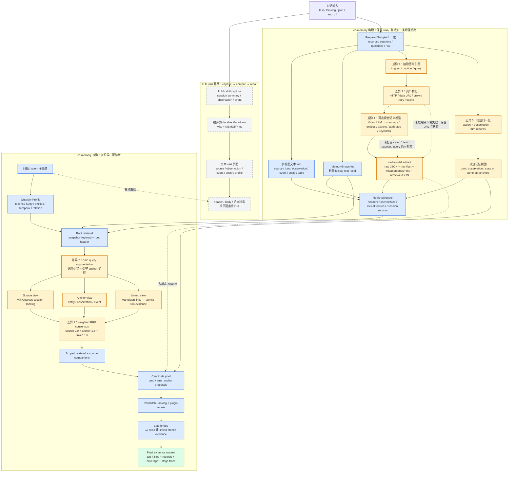

# cc-memory 与 LLM wiki 的三项关键差异

下面的流程图将文本 wiki 基线与 cc-memory 的多模态、qmd 多视图融合和 agent 轨迹链路并置展示。黄色节点为差异增强点。

```mermaid
flowchart TB
    input["对话输入<br/>text / thinking / json / img_url"]

    subgraph baseline["LLM wiki 基线：capture → compile → recall"]
        capture["LLM / skill capture<br/>session summary / observation / event"]
        compile["编译为 durable Markdown<br/>wiki/ + MEMORY.md"]
        wiki_pages["文本 wiki 页面<br/>source / observation / event / entity / profile"]
        flat_recall["header / body / 语义检索<br/>按页面直接排序"]
        capture --> compile --> wiki_pages --> flat_recall
    end

    input --> capture

    subgraph build["cc-memory 构建：保留 wiki，并增加三条增强链路"]
        normalize["PreparedSample 归一化<br/>records / sessions / questions / raw"]
        text_views["多视图文本 wiki<br/>source / turn / observation / event / entity / topic"]
        snapshot["MemorySnapshot<br/>轻量 lexical root recall"]
        mm_extract["差异 1：抽取图片引用<br/>img_url / caption / query"]
        mm_download["差异 1：资产物化<br/>HTTP / data URL / proxy / retry / cache"]
        mm_vision["差异 1：可选视觉语义增强<br/>Vision LLM → summary / entities / actions / attributes / keywords"]
        mm_artifact["multimodal artifact<br/>raw JSON + manifest + wiki/memories/*.md + retrieval JSON"]
        trajectory_adapter["差异 3：轨迹归一化<br/>action + observation → turn records"]
        trajectory_views["轨迹记忆视图<br/>turn / observation / state or summary anchors"]
        retrieval_assets["RetrievalAssets<br/>headers / cached files / lexical features / session sources"]

        normalize --> text_views --> retrieval_assets
        normalize --> snapshot --> retrieval_assets
        normalize --> mm_extract --> mm_download --> mm_vision --> mm_artifact --> retrieval_assets
        normalize --> trajectory_adapter --> trajectory_views --> retrieval_assets
    end

    input --> normalize
    mm_download -."未启用或下载失败：保留 URL 与状态".-> mm_artifact
    mm_vision -."未配置 vision：text / caption / query 仍可检索".-> mm_artifact

    subgraph query["cc-memory 查询：多阶段、可诊断"]
        question["问题 / agent 子任务"]
        profile["QuestionProfile<br/>tokens / fuzzy / entities / temporal / relation"]
        root["Root retrieval<br/>snapshot keyword + root header"]
        qmd_aug["差异 2：qmd query augmentation<br/>语料纠错 + 保守 anchor 扩展"]
        source_view["Source view<br/>wiki/sources session ranking"]
        anchor_view["Anchor view<br/>entity / observation / event"]
        linked_view["Linked view<br/>Markdown links → atomic turn evidence"]
        rrf["差异 2：weighted RRF consensus<br/>source 2.0 + anchor 1.5 + linked 1.0"]
        scoped["Scoped retrieval + source companions"]
        candidate["Candidate pool<br/>qmd / ama_anchor proposals"]
        rerank["Candidate ranking + plugin rerank"]
        bridge["Late bridge<br/>从 seed 补 linked atomic evidence"]
        final["Final evidence context<br/>top-k files + records + coverage + stage trace"]

        question --> profile --> root --> qmd_aug
        qmd_aug --> source_view
        qmd_aug --> anchor_view
        qmd_aug --> linked_view
        source_view --> rrf
        anchor_view --> rrf
        linked_view --> rrf
        rrf --> scoped --> candidate --> rerank --> bridge --> final
        trajectory_views --> candidate
    end

    question -."基线路径".-> flat_recall
    retrieval_assets --> root
    snapshot --> root
    mm_artifact -."多模态 adjunct".-> candidate

    classDef baseline fill:#f3f4f6,stroke:#6b7280,stroke-width:1px,stroke-dasharray:5 5;
    classDef core fill:#dbeafe,stroke:#2563eb,stroke-width:1.5px;
    classDef diff fill:#fff3cd,stroke:#d97706,stroke-width:2px;
    classDef output fill:#dcfce7,stroke:#16a34a,stroke-width:1.5px;
    class capture,compile,wiki_pages,flat_recall baseline;
    class normalize,text_views,snapshot,retrieval_assets,question,profile,root,scoped,candidate,rerank,bridge core;
    class mm_extract,mm_download,mm_vision,mm_artifact,trajectory_adapter,trajectory_views,qmd_aug,source_view,anchor_view,linked_view,rrf diff;
    class final output;
```
