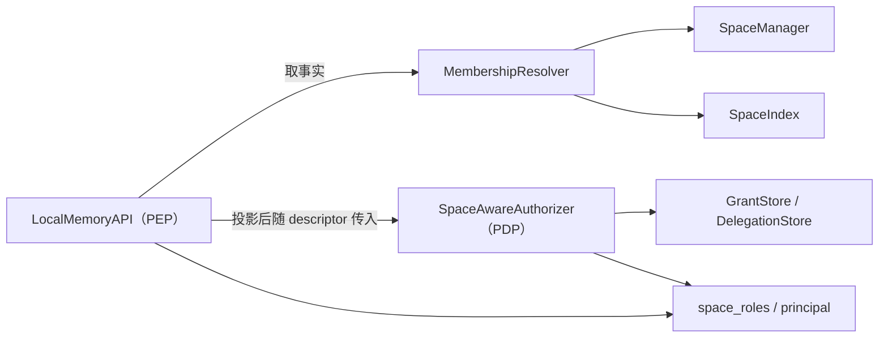

# S09 — 群体记忆与空间治理（Collective Memory & Space Governance）

## 元信息

| 项 | 值 |
|---|---|
| 关联模块 | jiuwen_memory/api/、jiuwen_memory/control/、jiuwen_memory/construction/、jiuwen_memory/common/security/ |
| 最近一次修订日期 | 2026-08-20 |
| 关联特性文档 | docs/features/F03-collective-memory-design.md |
| 交付状态 | 内核已交付，接入层未开始（见「交付状态」） |


## 范围 / 边界

**管什么**：

- 空间内的两轴权限模型（内容轴与治理轴）及其到动作集合的映射
- 空间归属主体登记、归属主体档与个体空间的判定依据
- 条目作者标记的推导、写入与不可伪造约束
- 空间感知判定实现的十步顺序，及其中三步空间语义的判据
- 空间授权事实的一次读取、投影、缓存与失效
- 主体到空间的反查索引契约
- 归属判定算子（`Router`）的契约、判定表配置与加载期校验
- 多空间写入的候选空间集合、多空间检索的编排与两族过滤谓词
- API 入口到「轴 + 动作」的映射，以及五类空间的开通契约

**不管什么**：

- 不定义认证、请求安全上下文、凭据撤销、限流与加密——归安全横切契约
- 不定义组织级角色（`Role`）、管理面角色闸门与可委托动作集合的取值——归安全横切契约，本规约只声明衔接位置
- 不改 `Scope` 结构、`MemoryUnit` 字段与序列化、存储层与检索层算子；判定产物全部落既有 `metadata` 字典
- 不实现跨空间流动溯源（阶段四），仅预留三个 `origin_*` metadata 键名，不写入默认值
- 不实现条目级可见性（阶段三），且不预留键名与轴位——判据依赖安全横切契约的可信代理身份，见「条目的可读范围」
- 不覆盖 `middle=true` 与后台演进通道的归属判定（见「归属判定的生效范围」）

## 交付状态

上线后的可观察变化：

| 变化 | 生效条件 |
|---|---|
| 新条目带作者标记；空间有归属登记与主体反查索引 | 无条件 |
| 判定生效：两轴角色、归属对比、归属主体档、空间状态校验按序执行；写入未注册空间由放行改为拒绝 | 装配空间感知判定实现 |
| 写入按归属坐标选目标空间、`scope` 可省；检索可跨空间 | 装配判定表 |

### 已交付

| 层 | 交付项 | 落点 |
|---|---|---|
| 安全 | 两轴角色、档位序号、归属主体档清单、判定事实投影、`most_specific`、三张动作矩阵 | `common/security/space_roles.py` |
| 安全 | 身份推导、形态校验、三种身份比较、两个 metadata 键常量 | `common/security/principal.py` |
| 安全 | 判定判据的第 2、6、7、10 步 | `common/security/space_decision.py` |
| 控制 | 成员记录两轴与存量兼容解析、归属登记及其编解码、`SpaceFacts` | `control/types.py`、`control/space_impl/kv_space_manager.py` |
| 控制 | 成员表单键化、状态流转校验、四处反查索引维护 | `control/space_impl/kv_space_manager.py` |
| 控制 | 空间事实一次读取、TTL 缓存与失效、主体反查 | `control/membership.py`、`control/membership_impl/`、`control/space_impl/space_index.py` |
| 控制 | 空间感知判定实现 | `control/permission_impl/space_aware_permission_manager.py` |
| 构建 | 判定算子契约与模型实现 | `construction/router.py`、`construction/router_impl/llm_router.py` |
| 构建 | 判定表数据类与十三条加载期校验 | `parse_route_table` |
| 构建 | 两个落盘不变量与判定应用 | `enforce_sanitized`、`with_all_tag_keys`、`route_batch`、`apply_decisions` |
| 构建 | 演进算子两分支接线 | `OrchestratingEvolver._route`、`DynamicEvolver._extract_step` |
| 构建 | 落盘产物回传 | `EvolveResult.created_units`，两个引擎实现的 `write` 改取回传对象 |
| API | 鉴权方法增轴与入口名、状态校验扩展至全部入口 | `_authorize_with_context`、`_ensure_space_state_allows` |
| API | 入口两层动作划分与归属主体档两级 | `ENTRY_RULES`、`_owner_entry_grade` |
| API | 改写防护与两处授出上界 | `_enforce_member_write_ceilings` 等三处 |
| API | 空间事实的传入通道 | `PermissionContext.space_facts` |
| API | `list_spaces` 逐空间求值 | `_readable_spaces` |
| API | 检索谓词第一族，注入 `search` 与 `list` | `_first_family_predicate` |
| API | 七个空间写入入口下发缓存失效 | `_invalidate_space_facts` |
| API | 空间策略裁剪，判据取本次鉴权带出的通过轴 | `_trim_space_policy` |
| API | 作者标记的写入 | `_with_author_marks` |
| API | 候选空间集合与单条判定入口 | `api/memory_api_impl/collective.py`、`_write_target` |
| API | `scope` 转可选、`coords` 入参，四个写入入口 | `add` / `add_async` / `batch_add` / `batch_add_async` |
| API | 写入边界校验 | `_reject_route_tag_keys`、`_reject_foreign_write_scope`、`_reject_kernel_system_metadata` |
| API | `search_spaces` 与检索谓词第二族 | `search_spaces`、`collective.narrow_predicates` |
| API | 跨空间检索的失败空间可见 | 失败空间产出 `ChannelError`，`RecallChannel` 新增 `SPACE` 取值 |
| API | 批量入口每批一次判定 | `_batch_write_targets`、`collective.route_many` |
| API | fallback 空间自动创建 | `_ensure_fallback_space`，策略键 `space.auto_create_fallback` 默认开 |
| API | 空间数上限可配置 | `_space_fanout_limit`，策略键 `space.fanout_limit` 缺省 8；写入侧与检索侧同取该值 |
| API | 装配期拒绝「判定表已配置而判定实现不读空间事实」 | `_reject_routing_without_space_authorization` |
| 运维 | 存量回填与四个配套子命令 | `deploy/migration/backfill.py` |

### 未交付项及其方向

| 项 | 归属 | 不做的后果 |
|---|---|---|
| 隐式创建收紧 | 判据取组织管理员角色，而组织级角色不在本规约范围（归安全横切契约） | 方向是放行：写入不存在的空间仍由策略开关 `scope.require_space` 裁决，与角色无关。发布声明须按本表撰写，不得宣称该收紧已生效 |
| 删除连带的编排 | 内核只交付 `DeleteSelector.filters`，编排属接入方职责 | 理由见「实体删除后的清理」 |
| 形态审查的第四类（`grantee.space` 非空的存量授权） | 依赖授权记录的存储形态定稿 | 该类存量授权不被回填脚本审查 |
| 接入层归属坐标构造与跨空间检索调用形态 | 接入方服务侧，属仓库外 HTTP 层的契约变更 | 经接入方的用户拿不到任何变化；只有直接调 SDK 的调用方能使用 |
| 五类空间的开通调用 | 接入方服务侧，见「空间开通契约」 | 四类共享空间没有建立途径，协作场景整体不成立 |
| `agent_team` / `project` 归属坐标的传递链路 | 接入方 | 判定表退化为只有用户记忆一类，全部内容落用户主空间 |

一项遗留事项：空间策略裁剪后的策略取默认值形态，调用方无从区分「默认值」与「被裁剪」。

### 本规约不覆盖的判定步骤

判定链十步中有五步在本规约内无判据来源，均因组织级角色与委托记录不在本规约范围（见「范围 / 边界」）：

| 步 | 内容 | 缺失方向 |
|---|---|---|
| 1 | 身份形态校验中的组织级形态 | 更严格 |
| 3 | 管理面角色闸门 | **终局判据**，缺失会使组织级入口落入后续步骤而被拒。因此组织级入口维持现状判据，不落入两轴求值 |
| 4 | `ROOT` 放行 | 更严格 |
| 5 | 组织 `ADMIN` 治理放行 | 更严格 |
| 9 | 代操作委托 | 更严格 |

除第 3 步外均为「命中即放行」分支，缺失方向是更严格而非更宽松。

判定的宿主是控制层 `PermissionManager` 的实现 `space_aware`，与 `sqlite` / `allow_all` / `routing` 平级注册。动作取值域取本规约自定义的 `SpaceAction`（入口名到轴与动作的映射见「入口到轴与动作的映射」），与安全横切契约的 `Action` 是两套枚举，取值在本规约用到的九项上同名同义。作者标记的主体取写入入口的 `identity` 入参。

判定判据与两轴语义不依赖宿主形态——判据主体落在 `common/security/space_decision.py`，是不访问存储的纯函数，宿主只负责取事实与折算结论。这一分工使判定能随授权架构演进换宿主而不改判据，两条支撑该分工的编码约束见 [F03 决策 4](../features/F03-collective-memory-design.md)。

### 两个开关与四种部署组合

特性由两个互不相关的开关控制，各自独立开启：

| 开关 | 判据 | 开启后生效的部分 |
|---|---|---|
| 空间治理 | 判定实现声明需要空间事实（`permission.default.target = space_aware`） | 两轴角色判定、归属对比、归属主体档、检索谓词第一族、空间状态校验扩展至全部入口 |
| 归属判定 | 声明 `router` 命名空间且判定表非空 | 写入侧 `scope` 可省、`coords` 生效、候选空间集合、显式 `scope` 归一、检索谓词第二族、写入边界校验 |

| 组合 | 行为 | 是否合法 |
|---|---|---|
| 两个都不开 | 与改造前一致 | 合法，是灰度上线的起点 |
| 只开空间治理 | 空间之间有权限边界，`scope` 仍必填、`coords` 不产生落点 | 合法 |
| 只开归属判定 | 内容按坐标分流进协作空间，而协作空间没有任何权限边界 | **装配期拒绝** |
| 两个都开 | 完整特性 | 合法 |

第三种组合等于把内容写进一个组织内任意主体可读的位置，方向为放行，且从调用侧看不出异常——写入成功、检索也拿得到，只是拿得到的人多了。由 `_reject_routing_without_space_authorization` 在 `build_kernel` 末尾拒绝，不靠配置注释提示。

### 判定结论的构造与取值约束

`AuthorizationDecision` 的构造契约由安全横切契约规定：`allow(rule)` 与 `deny(reason, rule)`，`rule` 在放行与拒绝两侧都必填，`allowed` 与 `reason` 的搭配在构造期校验。本规约新增的每一条判定分支都必须给出 `rule` 取值，轴信息编进 `rule`（如 `axis_governance`、`owner_entry`），不另设审计字段。

`DenyReason` 是封闭集合，其取值是审计与告警的匹配依据。本规约的新增拒绝分支不扩充枚举：

| 分支 | reason / rule | 理由 |
|---|---|---|
| 空间级目标未携带空间事实 | `CONTEXT_MISMATCH` | 请求上下文与判定所需不匹配，语义已被现有取值覆盖 |
| 调用方在该空间无成员记录 | `NOT_COVERED`，`rule` 取 `not_a_member` | 上游明确不细分「资源不存在」与「无权访问」——细分构成资源枚举侧信道 |

## 不变量

1. **`MemoryAPI` 是唯一鉴权点（PEP），判定实现是唯一判定点（PDP）**：判定不落控制层 `PermissionManager`——该算子在上游改造后退出请求授权路径，只服务兼容测试。本条约束目标形态；上游未合入期间的宿主形态与迁移义务见「判定宿主的过渡期形态」。
2. **判定实现不访问存储**：判定所需的空间事实由 PEP 一次读取、折算为最小投影后随资源描述对象传入；空间级目标缺事实即按拒绝处理，不回落为「判定实现自行读取」。
3. **安全层不反向依赖上层**：两轴角色、动作矩阵、归属主体档清单、判定事实投影与身份比较函数全部落 `common/security/`，其消费方跨安全层、API 层与控制层三侧。
4. **身份只有一个来源**：调用方身份取自 `security.auth.actor`，不新增 `identity` 入参，不由调用方经普通入参声明。
5. **身份不下沉**：作者标记在 API 层由身份推导后写入条目 metadata，`identity` 不传入引擎层与构建层。
6. **判定不改写调用方身份**：会话维在判定实现内部剥除用于比对，传入的 `AuthContext` 本身不改写——它是认证边界的产物。
7. **作者标记不可伪造**：`author_principal` / `author_agent` 由内核按身份推导写入，属保留 metadata 键，写入路径拒绝调用方赋值。
8. **判定相关的 metadata 键恒写入**：全部收窄维标签键在写入时一律落键，取值为空也不省略——两族谓词的语义依赖键存在，键缺失时过滤算子的行为不可预期。
9. **两轴独立授予**：内容轴与治理轴各自映射到一组动作，同一成员可以只持有其中一轴；归属对比只放行内容轴。
10. **归属关系不蕴含处置权**：归属主体经归属对比只取得内容轴的条目动作，治理动作与整空间导出另按归属主体档的入口清单裁决。
11. **空间生命周期状态不进判定链**：它不问「谁」，作为 PEP 的后置校验执行（排在授权通过之后），错误类型为参数校验失败，与无权限可区分。
12. **成员记录主体维取单维**：`user` 与 `agent` 同时非空的成员记录在写入处被拒绝；反查索引因此只有具名 user、具名 agent、组织通配三类桶。
13. **判定不扩权**：多空间写入的候选空间集合由「调用方在该空间有写权」机械推出，归属判定算子只在集内选择。
14. **反查索引是超集**：允许多给（候选集虚大，由逐空间判定裁决），不允许遗漏；写入次序为主数据先、索引后，删除次序相反。
15. **两族检索谓词分开生成**：第一族由空间事实与调用方身份生成、调用方不可干预；第二族由调用方声明的归属坐标生成。第二族可配置不得使第一族一并可配置。
16. **谓词一次下推**：两族谓词与调用方过滤表达式合成一个 AND 表达式随查询下推，在 top-k 截断之前生效，不做召回后二次过滤。
17. **单条判据与批量谓词同源**：「某条条目对当前调用方是否可读」在判定链与检索谓词两侧用同一个判据（`author_principal`）。判据分叉即出现「搜不到但按 id 读得到」或其反向。
18. **判定失败不阻断写入**：归属判定算子异常或未装配时，产物落 fallback 空间，行为与未启用该特性一致。
19. **判定早于去重**：归属判定插在抽取之后、去重之前；晚于去重会导致在源空间比对、在目标空间落盘。
20. **判定表来自配置**：类别、收窄维与空间命名由部署声明，加载期校验不通过即装配失败，不留到运行期。
21. **内核不认识接入方的产品概念**：归属坐标的键集合由内核自带三项（`user` / `agent` / `session`）加部署声明项构成，后者只作字典键透传；内核三项以身份为准，不接受调用方覆盖。
22. **条目落盘 scope 只有两维**：条目一律存在 `Scope(org, space)` 下，主体维与会话维交由条目上的作者标记与收窄维标签表达。

## 概念模型

七个名词贯穿本规约：

| 名词 | 定义 | 载体 |
|---|---|---|
| 空间 | 记忆的隔离单位，同时是权限边界。一个空间对应一个物理命名空间 | `Scope.space` |
| 归属主体 | 一个空间属于谁。建空间时登记，只取用户或代理之一 | `SpaceInfo.owners` |
| 作者标记 | 一条记忆是谁写的、经谁写的。写入时由内核按调用方身份打上 | `metadata.author_principal` / `metadata.author_agent` |
| 归属坐标 | 这次调用发生在哪些实体上下文里 | `coords` 入参，不落盘 |
| 收窄维 | 归属坐标中参与过滤的项。写入时落成条目标签，检索时折算为过滤条件 | `metadata.<tag_key>` |
| 载体空间 | 原文落盘的空间，也是判不出落点时的兜底落点，等同 fallback 空间 | `WriteTargets.carrier` |

调用身份、作者标记、归属坐标三者最易混淆，区别在于谁说了算以及是否落进条目：

| 项 | 回答什么 | 取值来源 | 落进条目 |
|---|---|---|---|
| 调用身份 | 谁在调用 | 认证结果，调用方声明不了 | 否，只用于鉴权与推导 |
| 作者标记 | 这条记忆谁写的 | 内核从调用身份推导 | 是 |
| 归属坐标 | 这次交互跟哪些实体有关 | 接入方随调用声明 | 否，只作判定与过滤的输入 |

身份与目标位置在接入层即分离，两者形态不同：

| 项 | 谁在调用 | 读写哪个位置 |
|---|---|---|
| 载体 | `security.auth.actor` | 入口的 `scope` / `space` 入参 |
| 形态 | 带 org 与主体维（user / agent / session），不带 space | 带 org 与 space，主体维一律为空 |
| 构造方 | 认证中间件（外部请求）或 `internal_context`（进程内调用） | 接入层 |

本规约不新增身份入参：安全横切契约的 `security` 已承载身份、来源证明与凭据状态，再加一个 `identity` 入参等于给同一件事开两个口子，其中一个不受 fail-closed 保护。

## 模块落点

| 模块 | 层 | 承载 |
|---|---|---|
| `common/security/space_roles.py` | 安全 | 两轴角色枚举、三张动作矩阵与档位序号、归属主体档两级入口清单、判定事实投影类型、`most_specific` |
| `common/security/principal.py` | 安全 | 作者标记的键名常量、身份推导、主体维形态校验、三种粒度的身份比较 |
| `common/security/authorization/authorization_impl/space_aware_authorizer.py` | 安全 | 判定本体：十步顺序，其中三步为本规约新增 |
| `control/membership.py` + `membership_impl/` | 控制 | 空间授权事实的一次读取、缓存与失效，主体到空间的反查 |
| `control/space_impl/space_index.py` | 控制 | 主体到空间的反查索引读写，由 `SpaceManager` 持有 |
| `api/memory_api_impl/collective.py` | API | 入口轴动作映射、事实投影折算、候选空间、系统谓词、并发召回与合并 |
| `construction/router.py` + `router_impl/` | 构建 | 归属判定契约、判定表、空间命名、落盘不变量函数、配置解析与加载校验 |

**前两个模块落安全层而非控制层或 API 层**，四条判据：

| 判据 | 内容 |
|---|---|
| 同名类型无法共存 | 三张矩阵的元素类型取安全横切契约的 12 值 `Action`，而 `control/types.py` 已有一个五值 `Action` 且授权记录仍在用它，两者在同一模块内无法共存 |
| 消费方跨三层 | 矩阵的消费方是判定实现与 API 层的上界校验，角色枚举的消费方还包括成员记录的字段类型与存量兼容解析（控制层）。三者能共同依赖的只有 `common/` |
| 同一条判据施加于三个同构对象 | 归属主体档清单、取最具体记录的划分规则、三个身份比较函数同样被判定实现与 API 层两侧读取，落上层即安全层反向依赖上层 |
| 判定事实的类型须在 `common/` 内 | 资源描述对象的新增字段类型不能落控制层，否则上游公共类型反向依赖控制层 |

## 接口契约

### MemoryAPI 变更（`api/memory_api.py`）

| 入口 | 变更 | 兼容性 |
|---|---|---|
| `add_async` | `scope` 由必填转 `Scope \| None = None`；新增 `coords: dict[str, str] \| None` | 向后兼容，传 `scope` 的调用方行为不变 |
| `batch_add_async` | 新增 `coords` 入参；逐项与批级 `scope` 皆为 `None` 时转入归属判定，不再抛缺参 | 向后兼容，两级 `scope` 任一非空时行为不变 |
| `search` | 新增 `coords` 入参 | 向后兼容 |
| `search_spaces` | 新增跨空间检索入口 | 新增 |
| `list` | 不增 `coords`，但注入第一族谓词 | 行为变更：个体空间内不再返回不可见条目 |
| `list_spaces` | `cursor` 标记废弃，实现不再解释其取值；`limit` 语义由每页条数改为返回条数上限 | 签名不变，翻页语义变更 |
| `create_space` | 签名不变；入参 `SpaceSpec` 新增 `owner` 字段，供开通服务声明归属主体或显式不登记 | 向后兼容 |
| `delete` | 入参 `DeleteSelector` 新增 `filters`；空选择器判据随之纳入该字段。实体删除后的跨空间清理由接入方经本入口逐个执行 | 向后兼容 |

`SpaceSpec.owner` 有三种形态，开通契约按空间类型各取其一。归属主体不另开接口入参：`SpaceSpec` 本身就是 `create_space` 的入参，再加一个 `owner_principal` 然后填进它的字段，是同一件事两个口子。

| 形态 | 归属登记 | 用途 |
|---|---|---|
| `None`（不填） | 由 API 层填入调用方身份的推导值 | 与改造前语义相同 |
| 主体维全空的 `Scope()` | 显式不登记 | 四类共享空间取此形态 |
| 具名主体 | 替该主体登记 | 开通服务预建用户主空间 |

`owner` 由调用方填写，API 层因此必须校验，三条缺一不可：

| 校验 | 不做的后果 |
|---|---|
| 须与目标空间同组织 | 可把归属登记成另一组织的主体，跨组织判定的前提被绕开 |
| 主体维恰好一维非空 | 双维登记项在反查索引写入处抛 `ValidationError`，建空间整体失败 |
| 非组织 `ADMIN` 不得填与调用方身份不符的主体 | 任何调用方都能把空间登记成别人的，归属对比随之失效 |

第三条是「替他人建空间」这项能力的闸门。开通服务须能替他人建空间，否则预建出的主空间归属开通服务，用户读不到也管不了自己的主空间。

```python
# api/memory_api.py
def search_spaces(self, query: str, context: Context, *,
                  identity: Scope,                      # 安全横切契约合入后改为 security
                  spaces: list[str] | None = None,
                  coords: dict[str, str] | None = None,
                  top_k: int = 10, ...) -> RetrievalResult: ...
```

`identity` 是过渡期形态，与其余入口一致：本仓库的调用方身份仍走 `identity` 入参，安全横切契约合入后随其余入口一并改取 `security.auth.actor`（不变量 4）。

取同步形态与既有 `search` 一致：并发召回在实现内部用协程完成，不向调用方暴露异步契约。`MemoryAPI` 上只有写入入口提供 `*_async` 双版本，检索侧无此先例。

三个入参的分工：

| 入参 | 回答的问题 | 内核拿它做什么 |
|---|---|---|
| `security` | 谁在调用 | 鉴权、推导作者标记 |
| `scope` | 写到哪个空间 | 直接作为落点 |
| `coords` | 这次交互发生在什么上下文 | 算落点、算检索的收窄条件 |

`scope` 与 `coords` 在写入侧是互斥的两条路径，不叠加：

| 调用形态 | 落点怎么定 | 是否启用归属判定 |
|---|---|---|
| 传了 `scope` | 就是它 | 否，按现有语义直写 |
| 省略 `scope` | 由 `coords` 推出候选空间集合，判定算子在集内选 | 是 |

两者同时传入时 `scope` 生效，`coords` 在写入侧整体不生效——**不只是落点不由它定，判定标签
也一概不写**。不改成「`scope` 定落点、`coords` 定标签」的叠加形态，是因为给定 `scope` 即
不判定，此时按坐标写标签等于让调用方间接给判定标签赋值，而写入边界正是要拒绝这件事：标签
一旦落盘就成为他人检索时的过滤依据。检索侧两者不冲突，`scope` 定查哪个空间、`coords` 定在
该空间内收窄到哪个上下文。

传 `scope` 时其主体维必须为空或与身份推导值一致，不一致即拒绝；条目落盘 scope 恒取 `Scope(org, space)` 两维。空 `Scope()` 与 `None` 分属两条路径，序列化层不得把缺省 `scope` 填成空 `Scope`。

检索侧两者不冲突：`scope` 定查哪个空间，`coords` 定在该空间内收窄到哪个上下文。

**`list` 不增 `coords`。** 第二族谓词是上下文相关性而非隔离依据，而 `list` 是枚举入口：调用方用它列举一个空间里有什么，按当次会话或项目收窄会使返回集少于该空间的实际内容，且调用方无从察觉。`search` 按相关性排序、召回本就不完整，收窄不产生同类误解。

`coords` 取显式入参而不复用 `Context.extensions`：后者的既有约定是内核核心不解释其内容，把内核必须解释的判定输入放进去会使该约定在两处成立、在一处不成立。

### 鉴权点的职责（`_authorize`）

PEP 在上游既有职责（来源证明校验、凭据撤销复核、调 PDP、放行与拒绝审计）之上增加三件事：空间事实读取、事实投影与属性编排、空间状态校验。

| 步骤 | 内容 |
|---|---|
| 1 形态校验 | 数据面入口要求身份带主体维，两维皆空即拒绝 |
| 2 取事实 | 目标带 space 且调用方未传入时，取一次空间授权事实；后端异常时留空，由 PDP 按拒绝处理 |
| 3 编排属性 | 轴、入口名、条目作者标记、主体次序写入资源描述属性 |
| 4 折算投影 | 控制层的空间事实折算为判定用的最小投影，一次折算、两轴共用 |
| 5 判定 | 一次判定一个轴；「两轴任一」在本层依次尝试，治理轴在前，任一通过即放行并记下通过的轴 |
| 6 状态校验 | 排在授权通过之后、入口返回之前 |

第 5 步的轴次序不可颠倒：治理轴不查授权记录，且其结论要被空间策略裁剪复用。

第 6 步的位置是刻意的：排在授权之前，无权调用方也能凭错误类型判断出该空间处于冻结或归档，与「不泄露空间是否存在」的方向相反；排在之后不削弱约束——归属主体与成员都要先过授权再撞上状态校验，平台级角色则两处都不受限。

**条目级入口分两段鉴权，两段的目标不同。**

| 段 | 目标 scope | 额外携带的属性 | 判什么 |
|---|---|---|---|
| 第一段 | 入参 scope 经归一后的空间级 scope（主体维恒为空） | 无 | 调用方对该空间有无该动作的权限。空间不存在即在此拒绝 |
| 第二段 | 条目真源 scope，由引擎从条目本身取回 | `author_principal` | 归属对比的作者标记比对与「本人所写」附加集合 |

两段都通过才放行。第二段的目标必须取条目真源 scope，不得沿用入参 scope：这是「判定第 8 步不会命中」的前置条件之一，也是「本人所写」判据能拿到作者标记的唯一途径。

`search` 与 `export_space` 只有第一段：前者的目标是查询范围、后者是整个空间，都不落到具体条目，内容边界由检索谓词与归属主体档承担。

**`list` 是两段，但第二段不携带作者标记。** 逐条鉴权的失败形态是抛异常而非过滤，携带后个体空间内只要有一条作者不是调用方的条目，整次 `list` 调用即失败——代理自主运行写入的条目与回填期多归属空间中另一归属主体写入的条目都属此列。`list` 的内容边界改由第一族谓词在取数时承担，第二段只判条目真源 scope 的空间归属。

### 空间状态校验

```python
def _ensure_space_state_allows(facts, action, entry, auth) -> None: ...
```

由现状的写入前置校验扩展并改名，调用点由两处扩到全部入口，判据由「非活跃即拒写」扩为完整状态规则：

| 状态 | 规则 |
|---|---|
| `ACTIVE` 或空间不存在 | 通过 |
| 平台级角色 | 一律通过，否则冻结不可逆、运维无法介入 |
| `DELETING` / `DELETED` | 全部动作拒绝，不适用任何豁免 |
| `FROZEN` / `ARCHIVED` | 读动作放行；仅改状态的那次变更放行；其余拒绝 |

「仅改状态」按修改内容判定，不按入口名：`update_space` 同时能改 `policy` 与 `principal_path`，二者都是判定依据，只看入口名等于允许在冻结态改写判定依据，冻结语义随之不成立。

仍抛参数校验失败而非权限拒绝。**错误类型的可区分性由调用次序保证，不是自动成立的**：无权调用方得权限拒绝（此时不透露状态），有权调用方对冻结空间得参数校验失败。次序被改动不会使任何既有用例失败，须有专项回归。

### 空间感知判定实现

判定是安全横切契约的 `Authorizer` 契约的第二个实现，与 `StandardAuthorizer` 平级、互斥装配。取独立实现而非装饰上游实现，是因为两轴求值必须嵌在授权记录求值的内部（成员记录与授权记录先取并集、再按两维取交），装饰形态插不进那个位置；代价是上游判定顺序中的五步要照抄一遍，上游改次序时两处须同步。

共十步，其中三步为本规约新增，七步沿用上游判据与次序：

| 步 | 来源 | 判据 | 结果 |
|---|---|---|---|
| 1 上下文时效 | 上游 | 身份凭据对 `environment.now` 是否有效 | 无效即拒绝 |
| 2 主体非空 | 上游 | `auth.actor` 是否为空 `Scope()` | 为空即拒绝 |
| 3 管理面角色闸门 | 上游 | 动作属管理面动作集合时按最低角色要求比对 | 终局：放行或拒绝，均不落后续 |
| 4 `ROOT` 放行 | 上游 | `auth.role` 为平台级角色 | 放行 |
| 5 组织级 `ADMIN` 治理放行 | 本规约 | 组织管理员 + 同组织 + 治理轴 | 放行 |
| 6 组织边界 | 上游 | 调用方组织与目标组织不同 | 直接拒绝 |
| 7 归属对比 | 本规约 | 个体空间、调用方覆盖归属登记、作者标记比对通过 | 放行，仅限内容轴 |
| 8 主体覆盖 | 上游 | `scope_covers(actor, resource.scope, principal_path=)` | 覆盖即放行 |
| 9 代操作委托 | 上游 | 按委托标识回查 `DelegationStore` | 命中即放行 |
| 10 归属主体档 + 两轴求值 | 本规约 | 先查归属主体档，未命中再按轴合成动作集合 | 任一命中即放行，否则拒绝 |

第 6 步刻意排在第 8 步之前，使跨组织请求得到准确的拒绝原因。

**第 8 步在目标形态下不命中，但该结论有两个前置条件，缺一即失效**：

| 前置条件 | 由谁保证 | 不成立时 |
|---|---|---|
| 条目真源 scope 不带主体维 | 存量回填的第 3 项 | 未回填的条目 scope 仍带主体维，该步逐维相等即放行，作者取得对自己条目的全部动作、不经内容轴矩阵 |
| 条目级入口第二段的目标取条目真源 scope | 两段鉴权 | 若沿用入参 scope，该步同样落空，但「本人所写」判据也拿不到条目真源，附加集合整体不生效 |

两条的失效方向相反，因此不能只靠其中一条。该步保留是为了不改上游对非空间级资源的既有行为。

四类入口实际经过的步骤：

| 入口类别 | 3 角色闸门 | 5 组织 ADMIN | 6 组织边界 | 7 归属对比 | 10 归属主体档 + 两轴 |
|---|---|---|---|---|---|
| 组织级入口 | 终局 | 不执行 | 不执行 | 不执行 | 不执行 |
| 空间级内容入口 | 不拦 | 轴不匹配，不放行 | 执行 | 个体空间且归属命中即放行 | 归属主体档 + 成员记录取交 |
| 空间级治理入口 | 不拦 | 组织管理员在此放行 | 执行 | 轴前置条件不满足，一律不放行 | 归属主体档 + 成员治理档 |
| 空间元数据读取入口 | 不拦 | 治理轴那遍放行 | 执行 | 治理轴那遍不放行 | 两轴各求值一次，先治理后内容 |

组织级的 `grant` / `revoke` 目标无 space 维，空间事实为空，第 10 步走纯授权记录分支。**该分支对非平台级、非组织管理员的主体恒拒绝**：治理轴上不查授权记录，动作集合恒为空集。它不是一条能经授权记录放行的功能路径，`rule` 取值只用于审计归因。

#### 第 7 步的两条排除

| 排除 | 内容 | 不设时的后果 |
|---|---|---|
| 只放行内容轴 | 治理动作转第 8、9、10 步 | 「目标不含条目信息即通过」会让删空间、改策略经代理调用时在本步放行，归属主体档的两级随之失效 |
| 内容轴中按「逐维相同」裁决的入口不走本步 | `export_space` 落第 10 步的归属主体档 | 该入口取内容轴读动作、又不带条目信息，只有轴排除时本步对它无条件放行。整空间导出产出的是脱离后续判定的全量副本，须按归属主体档第一级（主体维逐维相同）裁决；本步放行会使归属主体的代理导出整个空间，回填期的多归属空间中该副本还含另一归属主体写入的条目 |

目标不含条目信息（`search`、`list`）时本步跳过作者比对直接通过；携带时比对 `author_principal`。

组织比对不在本步进行：第 6 步的组织硬边界已保证两者相等。

#### 第 10 步的两段与次序约束

先查归属主体档，未命中再按维划分候选记录、每维取最具体的一条、与显式授权取并集、两维取交、按轴判含。维次序取自 `principal_path`，缺失与非法值一律回落默认次序。

求值内部的次序同样不可颠倒：先取最具体、再与显式授权取并集；主维无记录的拒绝判定在并入显式授权之后执行，提前则任何显式授权对非成员一律不生效。主体维为空与该维无记录命中是两种情形，前者不参与求值，后者不构成约束、不参与收窄。

**归属主体档必须排在「主维无记录即拒绝」之前，这是次序约束而非风格选择。** 四种事实形态下的可达性：

| 归属登记 | 成员表 | 排在其后时 | 排在其前时（本规约） |
|---|---|---|---|
| 单项（预建的用户主空间） | 空 | 主维取不到记录，在上一段即拒绝，归属主体档不可达 | 由归属主体档裁决，个体空间的治理入口可用 |
| 单项（写入首条成员记录后） | 非空 | 可达，但两轴求值通常已放行 | 先由归属主体档放行，审计归因改为归属主体档 |
| 多项（回填产生的多归属空间） | 空 | 同第一行，整体不可达 | 只放行第二级的四个只读入口，第一级由项数判据显式挡住 |
| 空（四类共享空间） | 非空 | 可达但恒返回假 | 立即返回假，落两轴求值 |

第一行是唯一需要归属主体档的形态，也恰好是它在原次序下到不了的形态：预建的主空间恒不写成员记录，因此归属主体档的全部入口整体不可达——用户改不了、删不了自己的主空间，也读不到它的策略与成员表，而条目读写照常通过。症状是「部分能用」，且不产生任何用例失败。

原次序还有一处不稳定：主维取自空间策略的主体次序，取值翻转时「主维无记录」的条件随之翻转，同一条判据的可达性随空间策略变化。

次序调整只在一个方向上改变结论：原先在「主维无记录」处被拒、而归属主体档本应放行的请求改为放行，范围恰好是两级清单列出的入口。两段都通过的请求集合不变。

**该范围与多归属空间的三项限制有交集，因此第一级另加项数判据。** 多归属空间与预建主空间的事实形态相同（归属登记非空、成员表为空，回填不写成员记录），唯一区别是登记项数，而两级清单本身不看项数。三项限制在原次序下都是「主维无记录即拒绝」的副产物、不是显式判据：次序一调，删空间与整空间导出对任一归属者放行，加成员也放行——而首条成员记录的补写只取第一项登记，写入后其余归属者失去归属主体档。加项数判据之后这三条由该判据保证，不再由求值次序保证。第二级的四个入口只读空间元数据、不含条目内容，不受该限制。

显式授权只在内容轴参与求值，治理轴不查授权表：治理权只由成员记录与归属主体档决定。该惰性同时是空间元数据入口「治理轴先判」的成本前提。

覆盖判定与授权记录存取全部取安全横切契约的单一实现，不自建；时效基准取 `environment.now`，一次判定内所有时效检查用同一个值。

### 空间事实的两层投影与传入通道

事实分两层，投影关系：

| 层 | 类型 | 内容 | 使用方 |
|---|---|---|---|
| 控制层 | `SpaceFacts`（`control/types.py`） | 空间元数据全量、成员记录全量（含时间戳与存量单轴角色） | 鉴权点：状态校验、空间策略读取、检索谓词生成 |
| 安全层 | `SpaceAuthorizationFacts`（`common/security/space_roles.py`） | 归属登记 + 成员记录的两轴角色，最小投影 | 判定实现 |

取投影而非直接传控制层类型的三条理由：上游公共类型不反向依赖控制层；空间策略与生命周期状态不进入判定的可见范围，与「状态校验不是授权判定」一致；上游文件的净改动收敛为一个字段。折算在鉴权点完成，是一次纯计算、不访问存储。

判定所需的五项信息经资源描述对象传入，按能否用字符串表达分成两处：

| 项 | 承载位置 | 取值 |
|---|---|---|
| 轴 | `attributes["space_axis"]` | `content` / `governance` |
| 入口名 | `attributes["space_entry"]` | 入口方法名，归属主体档按它查两级清单 |
| 条目作者主体 | `attributes["author_principal"]` | 归属对比与「本人所写」判据的比对值 |
| 主体维次序 | `attributes["principal_path"]` | 由上游从空间策略这个真源写入，非法值回落默认次序 |
| 空间事实快照 | `ResourceDescriptor.space_facts` | 新增的结构化字段 |

条目作者代理不在此表：它是记录项而非判据，写入条目 metadata 供审计与按作者的批量删除使用，判定不读它。

三条约束：

1. **必须是结构化字段**。安全横切契约规定 PDP 不读存储，事实只能由 PEP 传入；而属性通道是字符串映射且构造期强制字符串化，装不下成员元组与归属登记。备选形态是序列化为 JSON 串塞进属性，代价有两条：判定依据的类型检查由编译期挪到运行期，而这是安全属性；成员上限 1000 条时该属性体积达数十 KB。该字段与「请求 metadata 不能覆盖资源安全 metadata」这条上游约束不冲突——空间事实由 PEP 从成员表与空间元数据两个真源读出，请求方无法触及，与上游自己把主体次序写入资源描述属于同一性质。
2. **入口名与资源类型必须分开**，两者取值域不同：后者承载资源类型（`write_input` / `query` / `space_member` 等），归属主体档的清单按入口名列举。合并会使空间元数据读取入口静默失去归属主体档，失效方向是拒绝——归属主体读不到自己空间的元数据。
3. **「是否携带作者标记」由键是否存在表达**，不另设布尔字段：`author_principal` 在携带时恒非空，键存在即判据。

### MembershipResolver（`control/membership.py`）

```python
class MembershipResolver(ControlOperator):
    def facts(self, org: str, space: str) -> SpaceFacts: ...
    def spaces_for(self, actor: Scope, org: str) -> tuple[str, ...]: ...
    def invalidate(self, org: str, space: str | None = None) -> None: ...
```

| 方法 | 语义 | 约束 |
|---|---|---|
| `facts` | 取回该空间的元数据与已滤除过期记录的成员表 | 两次点读，不做 `scan`；后端不可用时抛 `BackendError`，调用方按拒绝处理，不沿用过期结果 |
| `spaces_for` | 按主体反查相关空间 | 超集契约：不遗漏、允许多给。返回值按空间名字典序去重排序——上限截断按序取前 N 项，顺序不稳定即截掉的空间随调用漂移 |
| `invalidate` | 使指定空间的事实缓存失效 | 调用方是 API 层的七个空间写入入口（含 `create_space`），各在提交返回后调一次 |

`facts` 不收调用方身份、不返回显式授权记录。两项都是为防止该算子重新成为判定的依赖：安全横切契约规定 PDP 不读存储，而判定实现一旦持有它，具名工厂的实例缓存在构造完成后才写入，互为依赖的两侧都取不到对方的半成品，装配以无限递归结束。

缓存契约：按 `(org, space)` 缓存整份事实，TTL 决定授权变更的最大延迟。「空间不存在」同样装填一份（元数据与成员皆空），因此建空间也须下发失效——接入层的先查后建会在建之前装填该形态，不清则新空间在一个 TTL 内判定无归属、无成员，归属主体本人也写不进去，且无任何错误信号可循。失效落在 API 层而非空间管理器内部——后者会与本算子构成构造期环，且匿名构造会产生两份实例使失效静默无效。代价是绕过 API 层直接操作空间管理器时不触发失效，滞后至多一个 TTL。

依赖方向单向无环：



### SpaceIndex（`control/space_impl/space_index.py`）

主体到空间的反查索引，由 `SpaceManager` 内部持有，不单独装配。

```python
class SpaceIndex:
    def add(self, principal: Scope, space: str) -> None: ...      # 幂等
    def remove(self, principal: Scope, space: str) -> None: ...   # 幂等
    def spaces_for(self, actor: Scope, org: str) -> tuple[str, ...]: ...
```

索引桶键只有三类：具名 user、具名 agent、组织通配。调用方带两维时两个桶都取，取并集而非交集——索引只负责不遗漏。

不设 user 与 agent 双维桶：两轴求值按两维各取最具体记录再取交，一条双维记录在两维同时命中，取交退化为与自身相交。同一用户名下的代理收窄由收窄维标签承担，不需要成员记录表达。

维护点四处，均与主数据写入同一方法：

| 触发点 | 索引动作 | 失败处置 |
|---|---|---|
| `create` 写归属登记 | 增索引项 | 索引写失败即回滚空间创建 |
| `add_member` | 增索引项 | 先写成员记录再写索引；索引失败中止并回滚 |
| `remove_member` | 删索引项 | 先删索引后删成员记录；索引项残留可容忍 |
| `delete` | 清理该空间全部索引项 | 孤儿项在逐空间判定处被挡住，只造成候选集虚大 |

### 身份推导与比较（`common/security/principal.py`）

无状态纯函数模块，不访问存储，被判定实现、API 层与控制层三侧共用。

```python
AUTHOR_PRINCIPAL = "author_principal"
AUTHOR_AGENT = "author_agent"

def derive_author(identity: Scope) -> tuple[str, str]: ...
def require_principal(identity: Scope) -> None: ...
def owner_entry_of(identity: Scope, org: str, space: str) -> Scope | None: ...
def covers_owner(entry: Scope, actor: Scope) -> bool: ...
def same_dims(entry: Scope, actor: Scope) -> bool: ...
def author_match(actor: Scope, author_principal: str) -> bool: ...
```

| 函数 | 语义 | 用途 |
|---|---|---|
| `derive_author` | 身份带 user 即返回 `("user:<id>", <agent>)`；只带 agent 即返回 `("agent:<id>", "")`；两维皆空抛校验异常 | 代理链上有人类主体即归人类 |
| `require_principal` | 主体维全空即拒绝 | 数据面入口的形态校验。与安全横切契约对空身份的拒绝是两层判据：前者拒绝形态不完整的数据面调用，后者拒绝完全空的身份 |
| `owner_entry_of` | 归属登记项，取单维；主体维全空返回空 | 运维通道建的空间不登记 |
| `covers_owner` | 登记项每个非空维在调用方上取值相同，调用方可另带其他维 | 归属对比的前提之一、归属主体档第二级 |
| `same_dims` | 主体维逐维相同 | 归属主体档第一级 |
| `author_match` | 只比作者主体项，不比作者代理——同一用户名下换代理不改变可达性 | 归属对比与「本人所写」判据 |

三个比较函数一律不比较 space 维。

身份的空间维不由 PEP 补齐：调用方身份来自认证产物，空间维缺失属身份不完整。会话维的剥除只在判定实现内部进行。

### 归属判定算子（`construction/router.py`）

与 `Classifier`、`LayerAnnotator` 同构：契约在接口层、实现自注册、不注入即跳过。

```python
class Router(ConstructionOperator):
    def route(self, units: list[MemoryUnit], ctx: RouteContext) -> list[RouteDecision]: ...
    def operator_type(self) -> OperatorType: ...     # OperatorType.ROUTER

    @property
    def table(self) -> RouteTable: ...               # 本实现装配时解析出的判定表
```

`table` 由实现持有并向上暴露，判定表不另设一条解析路径供 API 层单独读配置：两条路径对同一份配置得出不同产物时，写入边界拒绝的键集合与判定实际写入的键集合会不一致，表现为判定自己写的标签在下一次写入时被自己的边界校验拒绝。

| 项 | 契约 |
|---|---|
| 输入 | 候选单元列表 + `RouteContext`（归属坐标、已鉴权候选空间、fallback、类别与收窄维声明） |
| 输出 | 与输入等长的 `RouteDecision` 列表，逐条给目标空间、标签、命中类别与是否丢弃 |
| 落点约束 | 只在候选空间集合内选择；判定失败不得落任何跨 user 可见空间，必须落 fallback |
| 上下文通道 | `RouteContext` 经源单元的瞬态 metadata 键 `route_ctx` 传入，存储层写入前移除、不落盘 |
| 构建层插入点 | 抽取之后、分层标注与去重之前 |
| 未装配 | 整段跳过，行为与改造前一致 |
| 判定失败 | 全批落 fallback，不阻断写入 |
| 调用粒度 | 每批一次模型调用，不逐条调用 |

两个落盘不变量由构建层的公共函数承担，不放进任何 `Router` 实现内部——放实现内则换一个实现即可能漏掉，而漏掉的失效方向都是放行或静默收窄：

| 函数 | 作用 |
|---|---|
| `enforce_sanitized` | 目标类别声明「不含主体标识」时做一次确定性检查，命中即改落 fallback。不改写内容，也不阻断整批 |
| `with_all_tag_keys` | 补齐本次未出现的全部收窄维标签键为空串，保证键恒存在 |

两处调用点：构建层的判定应用处，与 API 层的单条判定入口。

**归属判定的生效范围**：

第一判据是 `scope` 给没给，第二判据才是写入路径——「传了 `scope` 就是它」是上位规定，不因开抽取而改变：

| 写入路径 | 判定 | 判定发生在 |
|---|---|---|
| 给定 `scope`（无论 `infer` / `procedural` 取值） | 不判定 | — |
| 省略 `scope` + `infer=true` 同步抽取 | 生效，派生单元逐条判定 | 构建层 |
| 省略 `scope` + `procedural=true` | 生效 | 构建层 |
| 省略 `scope` + 其余情形 | 生效，入参内容整体作为一条候选送判 | API 层的单条判定入口 |
| `middle=true` | 不判定 | — |
| 后台演进通道 | 不判定 | — |

给定 `scope` 时判定上下文不装配，构建层的判定应用处取不到瞬态键、整段跳过——不需要另写一处开关。

判定按写入路径生效，不按单条与批量入口区分：`batch_add` / `batch_add_async` 的逐项内容与 `add` 走同一套路径判据。

**批量入口的一条既有归一化约束已让位于判定**：`_normalize_batch_item` 原先在「逐项 `scope` 与批级 `scope` 皆为 `None`」时抛 `ValidationError("batch item scope is required")`，早于判定发生；不改这条，批量入口的省略 `scope` 永远进不到判定，`coords` 加在 `batch_add_async` 上即无实际作用。现行实现在装配了判定算子时放行该情形、转入归属判定，判定未装配时该校验照旧生效——判定路径不可达，缺参就是缺参。

**`infer=false` 的判定放在 API 层，不在构建层**：该路径不调演进算子，构建层没有插入点；而它确实需要判定——接入层的结论写入入口走的正是这条路径，写入的是一条已经成形的结论，是最需要归属判定的产物。不判定的后果是项目级事实经此入口永远进不了协作空间。

该入口与派生单元的处置有一处不同：未装配、判定失败或判为丢弃时一律取 fallback，不能像派生单元那样直接剔除——落盘的是调用方给的内容。

后台通道不判定的原因是机制性的：判定上下文经瞬态键传递，落盘时被过滤，而后台任务从存储重新读取原文，反序列化后该键已不存在。首版的规避方式是接入层在同步抽取模式下不再调用会话结束时的批量抽取，否则同一事实可能既被同步判定进其他空间、又被后台任务落进任务自身的 scope，而去重跨空间不比对。

### 多空间读写（`api/memory_api_impl/collective.py`）

```python
def authorization_facts(facts: SpaceFacts | None) -> SpaceAuthorizationFacts | None: ...
def kernel_coords(coords: dict[str, str] | None, identity: Scope) -> dict[str, str]: ...
def plan_write_targets(org, coords, naming, *, can_write, limit=8) -> WriteTargets: ...
def route_single(router, content: str, ctx: RouteContext) -> RouteDecision: ...
def narrow_from_coords(coords, dims, identity) -> dict[str, str]: ...
def system_predicates(facts, actor: Scope, narrow: dict[str, str]) -> list[FilterClause]: ...
def allocate_quota(spaces, top_k, weights) -> dict[str, int]: ...
def merge(results, *, top_k, priority) -> RetrievalResult: ...
```

两处签名与早前草案不同，理由须记：

| 函数 | 差异 | 理由 |
|---|---|---|
| `plan_write_targets` | 收 `can_write` 回调而不是判定器与事实读取算子 | 判权要读空间事实、要走判定链，属鉴权点的职责；本模块只接收判权结果，因而可脱离装配单测 |
| `route_single` | 返回 `RouteDecision` 而不是「空间名与标签」二元组 | 命中的类别名要落进条目 `metadata.memory_class`，二元组表达不了，调用处会再解析一次 |

**内核三项坐标在装配判定上下文之前就以身份覆盖，全链路只有一份坐标。** 不这样做时同一批取值有两个来源：检索侧折算时用身份覆盖同名键，而写入侧的主体标识检查读的是上下文里的坐标，两处口径不同，后者的检查强度随调用方传入的坐标变化——坐标里的 user 与 session 传空值即检查项减少，方向为放行。

写入侧候选空间集合是两个集合的交集，全程机械计算：

| 规定 | 内容 |
|---|---|
| 候选来源 | 由归属坐标按类别的空间名模板渲染出相关空间，再与调用方有写权的空间取交 |
| 反查索引的角色 | 只作粗筛，权限由逐空间判定裁决 |
| fallback 必须可写 | fallback 空间不在候选集内即整体拒绝写入——判不准时无处可落 |
| 上限 | 取策略项 `space.fanout_limit`，缺省 8，与检索侧空间数上限同值（同一处取值，分叉即出现「写得进去但检索不到」）。达到上限后其余空间不再参与判权——判权要读空间事实并走判定链，是候选集计算唯一的外部调用；截断按渲染顺序而非按写权结果，fallback 排在首位不会被截掉。截断记 WARNING，不静默丢弃 |
| 组织空间 | 不进写入候选 |
| 载体 scope | 原文与消息维护落 fallback 空间，判定只改派生单元的 scope，引擎写入签名不变 |
| 事务语义 | 逐目标空间独立提交，失败项单独返回，不做跨空间回滚 |
| 批量入口 | 判定上下文与判定本身**每批各一次**。`coords` 与身份批内恒定，候选集因而是同一份；逐项各算一次即把判权次数乘以批大小，而逐项各判一次使 `Router`「每批一次模型调用」的契约整段失效——N 条即 N 次串行模型调用，同批条目的判据也可以不一致 |

检索侧 `search_spaces` 是五步编排，底层仍是既有单空间召回：

| 步 | 做什么 | 关键约束 |
|---|---|---|
| 1 定候选空间 | `spaces` 给了就用它，否则取反查索引结果 | 截到 `space.fanout_limit`（缺省 8），超出记 WARNING |
| 2 逐空间判权 | 每个候选取一次空间事实、走一次读权判定 | 整段在并发之前一次性完成；无权的直接剔除，不报错 |
| 3 定取数上界 | 给每个通过判权的空间一个取数上界 | 上界取 `top_k`，由空间数上限与取数总量上限两道封顶 |
| 4 逐空间召回 | 每空间一次召回，带自己的上界与两族谓词 | 编排按并发写就，实际并发度取决于引擎（见本节末「并发度的现状」） |
| 5 合并 | 各空间轮流出一条，按内容去重，凑够 `top_k` 即止 | 重复内容保留优先级最高空间的那条；各空间的 `errors` 逐一保留 |

第 2 步不放进协程：事实读取与判权都是同步调用，授权记录查询还会在存储层串行。

**第 3 步是取数上界，不是把 `top_k` 切成定额。** 定额分配的隐含前提是每个空间都有至少该定额条相关内容，而空间按归属切分、规模天然不均，前提系统性地不成立。前提不成立时缺口有两个来源，两者在本特性下都是常态而非边缘情形：

| 缺口来源 | 表现 |
|---|---|
| 空间条目少于定额 | 该空间交不满，缺口不回流给仍有余量的空间 |
| 跨空间重复内容 | 重复的那条在源空间已占定额，合并去重后名额空置 |

两者的失效形态都是静默少返回：调用方拿不到 `top_k` 条且没有任何提示，这与本规约其余各处「截断记 WARNING、通道失败进 `errors`、标签键恒写入」的口径相反。因此取上界语义，缺口由第 5 步的轮转在合并阶段回收。取数成本由两道上限封住：候选空间数上限（8）限空间数，取数总量上限（`TOTAL_FETCH_CAP`，默认 400）应付 `top_k` 传得很大的调用，各空间上界取 `min(top_k, 总量上限 ÷ 空间数)`。`weights` 在上界语义下表示「谁可以多取」，不传即各空间同一上界。

**第 5 步的轮转有一处已知局限：不做跨空间的相关性排序。** 这是显式取舍，不是尚未实现。结果项的 `score` 是相对量，跨空间不可比，两族融合器的成因不同而结论一致：

| 融合器 | 分数构造 | 为何跨空间不可比 |
|---|---|---|
| `rrf` / `weighted_rrf`（默认 `rrf`） | `Σ 1/(k + rank + 1)`，纯名次函数 | 只有 3 条内容的空间里排第 1 的那条，与数千条里排第 1 的那条得分相同 |
| `score_max` | 通道内按本次召回最高分归一 | 每个空间的最高分都被归一到同一基准 |

轮转因此在多样性与相关性之间选择多样性：它保证每个有内容的空间都有代表，但不保证靠前的条目比靠后的更相关——某空间的第 1 条会排在另一空间的第 2 条之前，即使后者实际更相关。跨空间检索的目的是覆盖多个空间，该取舍与之一致；顺序拼接则相反，靠前的空间取满 `top_k` 后其余空间整体不出现。

要按相关性跨空间排序，需要一个跨空间可比的绝对量。只有纯向量单通道的部署可直接用原始余弦分（同一模型、同一查询向量）；混合检索的部署中全文通道的 idf 由各自索引的文档频率算出、同样不可比，唯一干净的路径是对合并集做一次统一 rerank。该能力不并入本节：`merge` 是不访问存储、不调模型的纯函数，rerank 需要模型调用，并入会破坏该定位，且时延从「最慢的单个空间」变为「最慢的单个空间加一次重排」。

轮转的两处行为使上界与实际返回条数解耦：某空间队列取空后本轮跳过它，其未用的名额流给仍有内容的空间；取到重复内容时从同一队列继续向下取，重复消耗队列而不消耗 `top_k` 名额。全部队列只剩重复内容时停止，不空转。

**单个空间失败不使整次调用失败，但必须可见。** 该空间产出一条 `ChannelError` 进 `RetrievalResult.errors`，`channel` 取新增的 `RecallChannel.SPACE`、`source` 取空间名。只记审计日志时调用方无从区分「这个空间里没有内容」与「这个空间挂了」，而两者的后续动作完全不同。`RecallChannel.SPACE` 不是召回通道，是编排层的失败标记位，只出现在 `errors` 里、不进候选与融合；穷举该枚举的接入方须容纳这一取值。

两个检索入口都把**授权所依据的路由值**回注为系统谓词（`_routing_clauses_of`，两处共用一份实现）：按 `memory_type=notes` 授的权，这次查询就只能读到 `memory_type=notes` 的数据。只挂一处时未挂的那个即该绑定的绕过通道，而 `search_spaces` 在显式传 `spaces` 时不依赖反查索引，路径始终可达。

**并发度的现状。** 第 4 步用 `asyncio.gather` 编排，但当前两个引擎实现（`CloudEngine`、`InMemoryEngine`）的 `recall` 都是不含 `await` 的 `async def`——函数体内的 `retriever.retrieve` 是同步阻塞调用，`gather` 因而顺序执行。跨空间检索的实测时延是空间数乘以单空间时延，候选取满上限时为单空间检索的 N 倍。

| 项 | 结论 |
|---|---|
| 归属 | 引擎侧的既有形态，不由本特性引入；本特性引入的是在其上编排并发 |
| 影响 | 时延随可读空间数线性放大，无任何信号；功能正确性不受影响 |
| 取得真并发的两条路径 | 用 `asyncio.to_thread` 包住每空间召回，前提是确认检索器与存储客户端在多线程下可安全共用；或由引擎层提供真正异步的 `recall` |
| 本规约的处置 | 两条路径都属引擎层改动，不在本规约范围内。在其落地之前，本节不声称并发收益 |

`list_spaces` 同样改为逐空间求值，走同一个鉴权方法。逐空间的拒绝不落审计——一次调用对无权空间产生 M 条拒绝记录，审计价值低于噪声成本；整次调用仍记一条。

| 项 | 规则 |
|---|---|
| 候选来源 | org 下的全部空间，不取反查索引（理由见下） |
| `limit` | 在鉴权**之后**生效，是返回条数上限。在鉴权之前截断时，可读空间字典序靠后即被挡在候选之外，返回条数远小于 `limit` 乃至为空，且无任何信号 |
| `cursor` | 传入时忽略并记进审计明细 `cursor_ignored`。静默忽略会让期望翻页的调用方拿到重复页而无从察觉 |
| 扫描上界 | 由 `_SPACE_SCAN_CAP` 封住，达到上界记 WARNING |

#### `list_spaces` 的候选来源

候选不取主体反查索引，尽管索引正是为避免全库扫描而建。

索引的超集契约针对**成员关系**，不针对「有权访问」：写入方只有归属登记与成员记录两类，靠显式授权（`grant`）取得读权的主体不在索引里。以索引作候选，这类调用方直接 `search` 读得到、`list_spaces` 却列不出来，且不报错。与 [F03 决策 23](../features/F03-collective-memory-design.md) 撤下 `cascade_delete` 时给出的理由是同一条，读侧同样成立。

授权记录接入索引是遗留事项，前置条件在索引项的结构上：

| 项 | 内容 |
|---|---|
| 障碍 | 索引项不带来源标记。`remove_member` 已需靠「被移除者是否仍在 `owners` 里」这一显式来源判断，才能避免误删归属主体的索引项 |
| 加第三类写入方的后果 | `revoke` 与 `remove_member` 两个方向都要判断「该主体是否仍凭另一来源持有该空间」，而授权记录在 `PermissionManager` 里、`SpaceManager` 查不到 |
| 失效方向 | 判断不全即索引遗漏，恰是超集契约唯一禁止的方向 |
| 前置条件 | 索引项带来源标记，或由一个能同时看到成员表与授权记录的组件维护索引。后者随安全横切契约的 `GrantStore` 落位后重新评估 |

代价是判权次数等于 org 下的空间数。这是改造前的既有形态，不由本规约引入。

`search_spaces` 不给 `spaces` 时有同一处遗漏（候选取自索引，`grant` 授权的空间不进候选），但它有 `spaces` 入参作为出口——显式传入即可达，`list_spaces` 没有等价出口。这是两者候选来源不同的原因。

## 数据结构

### 两轴角色与动作矩阵（`common/security/space_roles.py`）

| 轴 | 类型 | 档位 | 作用对象 |
|---|---|---|---|
| 内容轴 | `SpaceContentRole` | `none` / `viewer` / `contributor` / `editor` | 空间内的条目 |
| 治理轴 | `SpaceGovernanceRole` | `none` / `manager` / `owner` | 空间本身（成员、策略、状态） |

| 常量 | 内容 |
|---|---|
| `CONTENT_ACTIONS` | `viewer` → READ；`contributor` → READ / WRITE；`editor` → READ / WRITE / UPDATE / DELETE |
| `CONTENT_ACTIONS_OWN` | `contributor` 另有限「本人所写」的 UPDATE / DELETE |
| `GOVERNANCE_ACTIONS` | `manager` → READ / UPDATE / SHARE / REVOKE_SHARE；`owner` 另加 DELETE（指删空间） |
| `CONTENT_RANK` / `GOVERNANCE_RANK` | 档位序号，供授予上界与自提禁止比较 |
| `OWNER_ENTRY_SAME_DIMS` / `OWNER_ENTRY_COVERS` | 归属主体档的两级入口清单 |

映射写成代码常量而非配置或存储记录：它是判定的基础规则，不随部署变化，也不应在鉴权路径上产生额外的存储访问。

三张动作矩阵的元素类型取过渡期的 `SpaceAction`，其取值与安全横切契约的 `Action` 中本规约用到的九项同名同义；上游合入后随判定实现一并换回 `Action`，矩阵内容不变。

两轴角色是空间级的，与安全横切契约的组织级 `Role` 不是一回事：

| 项 | 安全横切契约的 `Role` | 两轴角色 |
|---|---|---|
| 作用范围 | 组织级 | 单个空间内 |
| 数据来源 | 服务端注册表，随身份一次性带入 | 空间成员表，属资源属性 |
| 判定位置 | 管理面角色闸门，终局 | 判定第 10 步 |
| 取值 | `USER` / `ADMIN` / `ROOT` | 内容轴四档 / 治理轴三档 |

治理轴中间档取名 `manager` 而非 `admin`，避免与 `Role.ADMIN` 同名不同义。

### 判定事实投影与取最具体记录

```python
@dataclass(frozen=True)
class SpaceMemberFact:
    scope: Scope
    content_role: SpaceContentRole
    governance_role: SpaceGovernanceRole

@dataclass(frozen=True)
class SpaceAuthorizationFacts:
    owners: tuple[Scope, ...] = ()
    members: tuple[SpaceMemberFact, ...] = ()

    @property
    def is_individual(self) -> bool: ...     # 成员表为空即个体空间

def most_specific(members, actor, *, dim: str) -> SpaceMemberFact | None: ...
```

`most_specific` 的划分规则由判定链的两轴求值与鉴权点的治理上界校验共用，不各写一份：

| 维 | 候选记录 |
|---|---|
| user | user 维与调用方相同且 agent 维为空的记录，加组织通配记录（主体两维皆空） |
| agent | agent 维与调用方相同的记录，含 user 维同时相同的双维记录；组织通配记录不进 agent 维候选，user 维不同的双维记录也不进 |

最具体的定义是非空主体维多者优先：双维记录优先于单维记录，单维优先于组织通配。同一具体度下至多一条——成员表按 scope 单键。组织通配记录只在 user 维参与命中，这是组织内全体共享与代理跨用户复用两类场景的可见范围依据。

### 动作取值域按两层划分

动作枚举取安全横切契约的 `Action`，不用控制层原有的五值枚举。划分依据是角色闸门只对管理面动作生效：

| 层次 | 管辖对象 | 动作 | 判据 |
|---|---|---|---|
| 组织级 | 哪些空间存在、组织审计、系统配置 | `MANAGE_SPACE` / `READ_AUDIT` / `ADMINISTER_SYSTEM` | 角色闸门，终局判定 |
| 空间内 | 空间属性、成员、策略、条目内容 | `READ` / `WRITE` / `UPDATE` / `DELETE` / `SHARE` / `REVOKE_SHARE` | 两轴求值 + 归属主体档 |

组织级那一行只列本规约用到的三项，不是管理面动作集合的全集：其余几项由上游自有入口使用。按这三项去核对入口划分的完整性会得出错误结论——划分依据是「动作是否属该集合」，不是「本规约是否用到」。

这一划分不绕过角色闸门：组织管理员管辖的是组织内有哪些空间、谁能进入组织，两轴管辖的是单个空间内部如何运作。

空间内的策略配置不取 `MANAGE_POLICY`：该动作在角色闸门里要求组织级 `ADMIN`，取它会使空间拥有者改不了自己空间的策略。

### 组织级 ADMIN 的治理放行

| 项 | 内容 |
|---|---|
| 理由 | 与安全横切契约「组织管理员可管理本组织内主体」的语义一致；否则空间拥有者离职后该空间无人可治理 |
| 只覆盖治理轴 | 内容轴不放行，组织管理员默认读不到空间内的记忆内容 |
| 与开通流程的约束 | 该角色只发给服务身份，不发给最终用户——发了即等于该用户对本组织全部空间持治理权，治理轴整体失效 |
| 已知性质 | 组织管理员可经加成员把自己加为内容轴成员从而取得内容权。该路径经过判定并落审计，与「默认可读」不同 |

### 空间数据结构变更（`control/types.py`）

| 类型 | 变更 | 说明 |
|---|---|---|
| `SpaceMember` | 新增 `content_role`、`governance_role`（类型自安全层导入）；`role` 保留 | 旧字段判定不再读取，读取侧按固定映射解析；未识别取值按最低档处置并记警告，不抛异常。成员表整表单键承载，单空间成员数上限 1000，超出即拒绝写入 |
| `SpaceInfo` | 新增 `owners: list[Scope]` | 归属登记。每项取单维；新建至多一项，列表形态只为兼容回填产生的多归属空间 |
| `SpaceSpec` | 新增 `owner: Scope \| None` | 归属主体，由调用方填写；`None` 即由 API 层填入调用方身份，主体维全空的 `Scope()` 即不登记 |
| `SpaceFacts` | 新增只读数据类 | 一次调用内的空间授权事实快照，鉴权点持有 |

存量单轴角色的解析映射：

| 旧 `role` | 内容轴 | 治理轴 |
|---|---|---|
| `owner` | `editor` | `owner` |
| `admin` | `editor` | `manager` |
| `member` | `contributor` | `none` |
| `viewer` | `viewer` | `none` |
| 其它取值 | `viewer` | `none`（记警告） |

`SpaceInfo` 的编解码是手写的逐字段映射，加字段不会自动落盘——新增字段必须同步补进序列化两侧，否则归属登记读回恒为空，归属对比整体不生效，且症状与「回填未完成」无法区分。成员记录的两个新字段同样须在写侧显式列举。

`Scope` 是 frozen 值对象，清空或改写维度须整体重建。附带收益是它可作字典键，空间级缓存与多路合并去重可直接以它为键。

### metadata 键（`common/type_def/memory.py`）

| 集合 | 新增键 | 谁写入 | 判定读它 |
|---|---|---|---|
| `KERNEL_SYSTEM_METADATA_KEYS` | `author_principal` | 内核从身份推导 | 是：归属对比主体项、「本人所写」、删 user 的连带清理 |
| `KERNEL_SYSTEM_METADATA_KEYS` | `author_agent` | 内核从身份推导 | 否：记录项，供审计与人工回溯「经哪个代理写入」 |
| `KERNEL_SYSTEM_METADATA_KEYS` | `memory_class` | 判定算子写入命中的类别名 | 否：判定产物的记录项，供落点追溯与测试断言 |
| `KERNEL_SYSTEM_METADATA_KEYS` | `origin_spaces`、`origin_contributors`、`pending_review_sources` | 阶段四才写入，本阶段无写入路径 | 否，提前占位防止存量数据占用键名（见下「占位的范围」） |
| `TRANSIENT_SYSTEM_METADATA_KEYS` | `route_ctx` | API 层的落点解析（`_routed_targets`） | 否，编解码器序列化时剥除、不落盘 |

#### 占位的范围

三个 `origin_*` 键的占位只包含两件事：键名列入 `KERNEL_SYSTEM_METADATA_KEYS`，以及写入边界经 `_reject_kernel_system_metadata` 拒绝调用方经 `system_metadata` 入参赋值。**本阶段不写入默认值**，原生条目上这三个键缺失。

评审曾建议提前写入默认值（`origin_spaces=[目标空间]`、`origin_contributors=[author_principal]`）以缩小阶段四的回填范围。不采纳，三条理由：

| 项 | 理由 |
|---|---|
| 收益 | 回填省不掉，只是范围变小。此刻之前的存量条目仍无这三个键，阶段四仍须回填；而回填脚本 `deploy/migration/backfill.py` 已有五项动作，加一项的成本低于提前写入的成本 |
| 代价 | `system_metadata` 全量投影进索引（`fulltext_index_builder`、`vector_index_builder` 均按 `system_metadata.<key>` 逐键投影），提前写入即每条记录的索引多两个字段，为一个未上线的功能付存储与索引成本 |
| 语义风险 | 取值口径未定案。派生单元的 `origin_spaces` 取「条目落点」还是「内容来源空间」两种口径都讲得通，而阶段四的 `contribute` 尚未设计。口径若与阶段四所需不符，已写入库的默认值比键缺失更难处理——后者回填一次即可，前者须先识别再重写 |

阶段四上线前须回填这三个键，回填口径随 `contribute` 设计一并定案。

判定标签键（收窄维标签键与记录维生成的键）不是静态保留键，而是装配期由判定表配置解析得出的运行时集合，写入路径据此拒绝调用方赋值。未装配判定算子时该集合为空，校验退化为空操作。

`memory_class` 的取值是 `RouteDecision.memory_class`，即命中的记忆类别名；走 fallback 时写 fallback 类别名，未启用判定的写入路径不写该键。设该键的理由是落点的判定依据在条目上不可见时，「内容落错空间」只能靠人工重放判定来定位；有该键后落点与类别可直接对照。它同时是落点断言的唯一稳定判据——派生记忆的 `content` 是模型产物，措辞不保证逐次一致，按内容等值匹配不成立。

**条目的可读范围由所在空间的权限决定，条目上不设可见性声明。** 写入入口不提供声明条目可见性的入参，作者代理（`author_agent`）只作记录项，判定不读它：同一用户经其名下任一代理发起的调用与本人直接调用推导出同一个作者主体，因此换代理不改变可达性。要让一部分内容对某些主体不可见，做法是把它放进另一个空间，而不是在条目上加标记。

该结论取自本仓库对早前方案的修订，理由是条目级可见性标记的判据取自调用方身份的代理维，而在安全横切契约合入前该维由调用方在请求体中自行声明、服务端不校验，标记因此不构成任何强度的隔离。后续若确有需求，须与可信的代理身份一并引入。

### 判定表数据结构（`construction/router.py`）

| 类型 | 承载什么 | 关键字段 |
|---|---|---|
| `RouteContext` | 判定的输入 | coords / candidates / fallback / classes / narrow_dims |
| `RouteDecision` | 逐条判定结果 | unit / scope / tags / memory_class / discarded / reason |
| `MemoryClass` | 一个归属类别，决定落哪个空间 | name / description / owner / space_template / cross_user / record_only / members / sanitized / fallback |
| `NarrowDim` | 一个收窄维，决定写哪些标签 | entity / tag_key / applies_to / question |
| `SpaceNaming` | 归属坐标到空间名的映射 | 由类别声明渲染；候选空间与 fallback 空间两处共用 |

收窄维与类别正交，各为独立的是非题：并入类别枚举时类别数为 2^n，拆开后为 n + m。

`SpaceNaming` 与判定表同源、同一次解析产出，不单独配置也不进工厂。它落构建层而非 API 层，因为其输入类型定义在该层；API 层引用构建层类型是既有形态，依赖方向为 API → 构建，无环。

## 判定规则

### 入口到轴与动作的映射

全部入口的「判哪条轴、要哪个动作」集中为一张代码常量表，不散在各方法里——漏配一个入口的后果是它绕开某条轴的判定，而散落的形态无法一眼核对完整性。

| 类别 | 入口 | 轴 | 动作 |
|---|---|---|---|
| 组织级 | `create_space` | 治理（占位） | `MANAGE_SPACE`，要求组织 `ADMIN` |
| 组织级 | `audit` | 治理（占位） | `READ_AUDIT`，要求组织 `ADMIN` |
| 组织级 | `admin_get` / `admin_all` / `admin_set` | 治理（占位） | `ADMINISTER_SYSTEM`，要求 `ROOT` |
| 内容轴 | `add` / `add_async` / `batch_add` / `batch_add_async` | 内容 | `WRITE` |
| 内容轴 | `search` / `list` / `get` / `inspect` / `trace` / `export_space` | 内容 | `READ` |
| 内容轴 | `update` | 内容 | `UPDATE` |
| 内容轴 | `delete` | 内容 | `DELETE` |
| 内容轴 | `evolve` | 内容 | `WRITE`；去重与遗忘两种模式取 `UPDATE` |
| 内容轴 | `job_status` / `job_cancel` | 内容 | 取发起该作业的演进模式对应的动作 |
| 两轴任一 | `get_space` / `list_spaces` / `space_usage` | 任一 | `READ` |
| 治理轴 | `get_space_policy` / `list_space_members` | 治理 | `READ` |
| 治理轴 | `update_space` / `archive_space` / `set_space_policy` | 治理 | `UPDATE` |
| 治理轴 | `add_space_member` / `grant` | 治理 | `SHARE` |
| 治理轴 | `remove_space_member` / `revoke` | 治理 | `REVOKE_SHARE` |
| 治理轴 | `delete_space` | 治理 | `DELETE`（指删空间） |

去重与遗忘两种演进模式取 `UPDATE`。任务状态查询与取消按发起该作业的演进模式取同一动作，这要求任务信息携带演进模式取值而非任务类名。

**「本人所写」附加集合按入口开关，不按是否携带作者标记。** 条目级入口分两段鉴权，第一段的目标是空间、不带条目信息，此时附加集合按可能成立处置，否则可贡献档在第一段即被拒（其 `UPDATE` / `DELETE` 只存在于该附加集合内），最终边界由携带作者标记的第二段给出。演进与两个任务入口没有第二段——它们作用于整个空间、条目作者各不相同，因此附加集合对它们一律不适用，只按基础集合求值。若改按「未携带作者标记即视为本人所写」统一处置，可贡献档成员即可对他人写入的条目执行遗忘与去重。

「两轴任一」的入口返回空间元数据、不含条目内容，内容轴成员与纯治理管理员都应看得到；判定仍是一次一轴，由鉴权点按「治理轴在前」依次尝试。

**空间策略必须从元数据返回值中裁剪。** `SpaceInfo` 内嵌策略字段，只把 `get_space_policy` 归治理轴而不裁剪 `get_space` / `list_spaces` 的返回值，调用方改调后两者即可照样读走策略，门槛等于没设。裁剪不另发起一次判定，直接复用「两轴任一」的通过轴：经治理轴通过即可读策略，只经内容轴通过则策略置空。该复用要求判定结论把通过的轴带回鉴权点——只返回布尔值则裁剪无从取判据，必然退化成第二次判定。

裁剪的两条边界条件：

| 条件 | 处置 |
|---|---|
| `principal_path` 在 `SpaceInfo` 上有顶层字段与策略内字段两份镜像，空间管理器同步写两份 | 裁剪保留策略内那份。置空则两份镜像相互矛盾，而顶层字段不在裁剪范围内，读它照样得到真值——遮不住却先自相矛盾 |
| 其余字段置为默认值形态 | 默认值不表示「不可见」：调用方无从区分「该空间的策略确为默认值」与「策略被裁剪」。要读真值须改调 `get_space_policy`。该区分要靠把策略字段改为可空才能给出，是接口破坏性变更，本期不做，作为遗留事项 |

映射表与归属主体档清单的分工由三条断言固定，任一不成立即两侧的分工被改坏：

| 断言 | 保的是什么 |
|---|---|
| `get_space`、`list_spaces`、`get_space_policy` 同处归属主体档第二级 | 策略裁剪的判据与可读判据不脱钩 |
| 两级清单不重叠 | 逐维相同者自然满足覆盖，重叠即判据二义 |
| 两级清单的入口名都能在映射表中查到 | 清单里出现映射表没有的入口名时该项静默失效 |

`add_space_member` / `remove_space_member` 取的动作不在安全横切契约的可委托动作集合内，因此代操作委托不能用于加减成员。

鉴权先于存在性判断带来一处可观察变化：对不存在的空间调 `get_space`，普通调用方得到权限拒绝而非「未找到」，只有平台级角色仍得到「未找到」。方向是不泄露空间是否存在，须随发布说明声明。

### 归属主体档

成员表为空的个体空间，归属主体在第 10 步的第一段按入口清单放行，不折算成任一轴的动作集合。分两级，查表用入口名：

| 级别 | 判据 | 入口 |
|---|---|---|
| 第一级 | 主体维逐维相同，且归属登记只有一项 | `update_space`、`archive_space`、`set_space_policy`、`delete_space`、`list_space_members`、`add_space_member`、`remove_space_member`、`export_space` |
| 第二级 | 覆盖即可（如本人经其代理调用），登记项数不限 | `get_space`、`list_spaces`、`space_usage`、`get_space_policy` |

两级不重叠：逐维相同者自然满足覆盖，因此第二级只列它独有的入口。第一级的项数判据实现多归属空间的三项限制——这八个入口作用于整个空间或其成员表，任一归属者执行即处置其他归属者的条目。

组织级的 `grant` / `revoke` 目标无 space 维，空间事实为空，归属主体档不适用于该分支。

**成员表非空时归属主体档仍然放行，这是知情接受的性质**：归属登记在写入首条成员记录后不清除，因此空间归属者在共享化之后仍持有治理入口与整空间导出权，成员记录被移除也不收回。它与两轴求值的结论在多数形态下一致，差别只在审计归因；不一致的形态是「归属者的成员记录被降档或移除」，此时归属主体档仍放行。

### 检索两族谓词

三个注入点：`search`、`search_spaces`、`list`。

| | 第一族：个体空间系统谓词 | 第二族：收窄维谓词 |
|---|---|---|
| 作用 | 挡住调用方本来就不该看到的条目 | 在可见条目中挑出与当前上下文有关的 |
| 条件来源 | 内核自算：空间事实 + 调用方身份 | 调用方传入的归属坐标 |
| 调用方可否改 | 不可，接口上没有这个口子 | 可，坐标是入参 |
| 注入点 | 三处全部 | `search` 与 `search_spaces` |
| 被改坏的后果 | 越权，读到不该读的条目 | 不越权，只是召回结果偏离上下文 |

**`list` 必须注入第一族，否则个体空间的隔离只在 `search` 上成立。** 它是同样按空间返回条目的批量入口，不注入的后果与 `search` 同因同向：自主运行的代理读得到该空间内其他主体所写的条目，回填期的多归属空间中两个归属主体互相读得到对方的条目。它的第二段鉴权不能替代谓词——逐条鉴权抛异常而不过滤。

第一族的生成规则（仅个体空间生效）：

| 调用形态 | 追加的谓词 |
|---|---|
| 代理自主运行 | `metadata.author_principal == "agent:<id>"` |
| 用户本人直接调用，或经其名下代理调用 | 不追加，该空间内全部条目可见 |

两种形态由 `derive_author` 的推导结果区分，与判定链第 7 步的作者比对同源：检索谓词管批量召回、作者比对管单条读取，判据分叉即出现「搜不到但按 id 读得到」或其反向。

多归属空间（回填产物）另有一条：恒追加「作者主体等于调用方」，不看调用方形态——缺它则回填窗口内两个归属者互相召回得到对方的条目，且不报错。

第二族由归属坐标折算：每个有取值的收窄维生成 `metadata.<tag_key> IN ["", <value>]`。坐标缺项不生成对应谓词，表现为该维不收窄——失效方向是放宽，不是越权。

**两族谓词都依赖「键恒存在」，这是它们语义可预期的前提。** 两个算子在缺失键上的行为不同，且都不可依赖：

| 算子 | 缺失键时 | 方向 |
|---|---|---|
| `IN ("", value)` | 集合查询不匹配缺失字段，该条被排除 | 静默收窄，条目查不到 |

因此不能靠「不写键表示默认值」，只能靠恒写键：全部收窄维标签键由判定应用处恒写入，包括该条目所属类别不适用的维与判为否的维，取值为空串。存量条目的标签键由回填补齐。

检索侧因此对全部收窄维一律生成谓词、不按目标空间的类别裁剪：裁剪需要由空间名反解类别，而恒写空串使裁剪不再必要。

两族与调用方过滤表达式合成一个 AND 表达式一次下推：

```
调用方自己的过滤表达式
AND  metadata.author_principal == "agent:a1"  ← 第一族（代理自主运行）
AND  metadata.project_id IN ["", "P1"]    ← 第二族
AND  metadata.session_id IN ["", "S1"]    ← 第二族
```

分族说的是条件的来源，不是执行的阶段。二次过滤会让被筛掉的条目白占召回名额，最终返回条数少于 `top_k`。

第二族允许调用方控制，是因为空间级的读权已由判定裁决过：改写坐标只能在本来就有读权的空间里换一批结果，换不出这个空间。这与写入侧拒绝调用方自行赋值收窄维标签不矛盾——写入侧的标签一旦落盘就成为他人检索时的过滤依据，检索侧的坐标只影响本次调用自身的结果。

`author_principal` 默认不作检索谓词——协作空间的前提是成员互相可见，按作者收窄会使其失去协作意义；该键只在按作者的批量删除、「本人所写」判据与代理自主运行的谓词中使用。

### 写入边界校验

写入型入口在既有的三行校验之后追加两项，且必须挂在全部写入型入口上——只挂一处会让其余入口成为绕过通道：

| 校验 | 内容 |
|---|---|
| 拒绝判定标签键 | 收窄维与记录维生成的键参与检索过滤，调用方能自行赋值即可绕过收窄 |
| 校验入参 scope 的主体维 | 为空即按身份推导填充，非空且与推导值不一致即拒绝——归属不由调用方声明 |

作者标记的写入次序在保留键校验之后：先拒绝调用方占用，再由内核写入。

### 改写防护与三处上界

判定依据有三类（成员角色、空间策略、显式授权记录），三者的写入路径都须防护。防护与判定链必须同期交付：角色成为鉴权来源之后，缺少防护的写入路径即提权路径。

| 防护 | 约束轴 | 效果 |
|---|---|---|
| 改前值与改后值各鉴权一次 | 治理轴 | 两次均通过才放行 |
| 成员记录的授予上界 | 治理轴 | 目标治理档不得高于授予方自身。改前值同受该上界约束——这一条实现「不能给拥有者降级或移除」：管理员可增设管理员，不能设立拥有者 |
| 成员记录的自提禁止 | 两轴 | 任一轴上都不得把自己的档位改高。只约束治理轴不够——治理管理员一次加成员即可把自己的内容档设为可编辑 |
| 显式授权的授出上界 | 内容轴 | 授出的动作集合须为授予方内容轴有效集合的子集；归属主体档的动作不计入基数 |

两处上界的基数各由一个函数给出，划分与取最具体记录复用判定链的同一实现，不另写一份规则。两者对平台侧角色的处置不同，须显式写出，不能由空集顺带得出：

| 角色 | 治理轴基数 | 内容轴基数 | 组织级授权 |
|---|---|---|---|
| 平台级 `ROOT` | 最高档 | 整个上界校验豁免 | 放行 |
| 组织级 `ADMIN` | 最高档 | 按成员记录计，无记录即空集 | 拒绝 |
| 空间内成员 | 两维各取最具体记录后取较低档 | 两维各取最具体记录的内容集合后取交，不含「本人所写」附加集合 | 拒绝 |
| 个体空间的归属主体 | 最高档 | 可编辑档的集合 | 拒绝 |

个体空间的归属主体单列一行，不能由「空间内成员」那一行顺带得出：成员表为空时两维都无记录、基数为空档，而首条成员记录的补写发生在空间管理器内部，鉴权点在校验时看到的仍是空表。缺这一行的表现是判定放行、上界校验拒绝，个体空间永远无法转为共享空间。

组织管理员在治理轴取最高档，是因为治理轴对它整体放行；若按无治理档计，组织侧无法为一个尚无拥有者的共享空间指派拥有者——而开通契约产出的正是这一形态。内容轴不给同等豁免：自动获得只覆盖治理轴，组织管理员因此发不出任何内容轴授权，要发就先把自己加为内容轴成员，该路径经过判定并落审计。

「本人所写」附加集合不计入授出基数：它以「这一条是本人所写」为条件，逐条成立，授出去即失去条件。

授出上界是三处防护中唯一目标由调用方提供的一处（取授予方 scope），其余两处的目标恒为空间 scope。授予方缺 space 维时该防护不适用并整体跳过：覆盖判定要求两侧 space 维相同，这样一条授权触达不到任何空间。跳过的判断须与判定输入装配路径取同一条，两条路径对同一目标得出不同处置时，一条会把空间管理器的入参校验异常抛给没有涉及任何空间的调用方。

防护边界是 `MemoryAPI`，边界之外有三项须随发布说明声明：进程内直接持有空间管理器可绕过全部防护、直调不触发事实缓存失效、装配为上游判定实现时空间语义整体不生效。

### 实体删除后的清理

一个业务实体（用户、项目、会话）被删除时，它散在各空间的记忆需要一并清掉。**这件事不由内核编排，由接入方按业务侧的实体关系逐个调 `delete`。** 内核为此交付的能力是 `DeleteSelector.filters`：连带谓词落在 `metadata` 上（判定标签与作者主体标记），既有的 `tags` 字段是标签数组、表达不了键值对。

早前的设计给过一个 `cascade_delete(entity, entity_id, org, *, identity)` 入口，由内核推导谓词、按主体反查索引枚举空间、逐个执行。撤下该入口的三条判据：

| 判据 | 内容 |
|---|---|
| 唯一有合规驱动的场景，谓词语义不匹配 | 三类实体里只有删 user 有明确驱动（数据主体删除权）。而该步的谓词是 `author_principal EQ "user:<id>"`，语义是「谁写的」，合规要清的是「关于谁的个人数据」。两者的差集双向存在：协作空间里该用户写的项目知识不是他的个人数据，一并删掉对组织是损失；别人写的关于他的条目该删而删不到 |
| 内核枚举不比接入方的名单更全 | 反查索引是**当前**成员关系的派生，不是历史足迹。主体退出某协作空间时索引项随成员记录一并删除，他在该空间写的条目不再被枚举到。实测：alice 退出 `p_apollo` 后 `cascade_delete("user","alice")` 只清了主空间，协作空间那条留存且不报错——失效方向是静默漏删，而合规场景里漏删比多删严重 |
| 另两类实体的需求存疑 | 项目结束通常是归档而非删除，且项目知识删掉对组织是损失；会话记忆的生命周期已由 TTL 与 forget 通道承担，不需要第二条删除路径 |

接入方的执行形态，以用户注销与项目删除为例：

| 步骤 | 调用 |
|---|---|
| 清该主体的主空间 | `delete_space(org, "u_<user>", mode=PURGE)` |
| 清他在各协作空间写的条目 | 逐空间 `delete(DeleteSelector(scope=<协作空间>, filters=metadata.author_principal EQ "user:<id>", mode=PURGE))` |
| 清各主空间里带某项目标签的条目 | 逐空间 `delete(DeleteSelector(scope=<主空间>, filters=metadata.project_id EQ "<id>", mode=PURGE))` |
| 删协作空间本身 | `delete_space(org, "p_<project>", mode=PURGE)` |

「哪些空间」由接入方从业务侧的参与者名单取得，它比反查索引更全——业务系统保有历史参与记录，反查索引只有当前成员关系。逐条清除依赖判定标签键恒存在：键缺失的条目在任何按标签的谓词下都不匹配，删不掉也查不到，这是显式 `scope` 写入也要补齐标签键的原因。

未交付且当前无对外形态的一项：**清空一个空间的内容但保留空间本身**。`delete` 的空选择器校验要求 `unit_ids` / `tags` / `before` / `filters` 至少给出一项，三项皆空的 selector 被拒；`delete_space` 则连空间元数据一并删除。需要该形态时另定接口，不要在既有入口上开旁路。

## metadata 命名空间与内核字段

上游把 `MemoryUnit.metadata` 拆成 `system_metadata` 与 `user_metadata` 两个命名空间（F04），本特性的全部内核字段落 `system_metadata`：

| 字段 | 写入方 | 说明 |
|---|---|---|
| `author_principal` / `author_agent` | 内核按调用方身份 | 归属对比的主体项、「本人所写」判据、按作者的批量删除 |
| `memory_class` | 判定算子 | 命中的类别名；走 fallback 时写 fallback 类别名 |
| 判定标签键（`<tag_key>`） | 判定算子 | 收窄维与记录维生成，参与第二族谓词 |
| `route_ctx` | API 层 | 判定上下文的透传通道，消费后剥除、不落盘 |

判据是这些字段由内核写入、内核解释并参与判定与检索谓词，符合 `system_metadata`「引擎可解释的系统控制与内部状态」的定义。连带三条：

| 项 | 内容 |
|---|---|
| 谓词路径 | 两族谓词一律 `system_metadata.<key>`。`metadata.<key>` 前缀在过滤规范化处被显式拒绝；但 `DeleteSelector.filters` 直传 `FilterClause` 不经规范化，写错前缀表现为静默不匹配，须由用例固定 |
| 写入边界 | `system_metadata` 同时是对外入参，调用方可直接赋值，因此两项校验仍需要且改为作用于该入参：`KERNEL_SYSTEM_METADATA_KEYS`（内核保留键，含索引投影字段与本特性四项）与判定表解析出的标签键集合。`user_metadata` 落在另一命名空间，物理上占用不了这些键，不需校验 |
| 瞬态键剥除 | `route_ctx` 取值是 `RouteContext` 对象，不可序列化。剥除有两处：`apply_decisions` 在判定应用时从被改写的单元剥除，`memory_codec.dumps` 按 `TRANSIENT_SYSTEM_METADATA_KEYS` 在序列化时剥除。后者是载体单元（`infer`/`procedural` 的原文不经判定）的唯一剥除点，缺它即写入报 `TypeError: Object of type RouteContext is not JSON serializable`。上游的 `_TRANSIENT_EXTENSION_KEYS` 只作用于 `extensions`，两者互不覆盖 |

`route_ctx` 不改走 `extensions` 的原因：判定上下文要跟着**源单元**到达构建层，而 `MemoryEngine.write` 的签名里没有 `extensions` 入参。

## 空间开通契约

**调用方指定的空间必须先经 `create_space` 注册，才能往里写记忆。** 这不是新增的一道存在性校验，而是判定生效后的结果：鉴权的两个判据（归属登记与成员记录）都存放在空间的注册记录里，空间未注册时两者皆空，判定链四条放行路径全部落空，写入得权限拒绝。改造前该路径放行，依据是「调用方 scope 覆盖目标 scope」的前缀判定——身份与目标分离后该判据不再命中。

**省略 `scope` 时的 fallback 空间是唯一的例外：不存在即按调用方身份自动创建并登记归属，由策略键 `space.auto_create_fallback` 控制，默认开。** 判据是空间名由谁决定——fallback 空间名由内核用调用方自己的身份渲染，别的主体渲染不出它，因此没有抢占面，归属该登记给谁也是确定的；而调用方传入的空间名是任意字符串，内核只有「坐标 → 空间名」的渲染方向、反解不出它归谁，登记给写入者即先写入者占有该空间名。决策与取舍见 [F03 决策 19b](../features/F03-collective-memory-design.md)。

自动创建的四条边界：

| 边界 | 内容 |
|---|---|
| 只建 fallback | 坐标指向的协作空间不自动建——共享形态成立的唯一条件是成员表非空，而内核不产生成员记录 |
| 只处理「不存在」 | 空间存在但调用方无写权（归档、被移出归属登记）时不创建，照常拒绝。否则任何一次写入都能把归档撤销 |
| 走空间管理器 | 不经 `create_space` 入口：这是内核代行的动作，不该按调用方身份过一次建空间的闸门。仍落一条审计事件使其可归因 |
| 空间策略取默认值 | 按套餐设配额仍须由开通服务预建；预建过的空间不触发自动创建，两者不冲突 |

开关关闭时接入方的开通流程成为硬前置，且须先于内核上线——不满足时新主体的首次写入全部失败。

**共享形态成立的唯一条件是成员表非空**，而三个可能的建立方都不承担这件事：内核不产生成员记录、回填只处理存量个体空间、接入层的写入路径不调建空间与加成员。缺这一段的后果不是「共享空间的权限配不全」，而是四类共享空间没有任何建立途径——首次写入产生的隐式空间成员表为空，判定按个体空间处置，第二个用户的内容落回自己的主空间。

空间命名解决的是「归属坐标怎么变成空间名」，不解决「该空间的成员表从哪来」，两者是独立的两件事。五类空间的开通形态因此定为契约，执行方是接入方服务侧：

| 空间 | 建立时机 | 归属主体登记 | 开通时写入的成员记录 |
|---|---|---|---|
| 用户主空间 | 用户开通 | 该用户 | 无。保持个体形态——代理收窄与作者隔离依赖成员表为空 |
| project 协作空间 | project 创建 | 不登记 | 逐参与者一条具名 user 记录，内容轴按项目角色取可贡献或可编辑、治理轴无；项目负责人的治理轴取管理员 |
| team 跨用户空间 | agent-team 创建 | 不登记 | 逐参与用户一条具名 user 记录，内容轴可贡献 |
| agent 跨用户空间 | agent 注册为可跨用户复用 | 不登记 | 一条组织通配记录内容轴可贡献；该 agent 一条具名 agent 记录，内容轴可贡献 |
| 组织空间 | org 开通 | 不登记 | 一条组织通配记录，内容轴只读。写入只走运维通道，该空间不进写入候选 |

四条配套规定：

| 规定 | 内容 |
|---|---|
| 共享空间不登记归属主体 | 归属登记服务的是个体空间的判定。共享空间成员表非空，归属对比的前提本就不满足；若把开通服务登记为归属主体，它会在该空间上长期持有归属主体档，而它只是执行开通动作的运维身份 |
| 共享空间不写治理轴拥有者记录 | 删空间要求治理轴拥有者档，因此共享空间只能由持组织管理员角色的管理服务删除。这是有意的：空间的生命周期由管理服务掌握，参与者拿到管理员档即可改成员与策略，但不能删空间 |
| 代理成员记录只在自主运行时必需 | 登记代理记录的作用是使其权限低于上游主体，不是授予权限。代理代表用户发起时该记录只起收窄作用，可不写；代理自主运行（身份不带 user 维）时必须具名登记，否则 user 维不参与求值、agent 维无记录即拒绝 |
| 参与者变更须同步 | 加入调加成员、退出调移除成员。漏加则该参与者的内容落回自己主空间、协作不成立；漏删则退出者仍可读写，而设计语义是「退出即失效」 |

**代理跨用户空间的通配档位取可贡献而非只读。** 两轴求值按 user 维与 agent 维分别求值后取交：技能的沉淀发生在用户会话中，身份带 user 与 agent 两维；通配取只读时 user 维只有读动作，与该代理具名记录取交仍是只读，写入候选集不含该空间，跨用户技能一律落回用户主空间。组织空间不受此影响——它本就不进写入候选。

**五类空间的建立都要求组织管理员角色，该角色只发给服务身份**：开通服务、项目管理服务、team 管理服务、agent 管理服务与运维通道。它同时带来本组织全部空间的治理权，因此不配给任何最终用户。

## 存量前提

装配空间感知判定实现之前必须完成存量回填，四项动作各自对应一项判定输入：

| 回填动作 | 缺失时的表现 | 失效方向 |
|---|---|---|
| 归属登记 | 归属对比与归属主体档一律不放行 | 拒绝 |
| 作者标记补齐 | 条目在比对下不可达 | 拒绝 |
| 条目 scope 主体维与会话维清空 | 条目按新查询形态搜不到；且判定第 8 步按各维相等放行，作者对自己写的条目取得全部动作权、不经内容轴矩阵 | **放行** |
| 成员表由逐成员键合并为单键 | 该空间成员表读空，共享空间退化为个体空间 | 视场景而定 |

第三项须特别标注：它不只是可用性问题，而是判定正确性的前提。其失效方向为放行，症状是「部分能用」——`viewer` 档成员对自己写的条目可改可删，而按设计只有 `contributor` 才有这一附加集合。

条目 scope 是存储的命名空间键，第三项是物理键搬迁而非字段更新：主存储、检索索引、图与融合存储的键或主键都含 scope 段，须逐条「写新 → 校验 → 删旧」，删旧作为最后一遍独立扫描执行以保留回滚窗口。

回填脚本以具名运维账号加平台级角色运行，不用空身份——后者在安全横切契约是直接拒绝，且具名主体使回填动作在审计里可归因到执行人。配套子命令另含「为清单内的主体预建主空间并登记归属」一项，它是「空间须显式创建」这条规则的开通前置。

## 配置契约

### 判定实现的装配

判定实现经安全横切契约的 `authorizer` 顶层段选择，与 `standard` 互斥：

```yaml
authorizer:
  default:
    target: space_aware              # 默认实现由 standard 改为 space_aware
    params:
      grant_store: default           # 两个 Store 都无默认实现，与 standard 一致
      delegation_store: default
membership:
  default:
    target: kv
```

同一部署不得同时装配两个判定实现。`StandardAuthorizer` 保留，供不启用空间治理的部署使用。

### 判定表

判定表落 `router` 命名空间。未声明该命名空间即不装配判定算子，四样解析产物均为空，写入侧 `scope` 必填、判定路径不可达，全链路行为与未启用该特性一致——这是可灰度上线的前提。

| 配置项 | 内容 |
|---|---|
| `coord_entities` | 部署声明的归属坐标实体名，内核只作字典键透传。不得与内核自带三项重名 |
| `memory_classes` | 类别列表，每项对应一个归属维与一个空间名模板 |
| `narrow_dims` | 收窄维列表，每项给出实体名、标签键、适用类别与判定措辞 |

解析产物四样，各有确定使用点：类别与收窄维进判定上下文与检索侧折算；判定标签键集合供写入边界拒绝调用方占用；空间命名供候选空间集合与 fallback 空间。

加载期十三条校验，任一不过即装配失败：

| # | 校验 | 不校验的后果 |
|---|---|---|
| 1 | `owner=user` 的类别不得 `cross_user` | 用户个人事实跨 user 可见即泄露 |
| 2 | `cross_user` 类别必须有成员来源或已声明脱敏 | 对全组织敞开 |
| 3 | 收窄维的 `entity` 须在坐标键集合内可解析 | 谓词构造为空值，检索表现为全部放行且不报错 |
| 4 | fallback 类别有且仅有一个 | 兜底落点不确定 |
| 5 | fallback 类别须 `cross_user=false` | 兜底落点不是最窄空间 |
| 6 | `applies_to` 只引用已声明的类别 | 收窄维对不存在的类别生效 |
| 7 | 收窄维标签键不得与记录维生成的键同名 | 两套语义写同一个键 |
| 8 | 判定标签键不得与保留 metadata 键同名 | 判定产物覆盖内核字段 |
| 9 | 空间名模板只引用坐标键集合内的键 | 模板渲染不出空间名 |
| 10 | 空间名模板必须引用该类别的 `owner` | 同一归属维的多个实体落进同一个空间 |
| 11 | 空间名模板不得重复 | 两个类别落同一空间 |
| 12 | `coord_entities` 不得声明内核自带三项 | 接入方取值覆盖内核由身份推导的权威取值 |
| 13 | `record_only` 类别须声明 `tag_key` 或 `owner` | 两者皆无即生成不出标签键，该类别的声明整体失效且不报错 |

第 12 条在求并之前校验：求并之后交集恒为空，判不出来。

`MemoryClass` 的 `members` 与 `sanitized` 首版无运行时使用点但保留：两者是第 2 条校验的输入，删掉即等于删掉「`cross_user` 类别不得对全组织敞开」这条加载期防护。

## 实现注册机制

| 契约 | 工厂 | 首版实现 | 装配形态 |
|---|---|---|---|
| `Authorizer`（安全横切契约） | `AuthorizationProducer` | `space_aware` | 与 `standard` 平级、互斥装配；默认值改为 `space_aware` |
| `MembershipResolver` | `MembershipProducer` | `kv` | 必选注入，唯一消费方是鉴权点 |
| `Router` | `RouterProducer` | `llm` | 可选注入，不注入即跳过 |
| `SpaceIndex` | 无 | 唯一实现 | 由 `SpaceManager` 内部持有，不单独装配 |
| `space_roles` / `principal` / `collective` | 无 | 纯函数与常量模块 | 直接导入，无状态、可脱离装配单测 |

判定算子首版只交付模型实现，不交付规则实现：规则版需要一套「类别到关键词或正则」的配置，而类别名来自接入方声明，不可照搬既有分类器的模块级常量；规则缺失时它整体落 fallback，等同判定关闭。判定失败的降级已由算子调用处的异常分支承担。

## 与其它 spec 的关系

| 关联 spec | 关系 |
|---|---|
| 安全横切契约 | 本规约的判定实现是其 `Authorizer` 契约的第二个实现；身份、请求安全上下文、角色闸门、授权记录与委托记录、拒绝原因取值域全部沿用，不另立一套。两轴角色、判定事实投影与身份比较函数落在其模块目录下 |
| S02-memory-api | `coords`、`search_spaces`、`scope` 转可选、`list_spaces` 翻页语义变更均落在 `MemoryAPI` 契约上；鉴权点即该层 |
| S03-control | 归属登记与空间授权事实落控制层类型；`MembershipResolver` 与 `SpaceIndex` 是控制层新增算子与内部组件；授权判定迁出本层 |
| S05-construction | `Router` 是构建层可装配算子，插在抽取之后、去重之前；两个落盘不变量函数与 `EvolveResult` 的产物回传字段同属该层 |
| S06-storage | 不改存储层契约。条目落盘 scope 由五维收敛为两维，存量数据须经回填搬迁物理键 |
| S07-common | 保留键与瞬态键集合扩充 |
| S08-config | 判定表落 `router` 配置命名空间，加载期校验失败即装配失败 |
| docs/features/common/F03-scope-space-isolation.md | 本规约延续其 space 隔离模型，把「space 是权限边界」细化为两轴权限与归属判定 |
